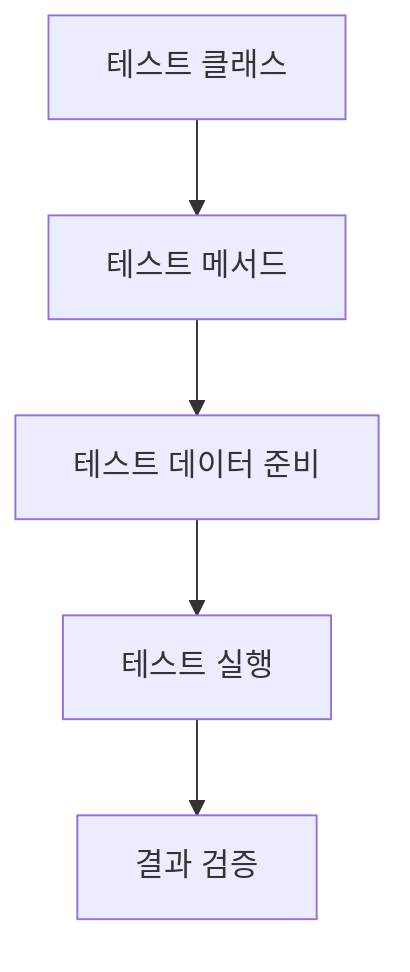

# Spring Test 코드 문서화

## 1. 테스트 스위트 개요
- **범위 및 목적**: 이 테스트 스위트는 `AppendRecommendTripStrategy` 클래스의 기능을 검증하기 위해 작성되었습니다. 이 전략은 사용자의 선호 여행지를 관리하고 추가하는 로직을 포함합니다.
- **테스트 카테고리**: 
  - 단위 테스트
- **주요 테스트 프레임워크 및 도구**: 
  - JUnit 5
  - AssertJ
- **테스트 구성 및 설정**: 
  - `ServiceTestConfig`를 상속하여 스프링 컨텍스트를 설정하고, 필요한 의존성을 주입받습니다.

## 2. API 문서화 테스트
- **REST Docs 테스트 구성**: 이 테스트는 REST API 문서화와 관련이 없으므로 해당 항목은 생략합니다.
- **API 문서화 생성 프로세스**: 이 테스트는 API 문서화와 관련이 없으므로 해당 항목은 생략합니다.

### 각 API 엔드포인트 테스트
- **HTTP 요청 사양**: 해당 테스트는 API 엔드포인트를 호출하지 않으므로 생략합니다.
- **HTTP 응답 사양**: 해당 테스트는 API 엔드포인트를 호출하지 않으므로 생략합니다.
- **유효성 검사 제약 조건**: 해당 테스트는 API 엔드포인트를 호출하지 않으므로 생략합니다.
- **오류 시나리오 및 응답**: 해당 테스트는 API 엔드포인트를 호출하지 않으므로 생략합니다.

## 3. 테스트 환경
- **필요한 구성 속성**: `ServiceTestConfig`에서 필요한 속성을 설정합니다.
- **테스트 데이터베이스 설정**: 테스트 데이터베이스는 H2 또는 다른 인메모리 데이터베이스를 사용할 수 있습니다.
- **모의 서비스 및 테스트 더블**: 이 테스트는 실제 리포지토리를 사용하므로 모의 서비스는 사용하지 않습니다.
- **테스트 데이터 준비**: `TripFixture`와 `MemberFixtures`를 사용하여 테스트 데이터를 준비합니다.
- **필요한 스프링 프로파일**: 기본 프로파일을 사용합니다.

## 4. 테스트 카테고리

### a. 단위 테스트
- **테스트 클래스 구조 및 명명 규칙**: `AppendRecommendTripStrategyTest`라는 이름으로, 테스트할 클래스 이름에 `Test`를 붙입니다.
- **모킹 전략 및 도구**: 실제 리포지토리를 사용하므로 모킹은 사용하지 않습니다.
- **공통 테스트 유틸리티 및 헬퍼**: AssertJ를 사용하여 검증합니다.
- **테스트 생명주기 관리**: 각 테스트 메서드는 독립적으로 실행됩니다.

### b. 통합 테스트
- 해당 테스트는 통합 테스트가 아니므로 생략합니다.

### c. 엔드 투 엔드 테스트
- 해당 테스트는 엔드 투 엔드 테스트가 아니므로 생략합니다.

## 5. 테스트 구현 세부사항
### 각 테스트 클래스/메서드
- **목적 및 범위**: `AppendRecommendTripStrategy`의 기능을 검증합니다.
- **테스트 데이터 설정 및 전제 조건**: `하온`이라는 멤버와 여러 여행지를 생성합니다.
- **예상 결과 및 단언**: 추천 여행지의 개수와 랭킹을 검증합니다.
- **API 문서화 스니펫**: 해당 테스트는 API 문서화와 관련이 없으므로 생략합니다.
- **정리 요구 사항**: 테스트 후 특별한 정리 작업은 필요하지 않습니다.
- **알려진 제한 사항 또는 제약 조건**: 없음.

## 6. API 테스트 패턴
- **요청/응답 문서화**: 해당 테스트는 API 문서화와 관련이 없으므로 생략합니다.
- **입력 유효성 검사 테스트**: 해당 테스트는 API 문서화와 관련이 없으므로 생략합니다.
- **오류 응답 테스트**: `NoExistRecommendTripException` 예외를 검증합니다.
- **인증/권한 테스트**: 해당 테스트는 API 문서화와 관련이 없으므로 생략합니다.
- **페이지네이션 테스트**: 해당 테스트는 API 문서화와 관련이 없으므로 생략합니다.
- **파일 업로드/다운로드 테스트**: 해당 테스트는 API 문서화와 관련이 없으므로 생략합니다.
- **비동기 작업 테스트**: 해당 테스트는 API 문서화와 관련이 없으므로 생략합니다.

## 7. 테스트 실행 흐름
- **테스트 설정 및 문서화 생성 흐름**: 해당 테스트는 API 문서화와 관련이 없으므로 생략합니다.
- **테스트 데이터 흐름**: 테스트 데이터는 `TripFixture`와 `MemberFixtures`에서 생성됩니다.
- **모의 상호작용 패턴**: 해당 테스트는 실제 리포지토리를 사용하므로 생략합니다.
- **검증 단계**: AssertJ를 사용하여 검증합니다.

### Mermaid 다이어그램


## 8. 문서화 생성
- **REST Docs 스니펫 구성**: 해당 테스트는 API 문서화와 관련이 없으므로 생략합니다.
- **커스텀 스니펫 생성**: 해당 테스트는 API 문서화와 관련이 없으므로 생략합니다.
- **문서화 조립 프로세스**: 해당 테스트는 API 문서화와 관련이 없으므로 생략합니다.
- **템플릿 사용자 정의**: 해당 테스트는 API 문서화와 관련이 없으므로 생략합니다.
- **출력 형식 구성**: 해당 테스트는 API 문서화와 관련이 없으므로 생략합니다.
- **버전 관리**: 해당 테스트는 API 문서화와 관련이 없으므로 생략합니다.

## 9. 모범 사례
- **명명 규칙**: 테스트 메서드는 한글로 명명하여 가독성을 높입니다.
- **단언 전략 설명**: AssertJ를 사용하여 가독성 높은 단언을 작성합니다.
- **테스트 격리 접근법**: 각 테스트는 독립적으로 실행됩니다.
- **문서화 유지 관리**: API 문서화와 관련이 없으므로 생략합니다.
- **성능 최적화 기법**: 테스트는 빠르게 실행되도록 설계되었습니다.

## 10. 예제 문서화
- **REST Docs 테스트 케이스**: 해당 테스트는 API 문서화와 관련이 없으므로 생략합니다.
- **생성된 문서 스니펫**: 해당 테스트는 API 문서화와 관련이 없으므로 생략합니다.
- **커스텀 문서화 템플릿**: 해당 테스트는 API 문서화와 관련이 없으므로 생략합니다.
- **공통 테스트 패턴**: 해당 테스트는 API 문서화와 관련이 없으므로 생략합니다.
- **문서화 사용자 정의**: 해당 테스트는 API 문서화와 관련이 없으므로 생략합니다.
```
