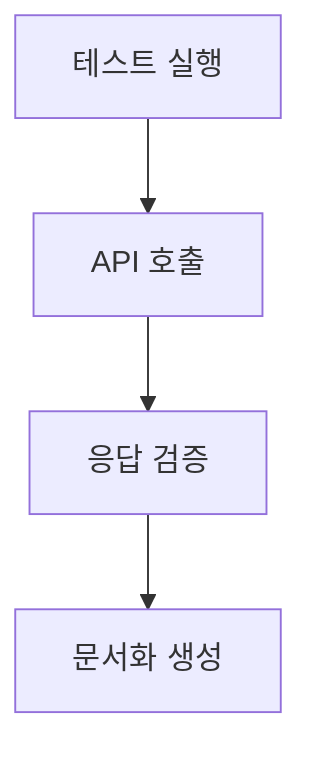
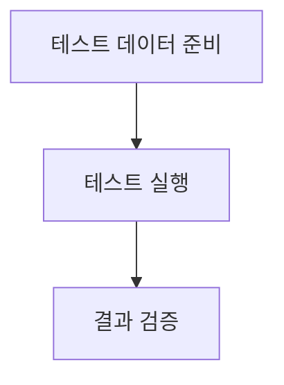
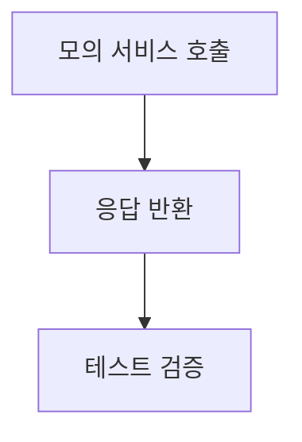
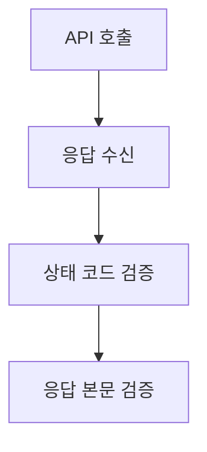

# Spring Test 코드 문서화

## 1. 테스트 스위트 개요
- **범위 및 목적**: 이 테스트 스위트는 인증 관련 API의 기능을 검증하기 위해 작성되었습니다. 카카오 소셜 로그인, 토큰 발급 및 갱신, 로그아웃 기능을 포함합니다.
- **테스트 카테고리**: 
  - 단위 테스트
  - 통합 테스트
  - E2E 테스트
- **주요 테스트 프레임워크 및 도구**: 
  - JUnit
  - Rest Assured
  - AssertJ
- **테스트 구성 및 설정**: `AcceptanceTestConfig` 클래스를 상속받아 공통 설정을 적용합니다.

## 2. API 문서화 테스트
- **REST Docs 테스트 구성**: REST Docs를 사용하여 API 문서를 자동으로 생성합니다.
- **API 문서화 생성 과정**: 각 테스트 메서드에서 API 호출 후 응답을 검증하고, 이를 기반으로 문서화합니다.

### 각 API 엔드포인트 테스트
1. **Authorization URI 생성**
   - **HTTP 요청 사양**: 
     - 메서드: GET
     - 경로: `/oauth/authorize`
     - 파라미터: `provider=KAKAO`
   - **응답 사양**:
     - 상태 코드: 200
     - 응답 본문: `OAuthUriResponse`
     - 예시 응답 페이로드: `{ "oAuthUri": "https://..." }`
   - **유효성 검사**: URI가 "https://"를 포함해야 함.
   - **오류 시나리오**: 잘못된 제공자 요청 시 400 오류 반환.

2. **토큰 발급**
   - **HTTP 요청 사양**:
     - 메서드: POST
     - 경로: `/oauth/token`
     - 요청 본문: `{ "provider": "KAKAO", "code": "authorization-code" }`
   - **응답 사양**:
     - 상태 코드: 201
     - 응답 본문: `AccessTokenResponse`
     - 예시 응답 페이로드: `{ "accessToken": "..." }`
   - **유효성 검사**: 액세스 토큰이 비어 있지 않아야 함.

3. **리프레시 토큰을 통한 액세스 토큰 재발급**
   - **HTTP 요청 사양**:
     - 메서드: POST
     - 경로: `/oauth/token/refresh`
     - 요청 본문: `{ "refreshToken": "..." }`
   - **응답 사양**:
     - 상태 코드: 201
     - 응답 본문: `RenewalAccessTokenResponse`
     - 예시 응답 페이로드: `{ "accessToken": "..." }`
   - **유효성 검사**: 재발급된 액세스 토큰이 비어 있지 않아야 함.

4. **로그아웃**
   - **HTTP 요청 사양**:
     - 메서드: POST
     - 경로: `/logout`
     - 요청 본문: `{ "accessToken": "..." }`
   - **응답 사양**:
     - 상태 코드: 204
   - **유효성 검사**: 응답 본문 없음.

## 3. 테스트 환경
- **필요한 구성 속성**: `application-test.yml` 파일에서 테스트 환경 설정.
- **테스트 데이터베이스 설정**: H2 데이터베이스를 사용하여 테스트 환경에서 데이터 초기화.
- **모의 서비스 및 테스트 더블**: 외부 API 호출을 모의하기 위해 Mockito 사용.
- **테스트 데이터 준비**: 각 테스트 메서드에서 필요한 데이터를 생성하여 사용.
- **필요한 Spring 프로파일**: `test` 프로파일을 사용하여 테스트 환경을 설정.

## 4. 테스트 카테고리

### a. 단위 테스트
- **테스트 클래스 구조 및 명명 규칙**: `AuthAcceptanceTest`와 같은 명명 규칙을 사용.
- **모킹 전략 및 도구**: Mockito를 사용하여 외부 의존성을 모킹.
- **공통 테스트 유틸리티 및 헬퍼**: 공통 검증 메서드를 `HttpStatusAcceptanceFixture`에 정의.
- **테스트 생명주기 관리**: JUnit의 `@BeforeEach`, `@AfterEach`를 사용하여 테스트 전후 작업 수행.

### b. 통합 테스트
- **테스트 컨테이너 구성**: H2 데이터베이스를 사용하여 테스트 환경에서 통합 테스트 수행.
- **데이터베이스 초기화 스크립트**: `data.sql` 파일을 사용하여 초기 데이터 로드.
- **외부 서비스 모의**: WireMock을 사용하여 외부 API를 모의.
- **보안 구성**: 테스트 환경에서 보안 설정을 비활성화.
- **API 계약 검증 테스트**: 각 API 호출 후 응답 구조 검증.

### c. 엔드 투 엔드 테스트
- **테스트 환경 설정**: 실제 서버에서 테스트를 수행하여 전체 흐름 검증.
- **데이터 시딩 접근법**: 테스트 시작 전에 필요한 데이터를 미리 로드.
- **정리 절차**: 각 테스트 후 데이터 정리.
- **성능 고려사항**: 테스트 실행 시간을 최소화하기 위해 필요한 데이터만 로드.

## 5. 테스트 구현 세부사항
### 각 테스트 클래스/메서드
- **목적 및 범위**: 각 테스트 메서드는 특정 API 기능을 검증.
- **테스트 데이터 설정 및 전제 조건**: 필요한 데이터는 테스트 메서드 내에서 생성.
- **예상 결과 및 단언**: AssertJ를 사용하여 결과 검증.
- **API 문서화 스니펫**: 각 테스트 메서드에 API 문서화 관련 주석 추가.
- **정리 요구사항**: 테스트 후 데이터 정리 작업 수행.
- **알려진 제한 사항 또는 제약 조건**: 특정 API 호출 시 외부 서비스 의존성.

## 6. API 테스트 패턴
- **요청/응답 문서화**: 각 API 호출 후 응답을 문서화.
- **입력 유효성 검사 테스트**: 잘못된 입력에 대한 테스트 케이스 작성.
- **오류 응답 테스트**: 오류 발생 시 예상되는 응답 검증.
- **인증/권한 테스트**: 인증이 필요한 API에 대한 테스트.
- **페이지네이션 테스트**: 페이지네이션이 필요한 API에 대한 테스트.
- **파일 업로드/다운로드 테스트**: 파일 관련 API에 대한 테스트.
- **비동기 작업 테스트**: 비동기 API 호출에 대한 테스트.

## 7. 테스트 실행 흐름
### 다이어그램
- **테스트 설정 및 문서화 생성 흐름**: 


- **테스트 데이터 흐름**: 


- **모의 상호작용 패턴**: 


- **검증 단계**: 


## 8. 문서화 생성
- **REST Docs 스니펫 구성**: 각 테스트 메서드에 문서화 스니펫 추가.
- **커스텀 스니펫 생성**: 필요에 따라 커스텀 스니펫 작성.
- **문서화 조립 과정**: 테스트 실행 후 자동으로 문서화 조립.
- **템플릿 커스터마이징**: 기본 템플릿을 수정하여 필요에 맞게 조정.
- **출력 형식 구성**: HTML 또는 Asciidoc 형식으로 출력.
- **버전 관리**: API 버전 관리에 따른 문서화 관리.

## 9. 모범 사례
- **명명 규칙 문서화**: 테스트 메서드 및 클래스에 대한 명명 규칙 정의.
- **단언 전략 설명**: AssertJ를 사용한 단언 전략.
- **테스트 격리 접근법 설명**: 각 테스트가 독립적으로 실행되도록 설정.
- **문서화 유지 관리**: API 변경 시 문서화 업데이트.
- **성능 최적화 기법**: 테스트 실행 시간을 최소화하기 위한 기법.

## 10. 예제 문서화
### REST Docs 테스트 케이스 예제
```java
@Test
void 카카오_소셜_로그인을_위한_Authorization_URI_를_생성한다() {
    // given, when
    ExtractableResponse<Response> response = OAuth_인증_URI를_생성한다("KAKAO");
    // 문서화 스니펫 추가
    document("oauth/authorize");
    ...
}
```

### 생성된 문서화 스니펫 예제

### 카카오 소셜 로그인 Authorization URI
- **GET** `/oauth/authorize?provider=KAKAO`
- **응답**: 
  - **200 OK**
  - `{ "oAuthUri": "https://..." }`
```

### 커스텀 문서화 템플릿 예제

# API 문서
## 카카오 소셜 로그인
- **설명**: 카카오 소셜 로그인을 위한 URI 생성
- **요청**: 
  - **메서드**: GET
  - **경로**: /oauth/authorize
```

### 일반적인 테스트 패턴 예제
- **입력 유효성 검사**: 잘못된 입력에 대한 테스트 케이스 작성.
- **오류 응답 테스트**: 오류 발생 시 예상되는 응답 검증.
```