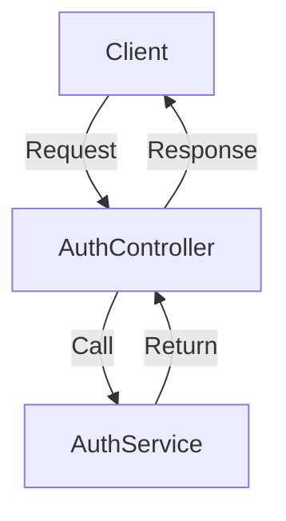

# AuthService 및 AuthController 문서화

## 1. Controller 개요

### 개요
`AuthController`는 인증 관련 기능을 제공하는 RESTful API를 구현합니다. 이 컨트롤러는 OAuth2를 사용하여 사용자를 인증하고, 액세스 토큰 및 리프레시 토큰을 생성 및 갱신하며, 로그아웃 기능을 제공합니다.

### 기본 URL 경로
- `/api/auth`

### REST 엔드포인트
- `GET /api/auth/{oAuthProvider}/link`: OAuth URI 생성
- `POST /api/auth/{oAuthProvider}/login`: 로그인 및 토큰 생성
- `POST /api/auth/extend/login`: 리프레시 토큰을 사용하여 액세스 토큰 갱신
- `DELETE /api/auth/logout`: 로그아웃 및 리프레시 토큰 제거

### 인증/권한 요구 사항
- 로그아웃 및 토큰 갱신 요청은 유효한 리프레시 토큰이 필요합니다.

### 공통 응답 형식 및 상태 코드
- 성공적인 요청: `200 OK`, `201 Created`
- 로그아웃: `204 No Content`
- 오류: 적절한 HTTP 상태 코드와 오류 메시지 반환

## 2. 요청 처리

### 각 @RequestMapping 메서드 문서화

#### 1. `generateUri`
- **HTTP 메서드**: GET
- **URL 경로**: `/api/auth/{oAuthProvider}/link`
- **URL 매개변수**: 
  - `oAuthProvider`: OAuth 제공자의 이름
- **응답 형식**: `OAuthUriResponse`
- **응답 상태 코드**: `200 OK`
- **오류 처리**: 제공자가 존재하지 않을 경우 적절한 오류 메시지 반환

#### 2. `login`
- **HTTP 메서드**: POST
- **URL 경로**: `/api/auth/{oAuthProvider}/login`
- **요청 본문 형식**: `TokenRequest` (JSON)
- **요청 헤더**: 없음
- **응답 형식**: `AccessTokenResponse`
- **응답 상태 코드**: `201 Created`
- **오류 처리**: 인증 실패 시 적절한 오류 메시지 반환

#### 3. `extendLogin`
- **HTTP 메서드**: POST
- **URL 경로**: `/api/auth/extend/login`
- **요청 본문 형식**: 없음
- **쿠키**: `refresh-token`
- **응답 형식**: `RenewalAccessTokenResponse`
- **응답 상태 코드**: `201 Created`
- **오류 처리**: 리프레시 토큰이 유효하지 않을 경우 오류 메시지 반환

#### 4. `logout`
- **HTTP 메서드**: DELETE
- **URL 경로**: `/api/auth/logout`
- **요청 본문 형식**: 없음
- **쿠키**: `refresh-token`
- **응답 형식**: 없음
- **응답 상태 코드**: `204 No Content`
- **오류 처리**: 리프레시 토큰이 유효하지 않을 경우 오류 메시지 반환

## 3. 상세 구성 요소 문서화

### a. Controller 클래스
- **클래스 이름**: `AuthController`
- **목적**: 인증 관련 API 엔드포인트 제공
- **의존성 주입**: `AuthService`
- **보안 주석**: `@Authentication`을 사용하여 인증된 사용자 정보 주입
- **예외 처리 전략**: 서비스에서 발생하는 예외를 적절히 처리하여 클라이언트에 오류 메시지 반환

### b. 요청/응답 DTO
- **TokenRequest**: 로그인 요청에 필요한 코드 포함
- **AccessTokenResponse**: 생성된 액세스 토큰 포함
- **RenewalAccessTokenRequest**: 리프레시 토큰 포함
- **RenewalAccessTokenResponse**: 갱신된 액세스 토큰 포함
- **LogoutRequest**: 로그아웃 요청에 필요한 리프레시 토큰 포함

## 4. 통합 지점
- **서비스 및 리포지토리**: `AuthService`는 `MemberService` 및 `TokenManager`와 상호작용하여 사용자 및 토큰 관리
- **외부 API**: OAuth 제공자와의 통신을 통해 사용자 인증
- **메시지 큐 또는 이벤트**: 해당 없음
- **캐싱 메커니즘**: 해당 없음

## 5. 구현 흐름
### 요청 처리 파이프라인
1. 클라이언트가 API 요청을 보냄
2. `AuthController`가 요청을 수신하고 적절한 메서드 호출
3. `AuthService`에서 비즈니스 로직 처리
4. 응답 생성 및 클라이언트에 반환

### 다이어그램

## 6. 테스트 고려 사항
- **주요 테스트 시나리오**:
  - 유효한 로그인 요청
  - 유효하지 않은 로그인 요청
  - 리프레시 토큰 갱신 요청
  - 로그아웃 요청
- **모킹 요구 사항**: 외부 의존성(예: `OAuthProvider`, `MemberService`) 모킹
- **중요 엣지 케이스**: 존재하지 않는 사용자, 만료된 리프레시 토큰 처리

이 문서는 `AuthService` 및 `AuthController`의 기능과 사용 방법을 명확히 이해하는 데 도움이 될 것입니다.