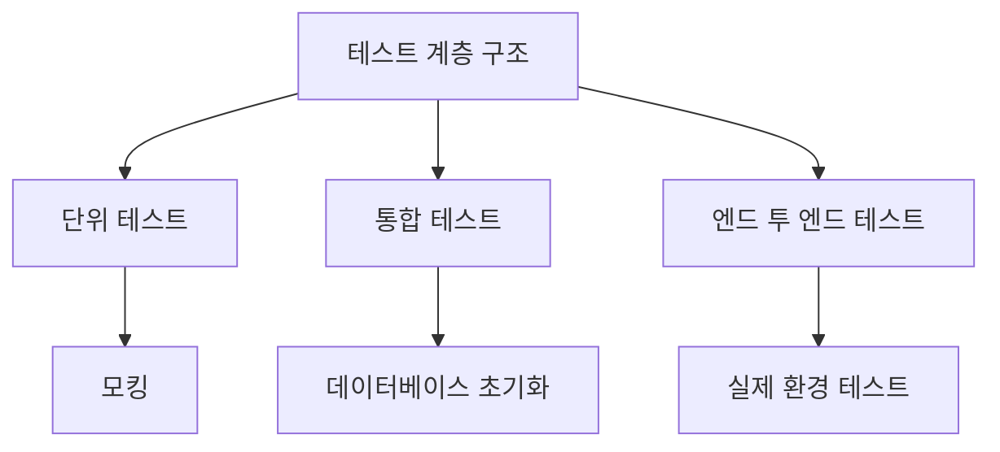

# Spring Test 코드 문서화

## 1. 테스트 스위트 개요
- **범위 및 목적**: 이 테스트 스위트는 `AuthController`의 REST API 엔드포인트를 검증하여 소셜 로그인, 토큰 발급, 리프레시 토큰 갱신, 로그아웃 기능이 올바르게 작동하는지 확인합니다.
- **테스트 카테고리**: 
  - 단위 테스트 (Unit Tests)
  - 통합 테스트 (Integration Tests)
  - 엔드 투 엔드 테스트 (End-to-End Tests)
- **주요 테스트 프레임워크 및 도구**: 
  - JUnit
  - Mockito
  - Spring REST Docs
- **테스트 구성 및 설정**: `ControllerTestConfig`를 상속하여 MockMvc를 설정하고, 필요한 Mock 객체를 주입합니다.

## 2. API 문서화 테스트
- **REST Docs 테스트 구성**: 
  - 요청 및 응답을 문서화하기 위해 `Spring REST Docs`를 사용합니다.
- **API 문서화 생성 과정**: 
  - 각 테스트 메서드에서 `document()` 메서드를 호출하여 API 문서를 생성합니다.

### 각 API 엔드포인트 테스트 문서화

#### 1. 소셜 로그인 링크 반환
- **HTTP 요청 사양**:
  - 메서드: `GET`
  - 경로: `/api/auth/{oAuthProvider}/link`
  - 경로 매개변수: `oAuthProvider` (소셜 로그인 제공처 이름)
- **HTTP 응답 사양**:
  - 상태 코드: `200 OK`
  - 응답 본문: 
    ```json
    {
      "oAuthUri": "URI"
    }
    ```
- **유효성 검사**: 없음
- **오류 시나리오**: 없음

#### 2. OAuth 로그인
- **HTTP 요청 사양**:
  - 메서드: `POST`
  - 경로: `/api/auth/{oAuthProvider}/login`
  - 요청 본문: 
    ```json
    {
      "code": "OAuth 로그인 인증 코드"
    }
    ```
- **HTTP 응답 사양**:
  - 상태 코드: `201 Created`
  - 응답 본문: 
    ```json
    {
      "accessToken": "엑세스 토큰"
    }
    ```
  - 쿠키: `refresh-token`
- **유효성 검사**: 없음
- **오류 시나리오**: OAuth 로그인 서버 오류 시 `500 Internal Server Error`

#### 3. 리프레시 토큰으로 엑세스 토큰 발급
- **HTTP 요청 사양**:
  - 메서드: `POST`
  - 경로: `/api/auth/extend/login`
  - 요청 쿠키: `refresh-token`
- **HTTP 응답 사양**:
  - 상태 코드: `200 OK`
  - 응답 본문: 
    ```json
    {
      "accessToken": "새로운 엑세스 토큰"
    }
    ```
- **유효성 검사**: 없음
- **오류 시나리오**: 만료된 토큰 시 `401 Unauthorized`

#### 4. 로그아웃
- **HTTP 요청 사양**:
  - 메서드: `DELETE`
  - 경로: `/api/auth/logout`
  - 요청 헤더: `Authorization: Bearer {token}`
  - 요청 쿠키: `refresh-token`
- **HTTP 응답 사양**:
  - 상태 코드: `204 No Content`
- **유효성 검사**: 없음
- **오류 시나리오**: 없음

## 3. 테스트 환경
- **필요한 구성 속성**: 
  - 데이터베이스 연결 정보
  - Mock 객체 설정
- **테스트 데이터베이스 설정**: 테스트 전용 데이터베이스를 사용하여 데이터 격리를 보장합니다.
- **모의 서비스 및 테스트 더블**: Mockito를 사용하여 서비스 레이어의 Mock 객체를 생성합니다.
- **테스트 데이터 준비**: 각 테스트 메서드에서 필요한 테스트 데이터를 설정합니다.
- **필요한 Spring 프로파일**: `test` 프로파일을 사용하여 테스트 환경을 설정합니다.

## 4. 테스트 카테고리

### a. 단위 테스트
- **테스트 클래스 구조 및 명명 규칙**: `AuthControllerTest`와 같은 형식으로 명명합니다.
- **모킹 전략 및 도구**: Mockito를 사용하여 의존성을 모킹합니다.
- **공통 테스트 유틸리티 및 헬퍼**: `MockMvc`를 사용하여 HTTP 요청을 시뮬레이션합니다.
- **테스트 생명주기 관리**: JUnit의 `@BeforeEach`, `@AfterEach`를 사용하여 테스트 전후 작업을 수행합니다.

### b. 통합 테스트
- **테스트 컨테이너 구성**: 필요한 경우 테스트 컨테이너를 설정합니다.
- **데이터베이스 초기화 스크립트**: 테스트 데이터베이스를 초기화하는 스크립트를 사용합니다.
- **외부 서비스 모의**: Mockito를 사용하여 외부 서비스 호출을 모킹합니다.
- **보안 구성**: 테스트 환경에서 보안 구성을 설정합니다.
- **API 계약 검증 테스트**: API 문서화와 실제 응답을 비교하여 계약을 검증합니다.

### c. 엔드 투 엔드 테스트
- **테스트 환경 설정**: 실제 환경과 유사한 테스트 환경을 설정합니다.
- **데이터 시딩 접근법**: 테스트 데이터베이스에 초기 데이터를 삽입합니다.
- **정리 절차**: 각 테스트 후 데이터베이스를 정리합니다.
- **성능 고려 사항**: 테스트 성능을 최적화합니다.

## 5. 테스트 구현 세부사항
각 테스트 클래스/메서드에 대해:
- **목적 및 범위**: 각 테스트의 목적을 설명합니다.
- **테스트 데이터 설정 및 전제 조건**: 필요한 테스트 데이터를 설정합니다.
- **예상 결과 및 단언**: 테스트의 예상 결과를 단언합니다.
- **API 문서화 스니펫**: REST Docs를 사용하여 문서화합니다.
- **정리 요구 사항**: 테스트 후 정리 작업을 수행합니다.
- **알려진 제한 사항 또는 제약 조건**: 테스트의 한계를 설명합니다.

## 6. API 테스트 패턴
- **요청/응답 문서화**: REST Docs를 사용하여 요청 및 응답을 문서화합니다.
- **입력 유효성 검사 테스트**: 입력 데이터의 유효성을 검사합니다.
- **오류 응답 테스트**: 오류 발생 시 응답을 검증합니다.
- **인증/권한 테스트**: 인증 및 권한 관련 테스트를 수행합니다.
- **페이지네이션 테스트**: 페이지네이션 기능을 검증합니다.
- **파일 업로드/다운로드 테스트**: 파일 처리 기능을 테스트합니다.
- **비동기 작업 테스트**: 비동기 작업의 결과를 검증합니다.

## 7. 테스트 실행 흐름
- **테스트 설정 및 문서화 생성 흐름**: 테스트 실행 시 문서화가 생성되는 흐름을 설명합니다.
- **테스트 데이터 흐름**: 테스트 데이터가 어떻게 흐르는지 설명합니다.
- **모의 상호작용 패턴**: Mock 객체와의 상호작용 패턴을 설명합니다.
- **검증 단계**: 테스트 결과를 검증하는 단계를 설명합니다.

### Mermaid 다이어그램


## 8. 문서화 생성
- **REST Docs 스니펫 구성**: 요청 및 응답 스니펫을 구성합니다.
- **커스텀 스니펫 생성**: 필요에 따라 커스텀 스니펫을 생성합니다.
- **문서화 조립 과정**: 생성된 스니펫을 조합하여 최종 문서를 생성합니다.
- **템플릿 사용자 정의**: 문서화 템플릿을 사용자 정의합니다.
- **출력 형식 구성**: 문서의 출력 형식을 설정합니다.
- **버전 관리**: 문서의 버전을 관리합니다.

## 9. 모범 사례
- **명명 규칙 문서화**: 테스트 및 메서드의 명명 규칙을 문서화합니다.
- **단언 전략 설명**: 단언을 수행하는 전략을 설명합니다.
- **테스트 격리 접근법 설명**: 테스트 간의 격리를 보장하는 방법을 설명합니다.
- **문서화 유지 관리**: 문서화의 유지 관리 방법을 설명합니다.
- **성능 최적화 기법**: 테스트 성능을 최적화하는 기법을 설명합니다.

## 10. 예제 문서화
- **REST Docs 테스트 케이스**: 각 테스트 케이스의 REST Docs 스니펫 예시를 포함합니다.
- **생성된 문서 스니펫**: 실제로 생성된 문서의 예시를 포함합니다.
- **커스텀 문서화 템플릿**: 사용자 정의 템플릿의 예시를 포함합니다.
- **일반적인 테스트 패턴**: 자주 사용되는 테스트 패턴의 예시를 포함합니다.
- **문서화 사용자 정의**: 문서화 사용자 정의의 예시를 포함합니다.
```
