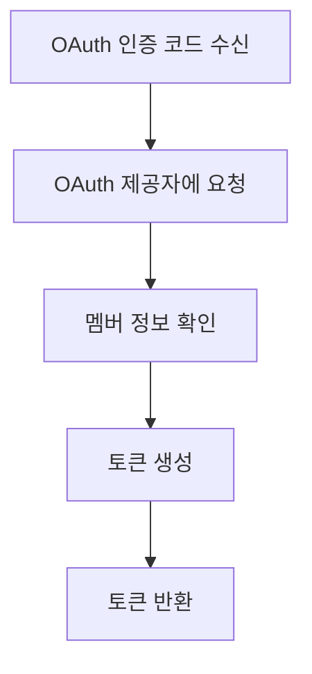
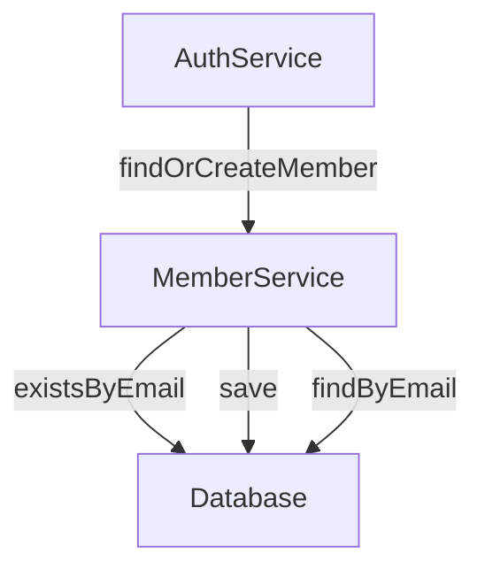
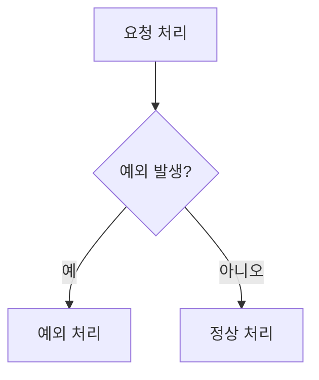
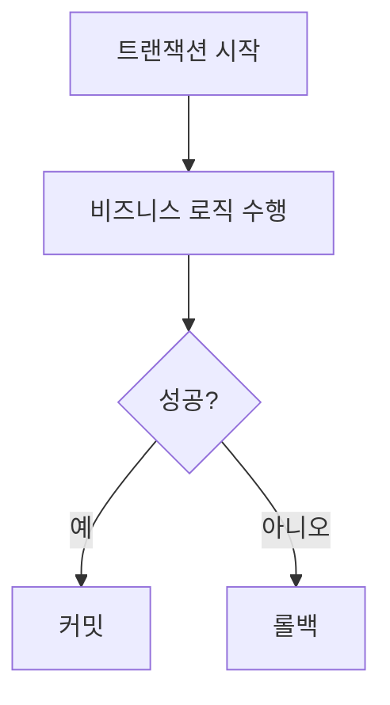

# AuthService 문서화

## 1. 서비스 개요

### 서비스 개요
`AuthService`는 OAuth 인증 및 토큰 관리를 담당하는 서비스입니다. 이 서비스는 외부 OAuth 제공자로부터 인증 코드를 받아 사용자의 토큰을 생성하고, 리프레시 토큰을 통해 액세스 토큰을 갱신하며, 로그아웃 시 리프레시 토큰을 제거하는 기능을 제공합니다.

### 주요 비즈니스 작업
- OAuth 인증 코드로부터 토큰 생성
- OAuth 제공자에 대한 URI 생성
- 액세스 토큰 갱신
- 리프레시 토큰 제거
- 액세스 토큰으로부터 멤버 ID 추출

### 공개 메서드
- `generateTokenWithCode(String code, String providerName)`
- `generateUri(String providerName)`
- `generateRenewalAccessToken(RenewalAccessTokenRequest renewalAccessTokenRequest)`
- `removeRefreshToken(LogoutRequest logoutRequest)`
- `extractMemberId(String accessToken)`

### 트랜잭션 요구 사항
- `generateTokenWithCode`, `generateRenewalAccessToken`, `removeRefreshToken` 메서드는 트랜잭션을 필요로 하며, 데이터베이스에 대한 변경 작업을 포함합니다.

### 일반적인 오류 시나리오 및 처리 방법
- 존재하지 않는 멤버에 대한 요청: `NoExistMemberException` 예외를 발생시킵니다.
- OAuth 인증 실패: 적절한 예외 처리를 통해 사용자에게 오류 메시지를 전달합니다.

---

## 2. 비즈니스 로직 처리

### 2.1. `generateTokenWithCode` 메서드
- **메서드 시그니처 및 목적**: 
  ```java
  public MemberToken generateTokenWithCode(final String code, final String providerName)
  ```
  OAuth 인증 코드를 사용하여 멤버 토큰을 생성합니다.

- **입력 매개변수 및 검증 규칙**:
  - `code`: OAuth 제공자로부터 받은 인증 코드 (필수)
  - `providerName`: OAuth 제공자의 이름 (필수)

- **예상 반환 값**: `MemberToken` 객체

- **트랜잭션 경계 및 격리 수준**: 
  - 트랜잭션이 활성화되어 있으며, 기본 격리 수준을 사용합니다.

- **비즈니스 규칙 및 검증 로직**: 
  - OAuth 제공자로부터 멤버 정보를 가져오고, 해당 멤버가 존재하지 않으면 새로 생성합니다.

- **오류 시나리오 및 처리 전략**: 
  - OAuth 인증 실패 시 예외를 발생시킵니다.

- **사용 예제**:
  ```java
  MemberToken token = authService.generateTokenWithCode("auth_code", "provider_name");
  ```

### 2.2. `generateUri` 메서드
- **메서드 시그니처 및 목적**: 
  ```java
  public String generateUri(final String providerName)
  ```
  OAuth 제공자에 대한 인증 URI를 생성합니다.

- **입력 매개변수 및 검증 규칙**:
  - `providerName`: OAuth 제공자의 이름 (필수)

- **예상 반환 값**: 인증 URI 문자열

- **사용 예제**:
  ```java
  String uri = authService.generateUri("provider_name");
  ```

### 2.3. `generateRenewalAccessToken` 메서드
- **메서드 시그니처 및 목적**: 
  ```java
  public RenewalAccessTokenResponse generateRenewalAccessToken(final RenewalAccessTokenRequest renewalAccessTokenRequest)
  ```
  리프레시 토큰을 사용하여 액세스 토큰을 갱신합니다.

- **입력 매개변수 및 검증 규칙**:
  - `renewalAccessTokenRequest`: 리프레시 토큰을 포함하는 요청 DTO (필수)

- **예상 반환 값**: `RenewalAccessTokenResponse` 객체

- **사용 예제**:
  ```java
  RenewalAccessTokenResponse response = authService.generateRenewalAccessToken(new RenewalAccessTokenRequest("refresh_token"));
  ```

### 2.4. `removeRefreshToken` 메서드
- **메서드 시그니처 및 목적**: 
  ```java
  public void removeRefreshToken(final LogoutRequest logoutRequest)
  ```
  로그아웃 요청에 따라 리프레시 토큰을 제거합니다.

- **입력 매개변수 및 검증 규칙**:
  - `logoutRequest`: 리프레시 토큰을 포함하는 요청 DTO (필수)

- **사용 예제**:
  ```java
  authService.removeRefreshToken(new LogoutRequest("refresh_token"));
  ```

### 2.5. `extractMemberId` 메서드
- **메서드 시그니처 및 목적**: 
  ```java
  public Long extractMemberId(final String accessToken)
  ```
  액세스 토큰으로부터 멤버 ID를 추출합니다.

- **입력 매개변수 및 검증 규칙**:
  - `accessToken`: 액세스 토큰 (필수)

- **예상 반환 값**: 멤버 ID (Long)

- **오류 시나리오 및 처리 전략**: 
  - 존재하지 않는 멤버 ID 요청 시 `NoExistMemberException` 예외를 발생시킵니다.

- **사용 예제**:
  ```java
  Long memberId = authService.extractMemberId("access_token");
  ```

---

## 3. 상세 구성 요소 문서화

### a. 서비스 클래스
- **클래스 이름 및 비즈니스 목적**: `AuthService` - OAuth 인증 및 토큰 관리를 위한 서비스 클래스입니다.

- **의존성 주입 및 자동 주입된 구성 요소**:
  - `OAuthProvider`
  - `MemberService`
  - `TokenManager`

- **트랜잭션 관리 구성**: 
  - `@Transactional` 어노테이션을 사용하여 메서드의 트랜잭션을 관리합니다.

- **예외 처리 전략**: 
  - 비즈니스 로직에서 발생할 수 있는 예외를 적절히 처리합니다.

- **검증 접근 방식**: 
  - 입력 매개변수에 대한 검증은 각 메서드 내에서 수행됩니다.

### b. 비즈니스 DTOs
- **필드 설명 및 검증 제약 조건**:
  - `RenewalAccessTokenRequest`: 리프레시 토큰을 포함하는 DTO
  - `LogoutRequest`: 로그아웃 시 리프레시 토큰을 포함하는 DTO

- **데이터 변환/매핑 로직**: 
  - DTO는 서비스 메서드에서 직접 사용되며, 필요한 경우 변환 로직이 포함됩니다.

- **도메인 모델 관계**: 
  - `Member`, `OAuthMember`와의 관계를 통해 사용자 정보를 관리합니다.

---

## 4. 통합 지점
- **저장소 및 데이터베이스 작업**: 
  - `MemberService`를 통해 멤버 정보를 데이터베이스에 저장하고 조회합니다.

- **다른 서비스와의 상호작용**: 
  - `MemberService`와의 의존성을 통해 멤버 관련 작업을 수행합니다.

- **외부 시스템과의 상호작용**: 
  - OAuth 제공자와의 통신을 통해 인증 정보를 처리합니다.

- **이벤트 게시/처리**: 
  - 현재 구현에는 이벤트 게시/처리 로직이 포함되어 있지 않습니다.

---

## 5. 구현 흐름

### 비즈니스 로직 처리 파이프라인


### 서비스-저장소 상호작용


### 오류 처리 흐름


### 트랜잭션 경계


---

## 6. 테스트 고려 사항
- **주요 테스트 시나리오**:
  - OAuth 인증 코드로 토큰 생성
  - 리프레시 토큰으로 액세스 토큰 갱신
  - 로그아웃 시 리프레시 토큰 제거

- **모킹 요구 사항**:
  - 외부 OAuth 제공자와의 통신을 모킹하여 테스트합니다.
  - `MemberService`와 `TokenManager`의 메서드를 모킹하여 독립적인 테스트를 수행합니다.

- **중요한 비즈니스 엣지 케이스**:
  - 존재하지 않는 이메일로 멤버 생성 시나리오
  - 유효하지 않은 리프레시 토큰 처리
  - 멤버 ID가 존재하지 않을 때의 처리

이 문서는 `AuthService`의 기능과 사용 방법을 명확히 이해하는 데 도움이 될 것입니다.