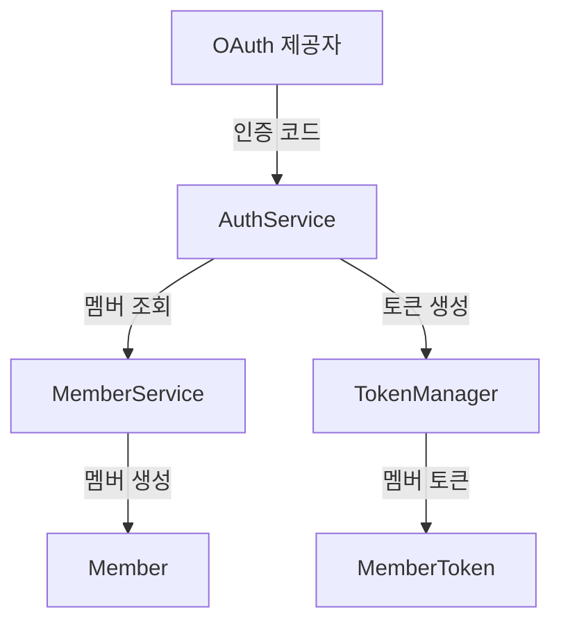

# AuthService 문서

## 1. 서비스 개요

### 서비스 목적
`AuthService`는 OAuth 인증 및 토큰 관리를 처리하는 서비스입니다. 이 서비스는 외부 OAuth 제공자로부터 인증을 받고, 사용자를 관리하며, 액세스 토큰 및 리프레시 토큰을 생성 및 갱신하는 기능을 제공합니다.

### 주요 비즈니스 작업
- OAuth 제공자로부터 인증 코드로 토큰 생성
- OAuth URI 생성
- 액세스 토큰 갱신
- 로그아웃 시 리프레시 토큰 제거
- 액세스 토큰에서 멤버 ID 추출 및 검증

### 공개 메서드
- `generateTokenWithCode(String code, String providerName)`
- `generateUri(String providerName)`
- `generateRenewalAccessToken(RenewalAccessTokenRequest renewalAccessTokenRequest)`
- `removeRefreshToken(LogoutRequest logoutRequest)`
- `extractMemberId(String accessToken)`

### 트랜잭션 요구 사항
- `generateTokenWithCode`, `generateRenewalAccessToken`, `removeRefreshToken` 메서드는 트랜잭션을 필요로 하며, 데이터베이스 상태를 변경합니다.
- 나머지 메서드는 읽기 전용 트랜잭션입니다.

### 일반적인 오류 시나리오 및 처리 접근 방식
- 존재하지 않는 멤버 ID로 인한 `NoExistMemberException` 발생
- OAuth 제공자로부터의 인증 실패 처리 (예외 처리 필요)

---

## 2. 비즈니스 로직 처리

### 2.1. `generateTokenWithCode`
- **메서드 시그니처**: `public MemberToken generateTokenWithCode(final String code, final String providerName)`
- **목적**: OAuth 인증 코드를 사용하여 멤버 토큰을 생성합니다.
- **입력 매개변수**:
  - `code`: OAuth 제공자로부터 받은 인증 코드
  - `providerName`: OAuth 제공자의 이름
- **예상 반환 값**: `MemberToken` 객체
- **트랜잭션 경계 및 격리 수준**: 트랜잭션 내에서 실행
- **비즈니스 규칙 및 유효성 검사 논리**: 
  - OAuth 제공자로부터 멤버 정보를 가져오고, 해당 멤버가 존재하지 않으면 생성합니다.
- **오류 시나리오 및 처리 전략**: OAuth 인증 실패 시 예외 처리 필요
- **사용 코드 예제**:
  ```java
  MemberToken token = authService.generateTokenWithCode("auth_code", "google");
  ```

### 2.2. `generateUri`
- **메서드 시그니처**: `public String generateUri(final String providerName)`
- **목적**: OAuth 제공자를 위한 인증 URI를 생성합니다.
- **입력 매개변수**: `providerName`: OAuth 제공자의 이름
- **예상 반환 값**: 인증 URI 문자열
- **트랜잭션 경계 및 격리 수준**: 읽기 전용
- **비즈니스 규칙 및 유효성 검사 논리**: 제공자가 유효한지 확인
- **오류 시나리오 및 처리 전략**: 제공자가 유효하지 않을 경우 예외 처리 필요
- **사용 코드 예제**:
  ```java
  String uri = authService.generateUri("google");
  ```

### 2.3. `generateRenewalAccessToken`
- **메서드 시그니처**: `public RenewalAccessTokenResponse generateRenewalAccessToken(final RenewalAccessTokenRequest renewalAccessTokenRequest)`
- **목적**: 리프레시 토큰을 사용하여 새로운 액세스 토큰을 생성합니다.
- **입력 매개변수**: `renewalAccessTokenRequest`: 리프레시 토큰 요청 객체
- **예상 반환 값**: `RenewalAccessTokenResponse` 객체
- **트랜잭션 경계 및 격리 수준**: 트랜잭션 내에서 실행
- **비즈니스 규칙 및 유효성 검사 논리**: 리프레시 토큰의 유효성 검사
- **오류 시나리오 및 처리 전략**: 유효하지 않은 리프레시 토큰 처리
- **사용 코드 예제**:
  ```java
  RenewalAccessTokenResponse response = authService.generateRenewalAccessToken(new RenewalAccessTokenRequest("refresh_token"));
  ```

### 2.4. `removeRefreshToken`
- **메서드 시그니처**: `public void removeRefreshToken(final LogoutRequest logoutRequest)`
- **목적**: 로그아웃 시 리프레시 토큰을 제거합니다.
- **입력 매개변수**: `logoutRequest`: 로그아웃 요청 객체
- **예상 반환 값**: 없음
- **트랜잭션 경계 및 격리 수준**: 트랜잭션 내에서 실행
- **비즈니스 규칙 및 유효성 검사 논리**: 리프레시 토큰의 유효성 검사
- **오류 시나리오 및 처리 전략**: 유효하지 않은 리프레시 토큰 처리
- **사용 코드 예제**:
  ```java
  authService.removeRefreshToken(new LogoutRequest("refresh_token"));
  ```

### 2.5. `extractMemberId`
- **메서드 시그니처**: `public Long extractMemberId(final String accessToken)`
- **목적**: 액세스 토큰에서 멤버 ID를 추출하고 검증합니다.
- **입력 매개변수**: `accessToken`: 액세스 토큰
- **예상 반환 값**: 멤버 ID
- **트랜잭션 경계 및 격리 수준**: 읽기 전용
- **비즈니스 규칙 및 유효성 검사 논리**: 멤버 ID의 존재 여부 확인
- **오류 시나리오 및 처리 전략**: 존재하지 않는 멤버 ID에 대한 예외 처리
- **사용 코드 예제**:
  ```java
  Long memberId = authService.extractMemberId("access_token");
  ```

---

## 3. 상세 구성 요소 문서화

### a. 서비스 클래스
- **클래스 이름**: `AuthService`
- **비즈니스 목적**: OAuth 인증 및 토큰 관리
- **의존성 주입 및 자동 와이어링된 구성 요소**:
  - `OAuthProvider`
  - `MemberService`
  - `TokenManager`
- **트랜잭션 관리 구성**: 메서드에 `@Transactional` 어노테이션 사용
- **예외 처리 전략**: 비즈니스 로직에서 발생하는 예외를 적절히 처리
- **유효성 검사 접근 방식**: 입력 매개변수의 유효성 검사 및 존재 여부 확인

### b. 비즈니스 DTO
- **LogoutRequest**:
  - **필드 설명**: `refreshToken` (리프레시 토큰)
  - **유효성 검사 제약 조건**: 비어 있지 않아야 함
- **RenewalAccessTokenRequest**:
  - **필드 설명**: `refreshToken` (리프레시 토큰)
  - **유효성 검사 제약 조건**: 비어 있지 않아야 함
- **RenewalAccessTokenResponse**:
  - **필드 설명**: `accessToken` (새로운 액세스 토큰)

---

## 4. 통합 지점
- **리포지토리 및 데이터베이스 작업**: `MemberService`를 통해 멤버 정보를 데이터베이스에서 조회 및 저장
- **다른 서비스**: `MemberService`와 통합하여 멤버 관리
- **외부 시스템**: OAuth 제공자와의 통신
- **이벤트 게시/처리**: 해당 없음

---

## 5. 구현 흐름

### 다이어그램


### 비즈니스 로직 처리 파이프라인
1. OAuth 제공자로부터 인증 코드 수신
2. `AuthService`에서 멤버 조회 및 생성
3. `TokenManager`를 통해 멤버 토큰 생성

### 서비스-리포지토리 상호작용
- `AuthService`는 `MemberService`를 통해 멤버 정보를 조회하고 저장합니다.

### 오류 처리 흐름
- OAuth 인증 실패 시 예외 발생
- 존재하지 않는 멤버 ID로 인한 예외 발생

### 트랜잭션 경계
- `generateTokenWithCode`, `generateRenewalAccessToken`, `removeRefreshToken` 메서드는 트랜잭션 내에서 실행됩니다.

---

## 6. 테스트 고려사항
- **주요 테스트 시나리오**:
  - 유효한 OAuth 코드로 토큰 생성
  - 유효하지 않은 OAuth 코드 처리
  - 리프레시 토큰으로 액세스 토큰 갱신
  - 로그아웃 시 리프레시 토큰 제거
  - 존재하지 않는 멤버 ID 처리
- **모킹 요구 사항**: `OAuthProvider`, `MemberService`, `TokenManager`를 모킹하여 단위 테스트 수행
- **중요한 비즈니스 엣지 케이스**:
  - OAuth 제공자가 응답하지 않는 경우
  - 데이터베이스 오류 발생 시 처리

이 문서는 `AuthService`의 기능과 사용 방법을 명확하게 설명하며, 개발자들이 이 서비스를 효과적으로 사용할 수 있도록 돕습니다.