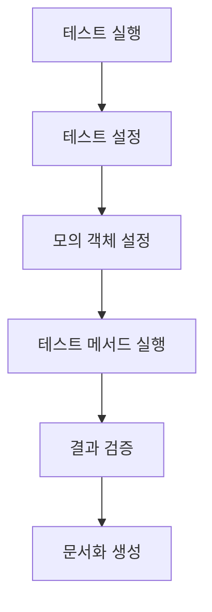

# Spring Test 코드 문서화

## 1. 테스트 스위트 개요
- **범위 및 목적**: 이 테스트 스위트는 `AuthenticationBearerExtractor` 클래스의 기능을 검증하기 위해 작성되었습니다. 주로 Authorization 헤더의 유효성을 검사하는 메서드의 동작을 확인합니다.
- **테스트 카테고리**: 
  - 단위 테스트
- **주요 테스트 프레임워크 및 도구**: 
  - JUnit 5
  - AssertJ
  - Mockito
- **테스트 구성 및 설정**: 
  - Spring Boot 테스트 환경에서 실행되며, `@SpringBootTest` 어노테이션을 사용하여 전체 컨텍스트를 로드합니다. `@ActiveProfiles("test")`를 통해 테스트 프로파일을 활성화합니다.

## 2. API 문서화 테스트
- **REST Docs 테스트 구성**: 이 테스트는 REST Docs와 관련된 설정을 포함하지 않지만, API 문서화에 필요한 테스트를 작성할 수 있습니다.
- **API 문서화 생성 프로세스**: API 문서화는 테스트 실행 후 REST Docs를 통해 자동으로 생성될 수 있습니다.

### 각 API 엔드포인트 테스트
#### 1. 헤더의 Authorization 값이 비어있으면 예외가 발생한다.
- **HTTP 요청 사양**:
  - 메서드: GET (가정)
  - 경로: /api/auth (가정)
  - 파라미터: 없음
  - 헤더: Authorization: null
  - 요청 본문 구조: 없음
  - 예시 요청 페이로드: 없음

- **HTTP 응답 사양**:
  - 상태 코드: 400 Bad Request
  - 응답 헤더: 없음
  - 응답 본문 구조: 예외 메시지
  - 예시 응답 페이로드: `{ "error": "Empty Bearer Header" }`

- **유효성 검사 제약 조건**: Authorization 헤더는 null이 아니어야 합니다.
- **오류 시나리오 및 응답**: Authorization 헤더가 비어있을 경우 `EmptyBearerHeaderException`이 발생합니다.

#### 2. 헤더의 Authorization 값이 유효하지 않다면 예외가 발생한다.
- **HTTP 요청 사양**:
  - 메서드: GET (가정)
  - 경로: /api/auth (가정)
  - 파라미터: 없음
  - 헤더: Authorization: "invalid token"
  - 요청 본문 구조: 없음
  - 예시 요청 페이로드: 없음

- **HTTP 응답 사양**:
  - 상태 코드: 400 Bad Request
  - 응답 헤더: 없음
  - 응답 본문 구조: 예외 메시지
  - 예시 응답 페이로드: `{ "error": "Invalid Token Format" }`

- **유효성 검사 제약 조건**: Authorization 헤더는 "Bearer {token}" 형식이어야 합니다.
- **오류 시나리오 및 응답**: Authorization 헤더가 유효하지 않을 경우 `InvalidTokenFormatException`이 발생합니다.

## 3. 테스트 환경
- **필요한 구성 속성**: `application-test.yml` 파일에서 테스트 관련 속성을 설정합니다.
- **테스트 데이터베이스 설정**: 테스트 데이터베이스는 인메모리 데이터베이스를 사용하여 설정할 수 있습니다.
- **모의 서비스 및 테스트 더블**: `HttpServletRequest`를 모의 객체로 사용하여 테스트합니다.
- **테스트 데이터 준비**: 테스트에 필요한 데이터는 메서드 내에서 설정합니다.
- **필요한 Spring 프로파일**: `test` 프로파일이 활성화되어야 합니다.

## 4. 테스트 카테고리
### a. 단위 테스트
- **테스트 클래스 구조 및 명명 규칙**: 각 테스트 클래스는 `*Test`로 끝나며, 테스트 메서드는 명확한 설명을 포함합니다.
- **모킹 전략 및 도구**: Mockito를 사용하여 `HttpServletRequest`를 모킹합니다.
- **공통 테스트 유틸리티 및 헬퍼**: AssertJ를 사용하여 가독성 높은 assertions를 작성합니다.
- **테스트 생명주기 관리**: 각 테스트 메서드는 독립적으로 실행되며, 상태를 공유하지 않습니다.

### b. 통합 테스트
- 이 테스트는 단위 테스트로, 통합 테스트는 포함되어 있지 않습니다.

### c. 엔드 투 엔드 테스트
- 이 테스트는 엔드 투 엔드 테스트가 포함되어 있지 않습니다.

## 5. 테스트 구현 세부사항
### 1. 헤더의 Authorization 값이 비어있으면 예외가 발생한다.
- **목적 및 범위**: Authorization 헤더가 비어있을 때 예외가 발생하는지 확인합니다.
- **테스트 데이터 설정 및 전제 조건**: `httpServletRequest.getHeader("Authorization")`가 null로 설정됩니다.
- **예상 결과 및 assertions**: `EmptyBearerHeaderException`이 발생해야 합니다.
- **API 문서화 스니펫**: 해당 테스트는 API 문서화에 포함될 수 있습니다.
- **정리 요구 사항**: 테스트 후 특별한 정리 작업은 필요하지 않습니다.
- **알려진 제한 사항 또는 제약 조건**: 없음.

### 2. 헤더의 Authorization 값이 유효하지 않다면 예외가 발생한다.
- **목적 및 범위**: Authorization 헤더가 유효하지 않을 때 예외가 발생하는지 확인합니다.
- **테스트 데이터 설정 및 전제 조건**: `httpServletRequest.getHeader("Authorization")`가 "invalid token"으로 설정됩니다.
- **예상 결과 및 assertions**: `InvalidTokenFormatException`이 발생해야 합니다.
- **API 문서화 스니펫**: 해당 테스트는 API 문서화에 포함될 수 있습니다.
- **정리 요구 사항**: 테스트 후 특별한 정리 작업은 필요하지 않습니다.
- **알려진 제한 사항 또는 제약 조건**: 없음.

## 6. API 테스트 패턴
- **요청/응답 문서화**: 각 테스트는 요청과 응답을 문서화하는 데 사용될 수 있습니다.
- **입력 유효성 검사 테스트**: Authorization 헤더의 유효성을 검사합니다.
- **오류 응답 테스트**: 예외 발생 시 적절한 오류 응답을 확인합니다.
- **인증/권한 부여 테스트**: Authorization 헤더의 유효성을 통해 인증을 테스트합니다.
- **페이지네이션 테스트**: 해당 테스트는 포함되어 있지 않습니다.
- **파일 업로드/다운로드 테스트**: 해당 테스트는 포함되어 있지 않습니다.
- **비동기 작업 테스트**: 해당 테스트는 포함되어 있지 않습니다.

## 7. 테스트 실행 흐름
- **테스트 설정 및 문서화 생성 흐름**: 테스트가 실행되면, 각 테스트 메서드가 독립적으로 실행되어 결과를 검증합니다.
- **테스트 데이터 흐름**: 테스트 데이터는 각 테스트 메서드 내에서 설정됩니다.
- **모의 상호작용 패턴**: Mockito를 사용하여 `HttpServletRequest`의 동작을 모의합니다.
- **검증 단계**: assertions를 통해 결과를 검증합니다.

### Mermaid 다이어그램


## 8. 문서화 생성
- **REST Docs 스니펫 구성**: REST Docs를 사용하여 API 문서화 스니펫을 생성할 수 있습니다.
- **커스텀 스니펫 생성**: 필요에 따라 커스텀 스니펫을 생성할 수 있습니다.
- **문서화 조립 프로세스**: 테스트 실행 후 자동으로 문서화가 생성됩니다.
- **템플릿 커스터마이징**: 필요에 따라 문서화 템플릿을 커스터마이징할 수 있습니다.
- **출력 형식 구성**: HTML, Asciidoc 등 다양한 형식으로 출력할 수 있습니다.
- **버전 관리**: 문서화 버전 관리를 통해 변경 사항을 추적할 수 있습니다.

## 9. 모범 사례
- **명명 규칙 문서화**: 테스트 메서드는 명확한 설명을 포함해야 합니다.
- **어설션 전략 설명**: AssertJ를 사용하여 가독성 높은 assertions를 작성합니다.
- **테스트 격리 접근법 설명**: 각 테스트는 독립적으로 실행되어야 합니다.
- **문서화 유지 관리 세부사항**: API 문서화는 테스트와 함께 업데이트되어야 합니다.
- **성능 최적화 기법**: 테스트 실행 시간을 최소화하기 위해 인메모리 데이터베이스를 사용합니다.

## 10. 예제 문서화
- **REST Docs 테스트 케이스**: 각 테스트 메서드는 REST Docs와 통합되어 문서화됩니다.
- **생성된 문서화 스니펫**: 테스트 실행 후 생성된 문서화 스니펫을 포함할 수 있습니다.
- **커스텀 문서화 템플릿**: 필요에 따라 커스텀 템플릿을 사용할 수 있습니다.
- **공통 테스트 패턴**: 각 테스트는 공통 패턴을 따릅니다.
- **문서화 커스터마이징**: 필요에 따라 문서화 내용을 커스터마이징할 수 있습니다.
```
