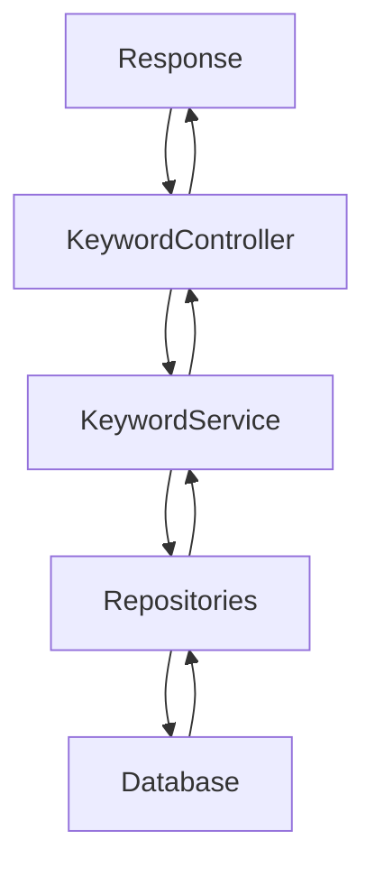
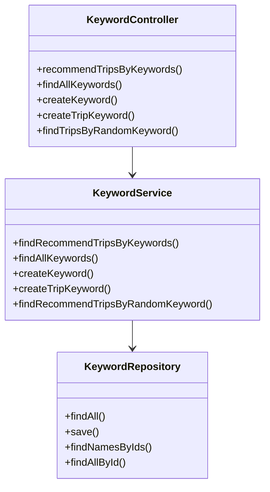
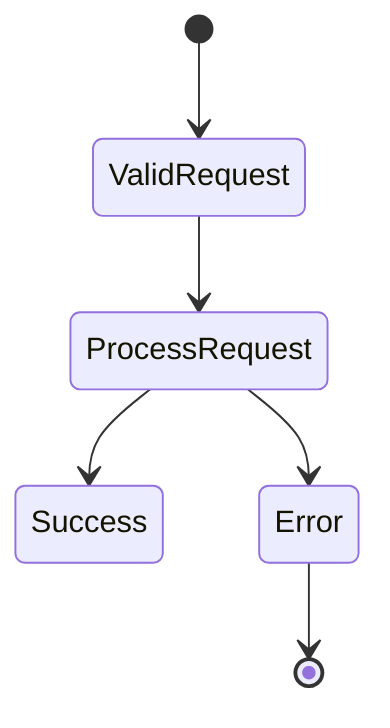
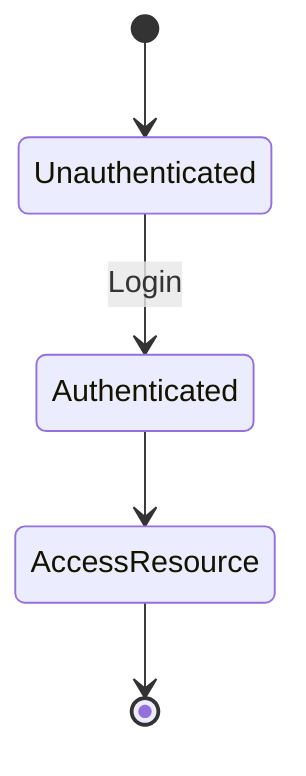

# Spring Controller Documentation

## 1. Controller Overview

### Controller Purpose
`KeywordController`는 키워드 관련 기능을 제공하는 RESTful API를 구현합니다. 이 컨트롤러는 키워드 생성, 키워드 목록 조회, 키워드에 기반한 여행 추천 기능을 포함합니다.

### Base URL Path
- `/api/keyword`

### Common Request Mappings
- `POST /api/keyword/trip/recommend`: 키워드에 기반한 여행 추천
- `GET /api/keyword`: 모든 키워드 조회
- `POST /api/keyword`: 새로운 키워드 생성
- `POST /api/keyword/trip`: 여행과 키워드의 관계 생성
- `GET /api/keyword/random/trip`: 랜덤 키워드에 기반한 여행 추천

### Authentication/Authorization Requirements
- 모든 엔드포인트는 `@Authentication` 어노테이션을 통해 인증된 사용자만 접근할 수 있습니다.

### Common Response Formats and Status Codes
- 성공적인 요청은 `200 OK`와 함께 JSON 형식의 응답을 반환합니다.
- 키워드 생성 및 여행 키워드 생성 요청은 `204 No Content`를 반환합니다.

---

## 2. Request Handling

### 2.1 recommendTripsByKeywords
- **HTTP Method**: `POST`
- **URL Path**: `/api/keyword/trip/recommend`
- **Request Body Format**: `TripsByKeyWordsRequest`
  - `keywordIds`: 키워드 ID 목록
- **Required Headers**: `Authentication` (사용자 인증 정보)
- **Expected Response Format**: `FindTripsResponse`
- **Possible Response Status Codes**:
  - `200 OK`: 요청 성공
  - `400 Bad Request`: 잘못된 요청 (예: 키워드 ID가 비어있음)
- **Error Handling and Validation**: 키워드 ID가 존재하지 않을 경우 `NoExistKeywordException` 발생

### 2.2 findAllKeywords
- **HTTP Method**: `GET`
- **URL Path**: `/api/keyword`
- **Request Body Format**: 없음
- **Required Headers**: `Authentication`
- **Expected Response Format**: `FindAllKeywordResponses`
- **Possible Response Status Codes**:
  - `200 OK`: 요청 성공
- **Error Handling and Validation**: 없음

### 2.3 createKeyword
- **HTTP Method**: `POST`
- **URL Path**: `/api/keyword`
- **Request Body Format**: `KeywordCreateRequest`
  - `keyword`: 생성할 키워드
- **Required Headers**: 없음
- **Expected Response Format**: 없음
- **Possible Response Status Codes**:
  - `204 No Content`: 요청 성공
- **Error Handling and Validation**: 없음

### 2.4 createTripKeyword
- **HTTP Method**: `POST`
- **URL Path**: `/api/keyword/trip`
- **Request Body Format**: `TripKeywordCreateRequest`
  - `tripId`: 여행 ID
  - `keywordId`: 키워드 ID
- **Required Headers**: 없음
- **Expected Response Format**: 없음
- **Possible Response Status Codes**:
  - `204 No Content`: 요청 성공
- **Error Handling and Validation**: 여행 또는 키워드가 존재하지 않을 경우 예외 발생

### 2.5 findTripsByRandomKeyword
- **HTTP Method**: `GET`
- **URL Path**: `/api/keyword/random/trip`
- **Request Body Format**: 없음
- **Required Headers**: 없음
- **Expected Response Format**: `FindTripsWithRandomKeywordResponse`
- **Possible Response Status Codes**:
  - `200 OK`: 요청 성공
- **Error Handling and Validation**: 없음

---

## 3. Detailed Component Documentation

### a. Controller Class: `KeywordController`
- **Class Name**: `KeywordController`
- **Purpose**: 키워드 관련 API 요청을 처리
- **Dependency Injections**: `KeywordService`를 주입받아 사용
- **Cross-Cutting Concerns**: 인증을 위한 `@Authentication` 어노테이션 사용
- **Security Annotations**: 모든 메서드에 `@Authentication` 적용
- **Exception Handling Strategies**: 서비스에서 발생하는 예외를 컨트롤러에서 처리하지 않고 서비스 레이어에서 처리

### b. Request/Response DTOs
- **Accessor**: 사용자 인증 정보를 담는 DTO
  - `id`: 사용자 ID
- **FindAllKeywordResponses**: 모든 키워드 응답 DTO
  - `findAllKeywordResponses`: 키워드 목록
- **FindTripsWithRandomKeywordResponse**: 랜덤 키워드에 기반한 여행 응답 DTO
  - `keywordName`: 키워드 이름
  - `findTripResponses`: 여행 응답 목록
- **KeywordCreateRequest**: 키워드 생성 요청 DTO
  - `keyword`: 생성할 키워드
- **TripsByKeyWordsRequest**: 키워드 ID 목록 요청 DTO
  - `keywordIds`: 키워드 ID 목록
- **TripKeywordCreateRequest**: 여행과 키워드 관계 생성 요청 DTO
  - `tripId`: 여행 ID
  - `keywordId`: 키워드 ID

---

## 4. Integration Points
- **Services**: `KeywordService`와 통신하여 비즈니스 로직을 수행
- **Repositories**: `KeywordRepository`, `TripRepository`, `TripKeywordRepository`와 상호작용하여 데이터베이스 작업 수행
- **External APIs**: 없음
- **Message Queues or Events**: 없음
- **Caching Mechanisms**: 없음

---

## 5. Implementation Flow

### Request Processing Pipeline

### Controller-Service-Repository Interaction

### Error Handling Flow

### Authentication/Authorization Flow

---

## 6. Testing Considerations
- **Key Test Scenarios**:
  - 키워드 생성 요청 테스트
  - 키워드 목록 조회 테스트
  - 키워드 기반 여행 추천 테스트
  - 랜덤 키워드 기반 여행 추천 테스트
- **Mocking Requirements**: 서비스 및 레포지토리 레이어를 모킹하여 단위 테스트 수행
- **Critical Edge Cases**:
  - 존재하지 않는 키워드 ID 요청
  - 비어 있는 키워드 ID 목록 요청
  - 중복 키워드 생성 요청

이 문서는 `KeywordController`의 기능과 사용 방법을 명확하게 이해하는 데 도움을 주기 위해 작성되었습니다.