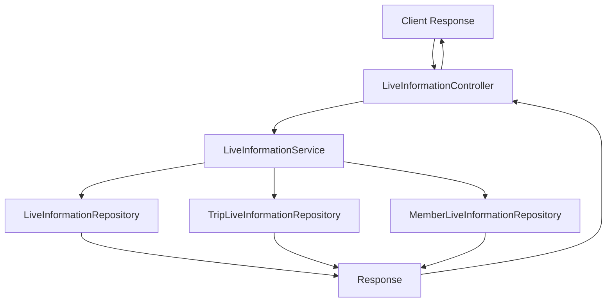
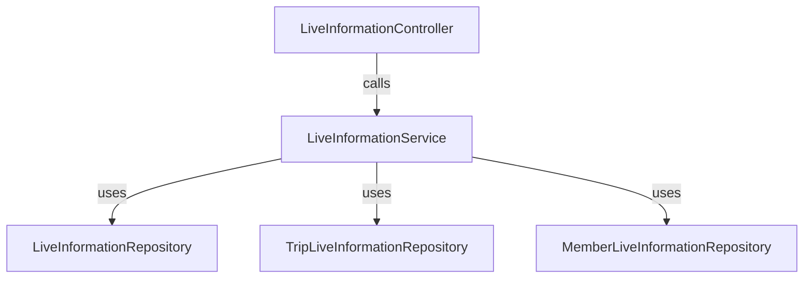
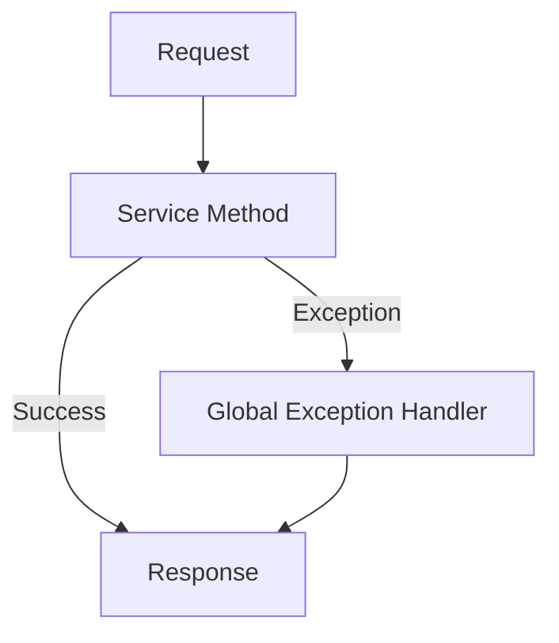
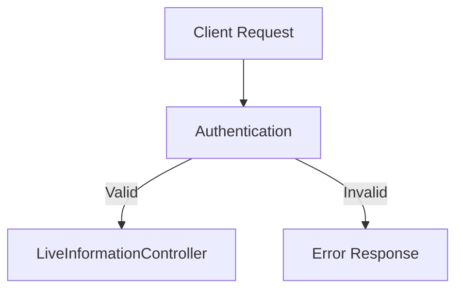

# Spring Controller Documentation

## 1. Controller Overview

### Controller Purpose
`LiveInformationController`는 생활정보와 관련된 REST API를 제공하는 컨트롤러입니다. 이 컨트롤러는 생활정보를 조회하고 생성하는 기능을 담당합니다.

### Base URL Path
- `/api/live/info`

### Common Request Mappings
- `GET /api/live/info/all`: 모든 생활정보 조회
- `POST /api/live/info`: 새로운 생활정보 생성
- `POST /api/live/info/trip/{tripId}/{liveInfoId}`: 특정 여행지에 생활정보 연결

### Authentication/Authorization Requirements
- 이 컨트롤러는 인증 및 권한 부여가 필요할 수 있으며, `@Authentication` 어노테이션을 통해 인증된 사용자 정보를 처리할 수 있습니다.

### Common Response Formats and Status Codes
- 성공적인 요청에 대한 응답은 JSON 형식이며, HTTP 상태 코드는 다음과 같습니다:
  - `200 OK`: 요청 성공
  - `204 No Content`: 요청 성공, 반환할 내용 없음
  - `404 Not Found`: 요청한 리소스가 존재하지 않음

## 2. Request Handling

### 2.1 `findAllLiveInformation()`
- **HTTP Method**: `GET`
- **URL Path**: `/api/live/info/all`
- **Request Body Format**: 없음
- **Expected Response Format**: `FindAllLiveInformationResponse`
- **Possible Response Status Codes**:
  - `200 OK`: 모든 생활정보가 성공적으로 조회됨
- **Error Handling and Validation**: 
  - 데이터베이스에서 생활정보를 찾지 못할 경우, `NoExistLiveInformationException` 예외가 발생할 수 있습니다.

### 2.2 `createLiveInformation()`
- **HTTP Method**: `POST`
- **URL Path**: `/api/live/info`
- **Request Body Format**: 
  ```json
  {
    "name": "생활정보 이름"
  }
  ```
- **Expected Response Format**: 없음
- **Possible Response Status Codes**:
  - `204 No Content`: 생활정보가 성공적으로 생성됨
- **Error Handling and Validation**: 
  - `LiveInfoNameException`이 발생할 수 있으며, 이는 이름의 길이가 유효하지 않을 때 발생합니다.

### 2.3 `createTripLiveInformation()`
- **HTTP Method**: `POST`
- **URL Path**: `/api/live/info/trip/{tripId}/{liveInfoId}`
- **Path Variables**:
  - `tripId`: 여행지 ID
  - `liveInfoId`: 생활정보 ID
- **Request Body Format**: 없음
- **Expected Response Format**: 없음
- **Possible Response Status Codes**:
  - `204 No Content`: 여행지와 생활정보가 성공적으로 연결됨
- **Error Handling and Validation**: 
  - `NoExistTripException` 및 `NoExistLiveInformationException`이 발생할 수 있습니다.

## 3. Detailed Component Documentation

### a. Controller Class
- **Class Name**: `LiveInformationController`
- **Purpose**: 생활정보 관련 API 요청을 처리
- **Dependency Injections**: 
  - `LiveInformationService`를 주입받아 사용
- **Cross-Cutting Concerns**: 
  - 로깅 및 예외 처리는 서비스 레이어에서 처리
- **Security Annotations**: 
  - `@Authentication` 어노테이션을 통해 인증된 사용자 정보를 처리할 수 있음
- **Exception Handling Strategies**: 
  - 서비스 레이어에서 발생하는 예외를 컨트롤러에서 처리하지 않고, 글로벌 예외 처리기를 통해 처리

### b. Request/Response DTOs
- **Accessor**: 사용자 ID를 포함하는 DTO
- **LiveInformationCreateRequest**: 새로운 생활정보 생성을 위한 요청 DTO
- **FindAllLiveInformationResponse**: 모든 생활정보의 응답 DTO
- **FindMemberLiveInformationResponses**: 특정 회원의 선택된 생활정보 응답 DTO
- **LiveInformationResponse**: 생활정보의 응답 DTO

## 4. Integration Points
- **Services**: 
  - `LiveInformationService`: 생활정보 관련 비즈니스 로직 처리
  - `MemberLiveInformationService`: 회원의 생활정보 관련 비즈니스 로직 처리
- **Repositories**: 
  - `LiveInformationRepository`: 생활정보 데이터베이스 접근
  - `TripLiveInformationRepository`: 여행지와 생활정보 연결 데이터베이스 접근
  - `MemberLiveInformationRepository`: 회원과 생활정보 연결 데이터베이스 접근
- **External APIs**: 없음
- **Message Queues or Events**: 없음
- **Caching Mechanisms**: 없음

## 5. Implementation Flow

### Request Processing Pipeline


### Controller-Service-Repository Interaction


### Error Handling Flow


### Authentication/Authorization Flow


## 6. Testing Considerations
- **Key Test Scenarios**:
  - 모든 생활정보 조회 테스트
  - 새로운 생활정보 생성 테스트
  - 여행지와 생활정보 연결 테스트
- **Mocking Requirements**:
  - 서비스 및 레포지토리 레이어에 대한 Mock 객체 필요
- **Critical Edge Cases**:
  - 존재하지 않는 ID로 요청 시 예외 처리
  - 유효하지 않은 요청 데이터 처리

이 문서는 `LiveInformationController`의 기능과 사용법을 명확히 이해하는 데 도움이 될 것입니다. 각 API 엔드포인트에 대한 예제와 curl 명령어를 추가하여 사용자가 쉽게 테스트할 수 있도록 할 수 있습니다.