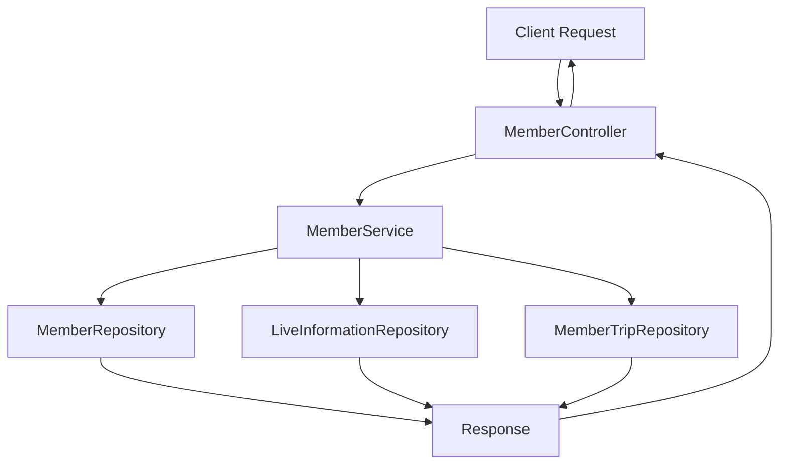
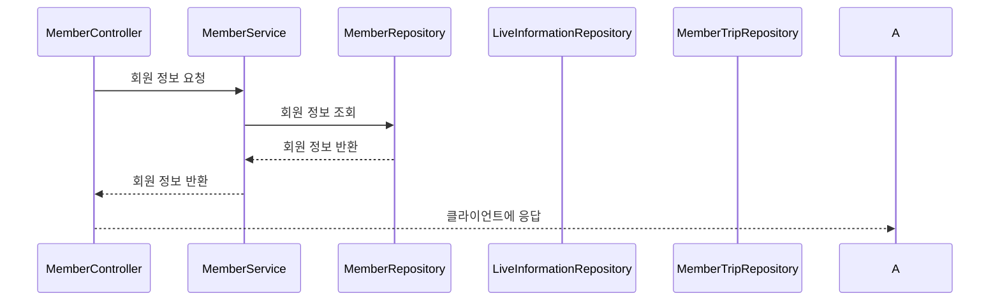
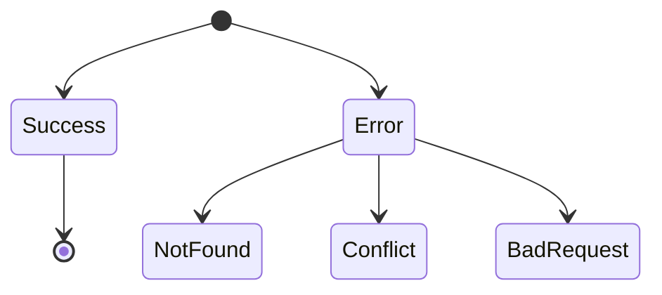

# Spring Controller Documentation

## 1. Controller Overview

### Purpose
`MemberController`는 회원 관련 API 엔드포인트를 제공하는 Spring REST Controller입니다. 이 컨트롤러는 회원의 프로필 조회, 회원 가입, 닉네임 중복 확인, 프로필 업데이트 등의 기능을 담당합니다.

### Base URL Path
- `/api/member`

### Common Request Mappings
- `GET /me`: 현재 사용자 정보 조회
- `POST /signup/profile`: 프로필로 회원 가입
- `POST /signup/liveinfo`: 생활 정보로 회원 가입
- `POST /signup/trip`: 관심 여행지로 회원 가입
- `POST /check/nickname`: 닉네임 중복 확인
- `PUT /profile`: 회원 프로필 업데이트
- `GET /authority/profile`: 회원 권한 및 프로필 이미지 조회

### Authentication/Authorization Requirements
- `@Authentication` 및 `@InitAuthentication` 어노테이션을 통해 인증된 사용자만 접근할 수 있는 엔드포인트입니다.

### Common Response Formats and Status Codes
- **200 OK**: 요청 성공
- **204 No Content**: 요청 성공, 반환할 내용 없음
- **400 Bad Request**: 잘못된 요청
- **404 Not Found**: 요청한 리소스가 존재하지 않음
- **409 Conflict**: 중복된 데이터 존재

---

## 2. Request Handling

### 2.1 `GET /me`
- **HTTP Method**: GET
- **URL Path**: `/me`
- **Request Body Format**: 없음
- **Required Headers**: 인증 헤더
- **Expected Response Format**: `MemberResponse`
- **Possible Response Status Codes**:
  - **200 OK**: 사용자 정보 반환
  - **404 Not Found**: 사용자 정보 없음

### 2.2 `POST /signup/profile`
- **HTTP Method**: POST
- **URL Path**: `/signup/profile`
- **Request Body Format**: `SignUpProfileRequest`
- **Required Headers**: 인증 헤더
- **Expected Response Format**: 없음
- **Possible Response Status Codes**:
  - **204 No Content**: 프로필로 회원 가입 성공
  - **404 Not Found**: 회원 정보 없음
  - **409 Conflict**: 중복된 닉네임

### 2.3 `POST /signup/liveinfo`
- **HTTP Method**: POST
- **URL Path**: `/signup/liveinfo`
- **Request Body Format**: `SignUpLiveInfoRequest`
- **Required Headers**: 인증 헤더
- **Expected Response Format**: 없음
- **Possible Response Status Codes**:
  - **204 No Content**: 생활 정보로 회원 가입 성공
  - **404 Not Found**: 회원 정보 없음

### 2.4 `POST /signup/trip`
- **HTTP Method**: POST
- **URL Path**: `/signup/trip`
- **Request Body Format**: `SignUpInterestTripsRequest`
- **Required Headers**: 인증 헤더
- **Expected Response Format**: 없음
- **Possible Response Status Codes**:
  - **204 No Content**: 관심 여행지로 회원 가입 성공
  - **404 Not Found**: 회원 정보 없음
  - **400 Bad Request**: 잘못된 요청

### 2.5 `POST /check/nickname`
- **HTTP Method**: POST
- **URL Path**: `/check/nickname`
- **Request Body Format**: `CheckDuplicateNicknameRequest`
- **Required Headers**: 인증 헤더
- **Expected Response Format**: `CheckDuplicateNicknameResponse`
- **Possible Response Status Codes**:
  - **200 OK**: 사용 가능한 닉네임
  - **409 Conflict**: 중복된 닉네임

### 2.6 `PUT /profile`
- **HTTP Method**: PUT
- **URL Path**: `/profile`
- **Request Body Format**: `UpdateProfileRequest`
- **Required Headers**: 인증 헤더
- **Expected Response Format**: 없음
- **Possible Response Status Codes**:
  - **204 No Content**: 프로필 업데이트 성공
  - **404 Not Found**: 회원 정보 없음
  - **409 Conflict**: 중복된 닉네임

### 2.7 `GET /authority/profile`
- **HTTP Method**: GET
- **URL Path**: `/authority/profile`
- **Request Body Format**: 없음
- **Required Headers**: 인증 헤더
- **Expected Response Format**: `FindMemberAuthorityAndProfileResponse`
- **Possible Response Status Codes**:
  - **200 OK**: 권한 및 프로필 이미지 반환
  - **404 Not Found**: 회원 정보 없음

---

## 3. Detailed Component Documentation

### a. Controller Class: `MemberController`
- **Class Name**: `MemberController`
- **Purpose**: 회원 관련 API 엔드포인트를 제공
- **Dependency Injections**: `MemberService`
- **Security Annotations**: `@Authentication`, `@InitAuthentication`
- **Exception Handling Strategies**: 각 서비스 메서드에서 발생하는 예외를 통해 적절한 HTTP 상태 코드 반환

### b. Request/Response DTOs
- **Accessor**: 사용자 ID를 포함하는 DTO
- **SignUpProfileRequest**: 프로필 가입 요청 DTO
- **SignUpLiveInfoRequest**: 생활 정보 가입 요청 DTO
- **SignUpInterestTripsRequest**: 관심 여행지 가입 요청 DTO
- **CheckDuplicateNicknameResponse**: 닉네임 중복 확인 응답 DTO
- **FindMemberAuthorityAndProfileResponse**: 회원 권한 및 프로필 이미지 응답 DTO
- **MemberResponse**: 회원 정보 응답 DTO

---

## 4. Integration Points
- **Services**: `MemberService`와 통신하여 회원 관련 비즈니스 로직 처리
- **Repositories**: `MemberRepository`, `LiveInformationRepository`, `MemberTripRepository`와 통신하여 데이터베이스 접근
- **External APIs**: 필요 시 외부 API와의 통신 (예: 여행 정보 API)
- **Caching Mechanisms**: 필요 시 캐싱 전략 적용 가능

---

## 5. Implementation Flow

### Request Processing Pipeline

### Controller-Service-Repository Interaction

### Error Handling Flow

---

## 6. Testing Considerations
- **Key Test Scenarios**:
  - 정상적인 회원 가입 및 프로필 업데이트
  - 중복 닉네임 확인
  - 잘못된 요청 처리 (예: 잘못된 데이터 형식)
- **Mocking Requirements**: 서비스 및 레포지토리 메서드에 대한 Mocking 필요
- **Critical Edge Cases**: 
  - 최대 및 최소 관심 여행지 수
  - 중복된 닉네임 처리
  - 존재하지 않는 회원 ID 처리

---

이 문서는 `MemberController`의 기능과 사용법을 명확히 이해하는 데 도움을 주기 위해 작성되었습니다. 각 엔드포인트에 대한 자세한 설명과 예외 처리 방법을 포함하여, 개발자들이 API를 효과적으로 사용할 수 있도록 안내합니다.