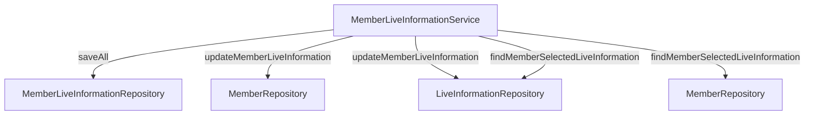

# MemberLiveInformationService 문서

## 1. 서비스 개요

### 서비스 목적
`MemberLiveInformationService`는 회원의 생활 정보를 관리하는 서비스입니다. 이 서비스는 회원이 선택한 생활 정보를 저장하고 업데이트하며, 특정 회원의 선택된 생활 정보를 조회하는 기능을 제공합니다.

### 주요 비즈니스 작업
- 회원의 생활 정보 저장
- 회원의 생활 정보 업데이트
- 특정 회원의 선택된 생활 정보 조회

### 공개 메서드
- `void saveAll(List<MemberLiveInformation> memberLiveInformations)`
- `void updateMemberLiveInformation(long memberId, UpdateMemberLiveInformationRequest request)`
- `FindMemberLiveInformationResponses findMemberSelectedLiveInformation(Long memberId)`
- `List<Long> findMemberLiveInfoIds(Long memberId)`

### 트랜잭션 요구 사항
- `updateMemberLiveInformation` 메서드는 트랜잭션을 사용하여 데이터의 일관성을 보장합니다.

### 일반적인 오류 시나리오 및 처리 접근 방식
- 존재하지 않는 회원 조회 시 `NoExistMemberException` 발생
- 존재하지 않는 생활 정보 조회 시 `NoExistLiveInformationException` 발생

---

## 2. 비즈니스 로직 처리

### 2.1. saveAll
- **메서드 시그니처**: `void saveAll(final List<MemberLiveInformation> memberLiveInformations)`
- **목적**: 회원의 생활 정보를 일괄 저장합니다.
- **입력 매개변수**: 
  - `memberLiveInformations`: 저장할 `MemberLiveInformation` 객체의 리스트
- **예상 반환 값**: 없음
- **트랜잭션 경계**: 없음
- **비즈니스 규칙**: 없음
- **오류 시나리오 및 처리 전략**: 없음
- **사용 코드 예제**:
  ```java
  memberLiveInformationService.saveAll(memberLiveInfoList);
  ```

### 2.2. updateMemberLiveInformation
- **메서드 시그니처**: `void updateMemberLiveInformation(final long memberId, final UpdateMemberLiveInformationRequest request)`
- **목적**: 특정 회원의 생활 정보를 업데이트합니다.
- **입력 매개변수**:
  - `memberId`: 업데이트할 회원의 ID
  - `request`: 업데이트 요청 데이터
- **예상 반환 값**: 없음
- **트랜잭션 경계**: 메서드 전체가 트랜잭션으로 처리됨
- **비즈니스 규칙**: 
  - 회원이 존재해야 하며, 요청된 모든 생활 정보가 존재해야 함
- **오류 시나리오 및 처리 전략**:
  - 존재하지 않는 회원: `NoExistMemberException`
  - 일부 생활 정보가 존재하지 않음: `NoExistLiveInformationException`
- **사용 코드 예제**:
  ```java
  memberLiveInformationService.updateMemberLiveInformation(memberId, request);
  ```

### 2.3. findMemberSelectedLiveInformation
- **메서드 시그니처**: `FindMemberLiveInformationResponses findMemberSelectedLiveInformation(final Long memberId)`
- **목적**: 특정 회원이 선택한 생활 정보를 조회합니다.
- **입력 매개변수**: 
  - `memberId`: 조회할 회원의 ID
- **예상 반환 값**: `FindMemberLiveInformationResponses` 객체
- **트랜잭션 경계**: 없음
- **비즈니스 규칙**: 회원이 존재해야 함
- **오류 시나리오 및 처리 전략**: 
  - 존재하지 않는 회원: `NoExistMemberException`
- **사용 코드 예제**:
  ```java
  FindMemberLiveInformationResponses responses = memberLiveInformationService.findMemberSelectedLiveInformation(memberId);
  ```

### 2.4. findMemberLiveInfoIds
- **메서드 시그니처**: `List<Long> findMemberLiveInfoIds(final Long memberId)`
- **목적**: 특정 회원의 생활 정보 ID 리스트를 조회합니다.
- **입력 매개변수**: 
  - `memberId`: 조회할 회원의 ID
- **예상 반환 값**: `List<Long>` (회원의 생활 정보 ID 리스트)
- **트랜잭션 경계**: 없음
- **비즈니스 규칙**: 없음
- **오류 시나리오 및 처리 전략**: 없음
- **사용 코드 예제**:
  ```java
  List<Long> liveInfoIds = memberLiveInformationService.findMemberLiveInfoIds(memberId);
  ```

---

## 3. 상세 구성 요소 문서화

### a. 서비스 클래스
- **클래스 이름**: `MemberLiveInformationService`
- **비즈니스 목적**: 회원의 생활 정보를 관리하는 서비스
- **의존성 주입**:
  - `MemberLiveInformationRepository`
  - `LiveInformationRepository`
  - `MemberRepository`
- **트랜잭션 관리 구성**: `@Transactional` 어노테이션을 사용하여 트랜잭션 관리
- **예외 처리 전략**: 특정 예외 발생 시 사용자 정의 예외를 던짐
- **유효성 검사 접근 방식**: 메서드 내에서 직접 유효성 검사 수행

### b. 비즈니스 DTO
- **UpdateMemberLiveInformationRequest**:
  - **필드 설명**: 생활 정보 ID 리스트
  - **유효성 검사 제약 조건**: ID 리스트가 비어있지 않아야 함
- **FindMemberLiveInformationResponses**:
  - **필드 설명**: 선택된 생활 정보 리스트
- **LiveInfoResponse**:
  - **필드 설명**: 생활 정보 ID, 이름, 선택 여부

---

## 4. 통합 지점
- **리포지토리 및 데이터베이스 작업**: 
  - `MemberLiveInformationRepository`, `LiveInformationRepository`, `MemberRepository`와의 상호작용
- **다른 서비스**: 없음
- **외부 시스템**: 없음
- **이벤트 게시/처리**: 없음

---

## 5. 구현 흐름

### 다이어그램


### 비즈니스 로직 처리 파이프라인
1. `updateMemberLiveInformation` 호출
2. 회원 존재 여부 확인
3. 생활 정보 존재 여부 확인
4. 기존 생활 정보 삭제
5. 새로운 생활 정보 저장

### 오류 처리 흐름
- 회원 또는 생활 정보가 존재하지 않을 경우 예외 발생

### 트랜잭션 경계
- `updateMemberLiveInformation` 메서드 내에서 트랜잭션 관리

---

## 6. 테스트 고려사항
- **주요 테스트 시나리오**:
  - 정상적인 생활 정보 저장 및 업데이트
  - 존재하지 않는 회원으로 인한 예외 처리
  - 존재하지 않는 생활 정보로 인한 예외 처리
- **모킹 요구 사항**: 
  - 리포지토리 메서드 모킹
- **중요한 비즈니스 엣지 케이스**:
  - 비어 있는 생활 정보 ID 리스트
  - 중복된 생활 정보 ID 처리

--- 

이 문서는 `MemberLiveInformationService`의 구조와 기능을 명확하게 이해하는 데 도움이 됩니다. 각 메서드와 구성 요소에 대한 세부 정보를 제공하여 개발자들이 이 서비스를 효과적으로 사용할 수 있도록 합니다.