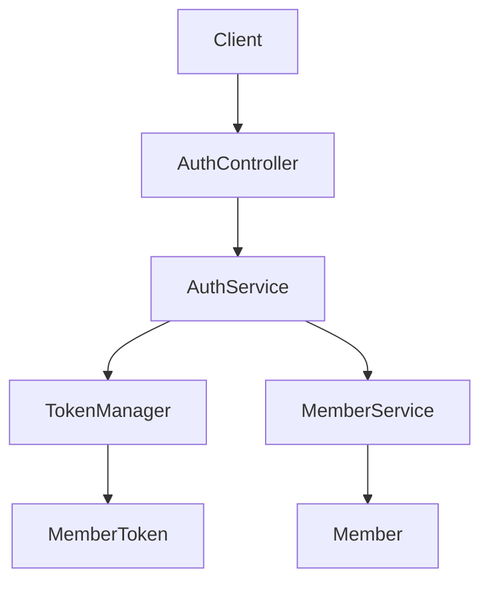
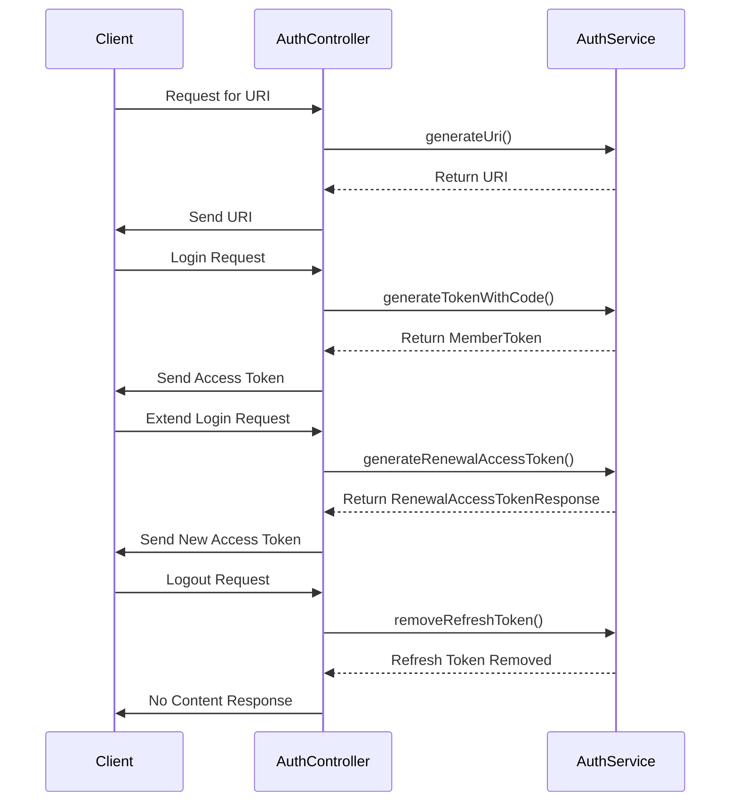

아래는 제공된 Java 코드에 대한 아키텍처 문서입니다. 이 문서는 시스템의 구조와 각 컴포넌트의 역할을 설명합니다.

# 시스템 아키텍처 문서

## 전체 구조

## 시스템 흐름

## 주요 컴포넌트 설명

### AuthController
- **역할과 책임**: 클라이언트의 요청을 처리하고, 서비스 계층과의 상호작용을 통해 인증 관련 작업을 수행합니다.
- **주요 메서드**:
  - `generateUri()`: OAuth 제공자로부터 인증 URI를 생성합니다.
  - `login()`: OAuth 인증 코드를 사용하여 로그인하고, 액세스 토큰을 생성합니다.
  - `extendLogin()`: 기존의 리프레시 토큰을 사용하여 새로운 액세스 토큰을 생성합니다.
  - `logout()`: 리프레시 토큰을 제거하여 로그아웃을 처리합니다.

### AuthService
- **역할과 책임**: 인증 관련 비즈니스 로직을 처리합니다. OAuth 제공자와의 상호작용, 멤버 생성 및 토큰 관리를 담당합니다.
- **주요 메서드**:
  - `generateTokenWithCode()`: OAuth 인증 코드를 사용하여 멤버 토큰을 생성합니다.
  - `generateUri()`: OAuth 제공자로부터 URI를 생성합니다.
  - `generateRenewalAccessToken()`: 리프레시 토큰을 사용하여 새로운 액세스 토큰을 생성합니다.
  - `removeRefreshToken()`: 로그아웃 시 리프레시 토큰을 제거합니다.
  - `extractMemberId()`: 액세스 토큰에서 멤버 ID를 추출합니다.

### TokenManager
- **역할과 책임**: 토큰 생성 및 검증을 담당합니다. 액세스 토큰과 리프레시 토큰의 생성 및 관리 기능을 제공합니다.

### MemberService
- **역할과 책임**: 멤버 관련 데이터의 CRUD 작업을 처리합니다. 멤버의 존재 여부를 확인하고, 새로운 멤버를 생성합니다.

### MemberToken
- **역할과 책임**: 액세스 토큰과 리프레시 토큰을 포함하는 데이터 구조입니다. 인증 과정에서 생성된 토큰 정보를 저장합니다.

## 주의사항
1. 각 컴포넌트의 역할과 책임을 명확히 이해하고, 필요 시 추가적인 설명을 덧붙이세요.
2. 시스템의 흐름을 시퀀스 다이어그램으로 표현하여 클라이언트와 서버 간의 상호작용을 명확히 하세요.
3. 각 메서드의 기능과 사용 예를 문서화하여 개발자들이 쉽게 이해할 수 있도록 하세요.
