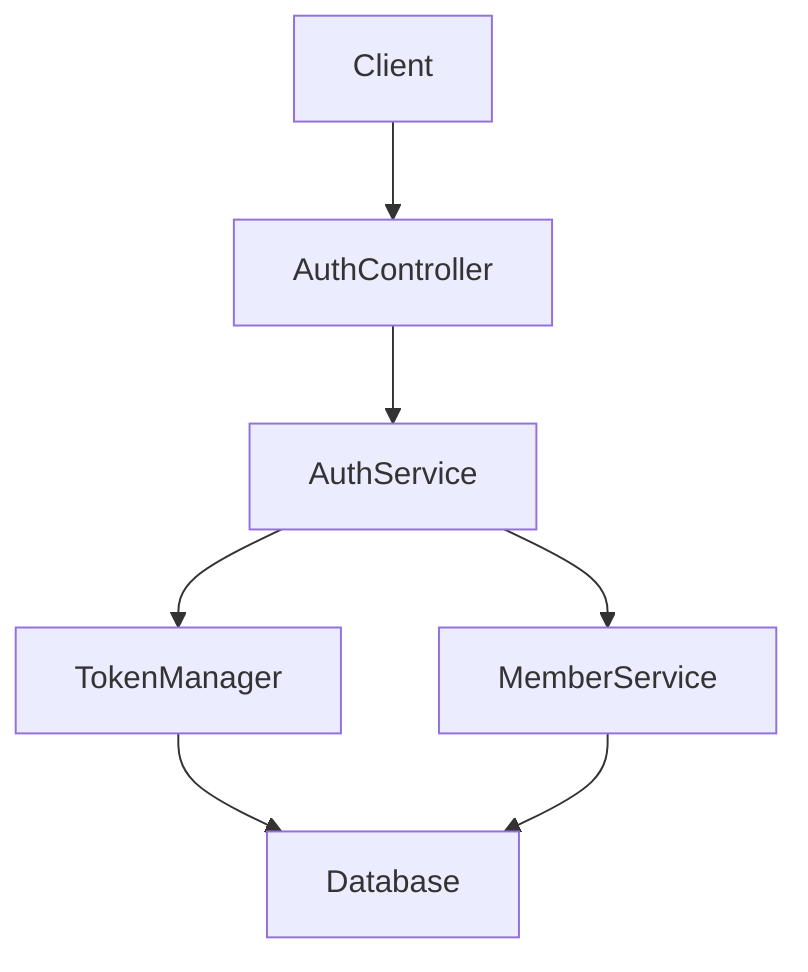
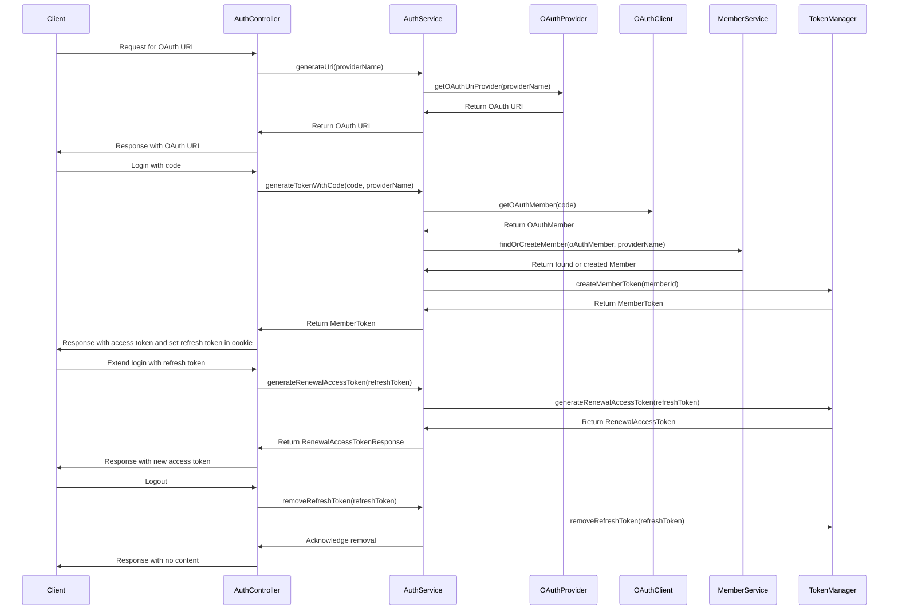

# 시스템 아키텍처 문서

## 전체 구조


## 시스템 흐름


## 주요 컴포넌트 설명

### AuthController
- 역할과 책임: 클라이언트의 인증 요청을 처리하고, AuthService와 상호작용하여 인증 관련 작업을 수행합니다.
- 주요 엔드포인트:
  - `GET /api/auth/{oAuthProvider}/link`: OAuth URI 생성
  - `POST /api/auth/{oAuthProvider}/login`: 로그인 처리
  - `POST /api/auth/extend/login`: 액세스 토큰 연장
  - `DELETE /api/auth/logout`: 로그아웃 처리

### AuthService
- 비즈니스 로직을 처리하며, OAuthProvider와 MemberService, TokenManager와 상호작용합니다.
- 주요 메서드:
  - `generateTokenWithCode`: OAuth 코드를 사용하여 토큰 생성
  - `generateUri`: OAuth URI 생성
  - `generateRenewalAccessToken`: 리프레시 토큰을 사용하여 액세스 토큰 연장
  - `removeRefreshToken`: 로그아웃 시 리프레시 토큰 제거

### TokenManager
- 토큰 생성 및 관리 기능을 제공합니다.
- 주요 메서드:
  - `createMemberToken`: 멤버 ID로부터 멤버 토큰 생성
  - `generateRenewalAccessToken`: 리프레시 토큰으로부터 새로운 액세스 토큰 생성
  - `removeRefreshToken`: 리프레시 토큰 제거

### MemberService
- 멤버 관련 데이터 접근 및 관리 기능을 제공합니다.
- 주요 메서드:
  - `existsByEmail`: 이메일로 멤버 존재 여부 확인
  - `save`: 새로운 멤버 저장
  - `findByEmail`: 이메일로 멤버 조회

## API 엔드포인트

### OAuth URI 생성
**GET** `/api/auth/{oAuthProvider}/link`

#### 설명
주어진 OAuth 제공자에 대한 인증 URI를 생성합니다.

#### 요청
##### Parameters
| 이름         | 타입   | 필수 여부 | 설명                     |
|--------------|--------|-----------|--------------------------|
| oAuthProvider| string | Required  | OAuth 제공자 이름       |

#### 응답
##### Success Response
- Status: 200 OK
```json
{
    "uri": "https://example.com/oauth/authorize"
}
```

### 로그인
**POST** `/api/auth/{oAuthProvider}/login`

#### 설명
OAuth 코드를 사용하여 로그인하고, 액세스 토큰 및 리프레시 토큰을 생성합니다.

#### 요청
##### Parameters
| 이름         | 타입   | 필수 여부 | 설명                     |
|--------------|--------|-----------|--------------------------|
| oAuthProvider| string | Required  | OAuth 제공자 이름       |

##### Request Body
```json
{
    "code": "authorization_code"
}
```

#### 응답
##### Success Response
- Status: 201 Created
```json
{
    "accessToken": "access_token_value"
}
```

### 액세스 토큰 연장
**POST** `/api/auth/extend/login`

#### 설명
리프레시 토큰을 사용하여 새로운 액세스 토큰을 생성합니다.

#### 요청
##### Request Body
```json
{
    "refreshToken": "refresh_token_value"
}
```

#### 응답
##### Success Response
- Status: 201 Created
```json
{
    "accessToken": "new_access_token_value"
}
```

### 로그아웃
**DELETE** `/api/auth/logout`

#### 설명
로그아웃 요청을 처리하고 리프레시 토큰을 제거합니다.

#### 요청
##### Request Body
```json
{
    "refreshToken": "refresh_token_value"
}
```

#### 응답
##### Success Response
- Status: 204 No Content
```json
{}
```

## 오류 응답 상태 코드
- **400 Bad Request**: 잘못된 요청 형식
- **401 Unauthorized**: 인증 실패
- **404 Not Found**: 요청한 리소스가 존재하지 않음
- **500 Internal Server Error**: 서버 오류

## 인증 및 권한
- 모든 API 엔드포인트는 적절한 인증이 필요합니다. 리프레시 토큰은 쿠키를 통해 전달되어야 하며, 액세스 토큰은 요청 헤더에 포함되어야 합니다.
