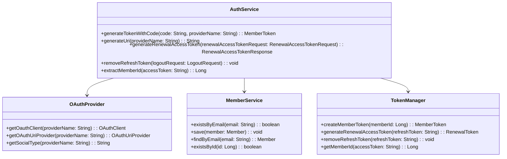
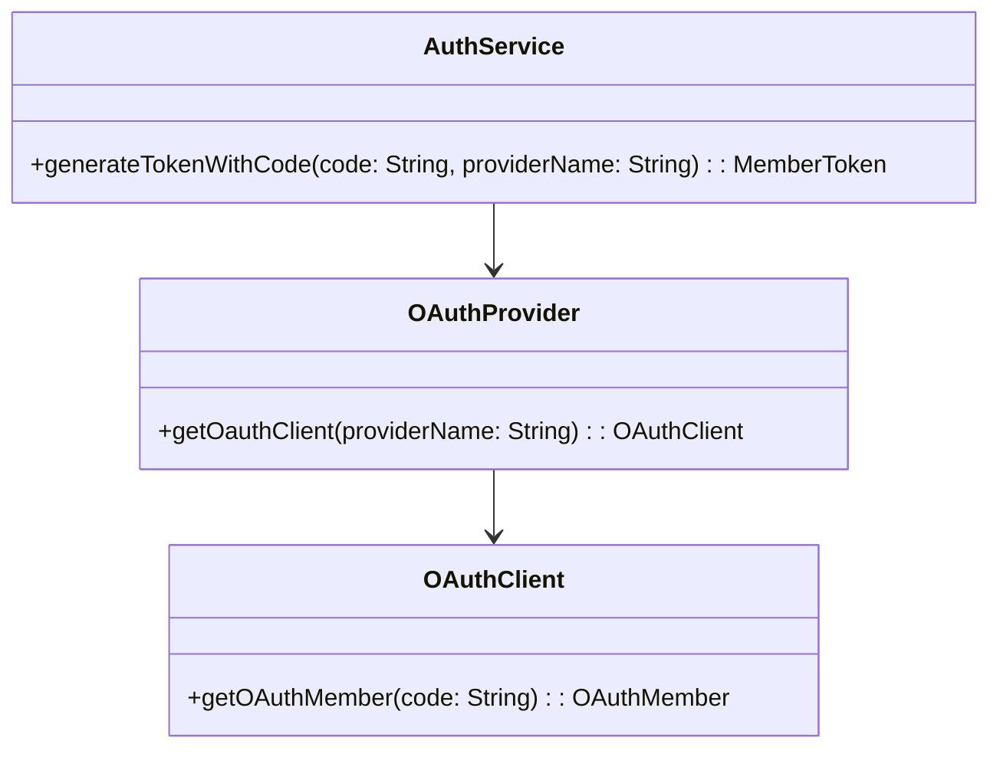
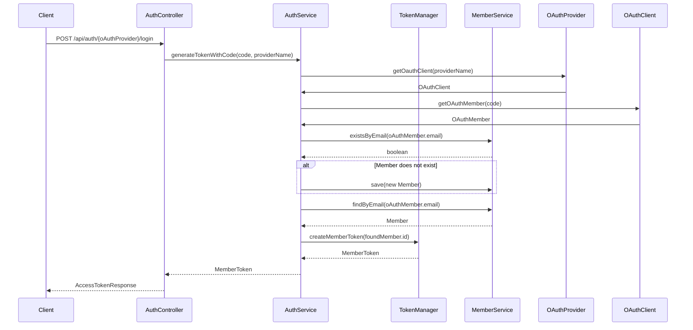

# Comprehensive Documentation for `moheng.auth.application.AuthService`

## 1. Overall Structure

### High-Level Overview
The `AuthService` class is part of the authentication module of the application, responsible for managing user authentication through OAuth providers. It interacts with various domain classes and services to generate tokens, manage user sessions, and handle user data.

### Purpose and Function
The primary function of the `AuthService` is to facilitate the authentication process by generating access tokens based on OAuth codes, managing user sessions with refresh tokens, and providing utility methods for user management.

### Interaction Between Components
- **AuthService** interacts with:
  - **OAuthProvider**: To retrieve OAuth clients and URI providers.
  - **MemberService**: To manage member data, including checking existence and saving new members.
  - **TokenManager**: To create and manage tokens for authenticated users.

### Mermaid Diagram


## 2. Strategy Pattern Implementation

### Strategy Pattern Overview
The strategy pattern is used in this codebase to encapsulate different authentication strategies (OAuth providers) and allow the `AuthService` to interact with them without needing to know the specifics of each provider.

### Strategy Interface and Concrete Strategy Classes
- **Strategy Interface**: `OAuthClient`
  - Defines methods for interacting with OAuth providers.
  
- **Concrete Strategy Classes**: Implementations of `OAuthClient` for each OAuth provider (not shown in the provided code).

### Context Class
- **Context Class**: `AuthService`
  - Uses the `OAuthProvider` to obtain the appropriate `OAuthClient` based on the provider name.

### Class Diagram


## 3. Detailed Component Documentation

### a. Classes

#### 1. Class: `AuthService`
- **Purpose**: Manages authentication processes, including token generation and user management.
- **Attributes**:
  - `OAuthProvider oAuthProvider`: Provides OAuth client instances.
  - `MemberService memberService`: Manages member data.
  - `TokenManager tokenManager`: Handles token creation and validation.
- **Role**: Central service for authentication, coordinating between OAuth providers and member management.

#### 2. Class: `MemberToken`
- **Purpose**: Represents a token pair (access and refresh tokens).
- **Attributes**:
  - `String accessToken`: The access token for authenticated requests.
  - `String refreshToken`: The refresh token for renewing access tokens.
- **Role**: Encapsulates token data for easy management and transfer.

### b. Methods and Functions

#### 1. Method: `generateTokenWithCode`
- **Purpose**: Generates a member token using an OAuth code.
- **Parameters**:
  - `String code`: The OAuth code received from the provider.
  - `String providerName`: The name of the OAuth provider.
- **Return Value**: `MemberToken`: The generated member token.
- **Code Example**:
  ```java
  MemberToken token = authService.generateTokenWithCode("oauth_code", "google");
  ```

#### 2. Method: `generateUri`
- **Purpose**: Generates the OAuth URI for a given provider.
- **Parameters**:
  - `String providerName`: The name of the OAuth provider.
- **Return Value**: `String`: The generated OAuth URI.
- **Code Example**:
  ```java
  String uri = authService.generateUri("google");
  ```

#### 3. Method: `generateRenewalAccessToken`
- **Purpose**: Generates a new access token using a refresh token.
- **Parameters**:
  - `RenewalAccessTokenRequest renewalAccessTokenRequest`: Contains the refresh token.
- **Return Value**: `RenewalAccessTokenResponse`: Contains the new access token.
- **Code Example**:
  ```java
  RenewalAccessTokenResponse response = authService.generateRenewalAccessToken(new RenewalAccessTokenRequest("refresh_token"));
  ```

#### 4. Method: `removeRefreshToken`
- **Purpose**: Removes the refresh token associated with a logout request.
- **Parameters**:
  - `LogoutRequest logoutRequest`: Contains the refresh token to be removed.
- **Return Value**: `void`
- **Code Example**:
  ```java
  authService.removeRefreshToken(new LogoutRequest("refresh_token"));
  ```

#### 5. Method: `extractMemberId`
- **Purpose**: Extracts the member ID from an access token.
- **Parameters**:
  - `String accessToken`: The access token to extract the member ID from.
- **Return Value**: `Long`: The extracted member ID.
- **Code Example**:
  ```java
  Long memberId = authService.extractMemberId("access_token");
  ```

## 4. Implementation Flow

### Sequence Diagram


This documentation provides a comprehensive overview of the `AuthService` class, its interactions, and its components, facilitating understanding for both new and experienced developers.