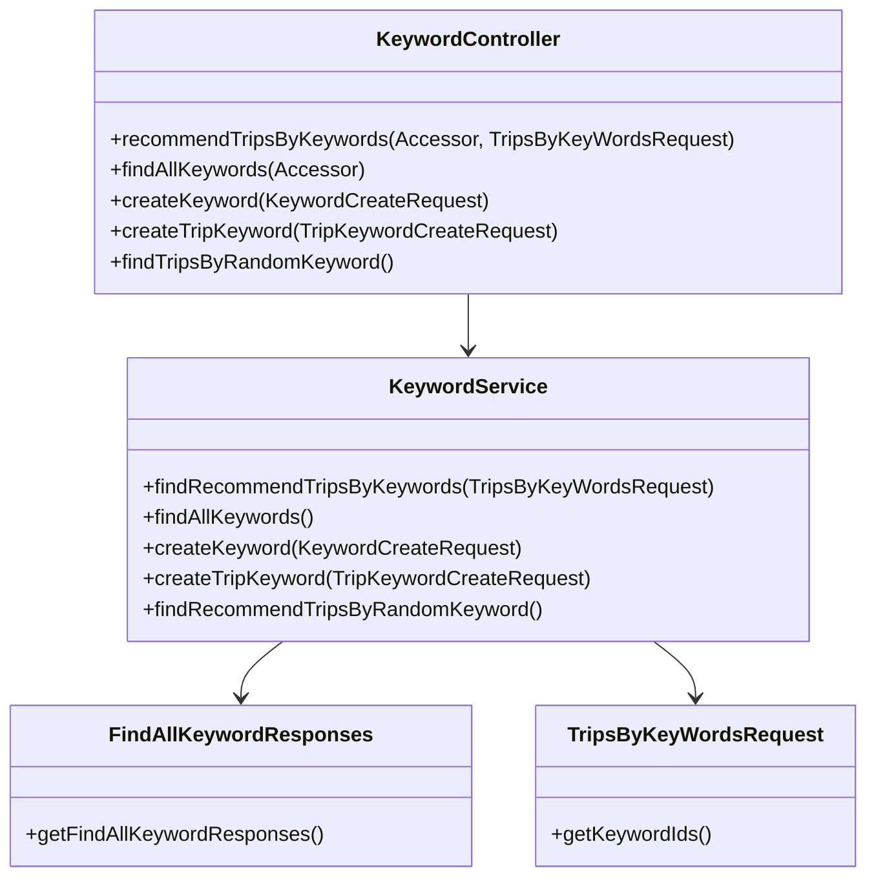
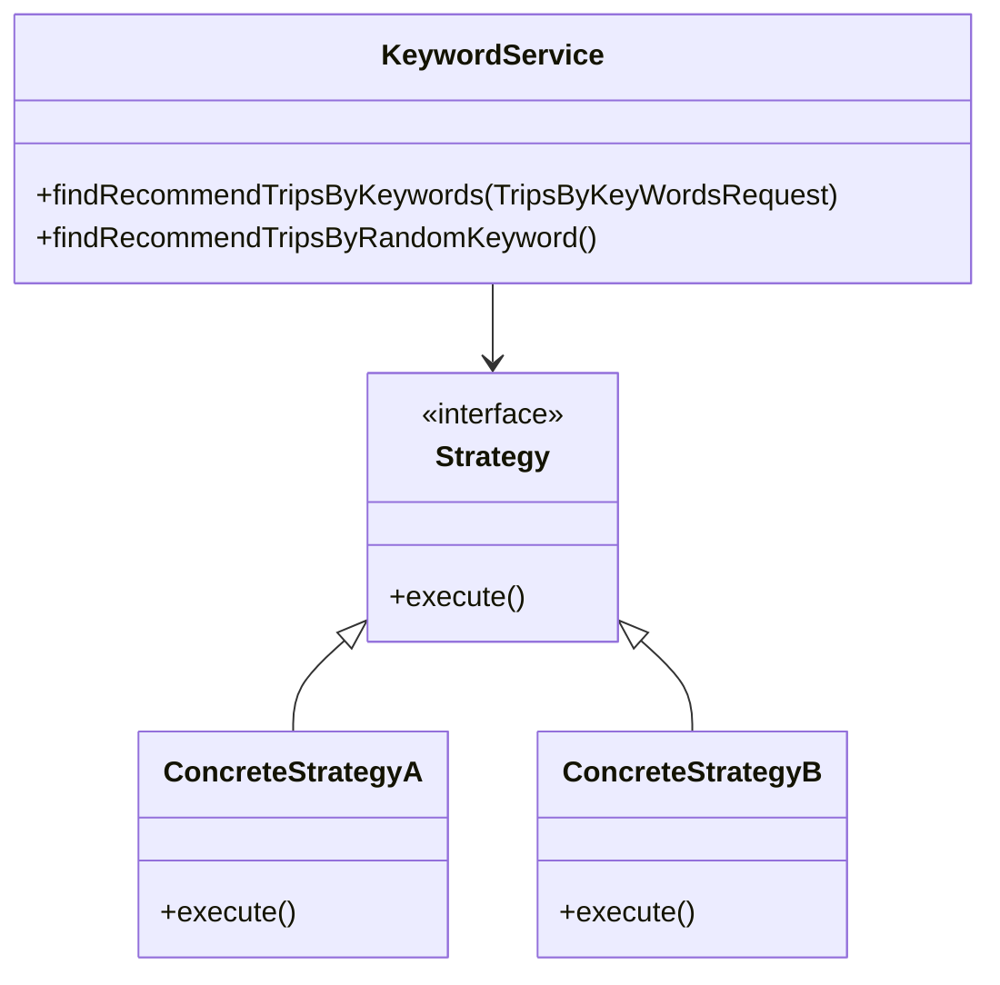
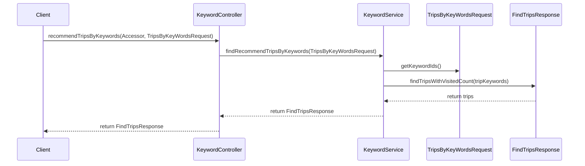

# Comprehensive Documentation for the Keyword Service Codebase

## 1. Overall Structure

### High-Level Overview
The codebase is structured around a keyword management system that allows users to create keywords, associate them with trips, and retrieve trips based on keywords. The main components include DTOs (Data Transfer Objects), services, and controllers that handle the business logic and HTTP requests.

### Purpose and Function of Service Code
The `KeywordService` class is responsible for managing keywords and their associations with trips. It provides methods to create keywords, retrieve all keywords, find trips by keywords, and recommend trips based on random keywords.

### Interaction Between Components
- **DTOs**: Classes like `FindAllKeywordResponses`, `KeywordCreateRequest`, and `TripsByKeyWordsRequest` are used to transfer data between the client and the server.
- **Service**: The `KeywordService` contains the business logic for handling keywords and trips.
- **Controller**: The `KeywordController` handles HTTP requests and responses, delegating the actual processing to the `KeywordService`.

### Mermaid Diagram

## 2. Strategy Pattern Implementation

### Strategy Pattern Overview
The strategy pattern is not explicitly implemented in the provided codebase. However, the `KeywordService` can be seen as a context that uses various strategies for handling keywords and trips, such as finding trips by keywords or generating random keywords.

### Context Class
- **KeywordService**: This class acts as the context that utilizes different strategies for managing keywords and trips.

### Class Diagram

## 3. Detailed Component Documentation

### a. Classes

#### 1. Accessor
- **Purpose**: Represents an accessor with an ID.
- **Attributes**:
  - `Long id`: Unique identifier for the accessor.
- **Role**: Used for authentication purposes in the controller.
- **Relationships**: None.

#### 2. FindAllKeywordResponses
- **Purpose**: Encapsulates a list of keyword responses.
- **Attributes**:
  - `List<FindAllKeywordResponse> findAllKeywordResponses`: List of keyword responses.
- **Role**: Used to return all keywords from the service.
- **Relationships**: None.

#### 3. FindTripsWithRandomKeywordResponse
- **Purpose**: Represents the response containing trips associated with a random keyword.
- **Attributes**:
  - `String keywordName`: Name of the keyword.
  - `List<FindTripResponse> findTripResponses`: List of trip responses.
- **Role**: Used to return trips associated with a randomly generated keyword.
- **Relationships**: None.

#### 4. KeywordCreateRequest
- **Purpose**: Represents a request to create a new keyword.
- **Attributes**:
  - `String keyword`: The keyword to be created.
- **Role**: Used to transfer keyword creation data to the service.
- **Relationships**: None.

#### 5. TripsByKeyWordsRequest
- **Purpose**: Represents a request to find trips by keyword IDs.
- **Attributes**:
  - `List<Long> keywordIds`: List of keyword IDs.
- **Role**: Used to transfer keyword IDs for trip retrieval.
- **Relationships**: None.

#### 6. KeywordService
- **Purpose**: Manages keywords and their associations with trips.
- **Attributes**:
  - Various repositories and services for handling keywords and trips.
- **Role**: Contains business logic for keyword management.
- **Relationships**: Interacts with repositories and DTOs.

### b. Methods and Functions

#### 1. Accessor
- **getId()**
  - **Purpose**: Returns the ID of the accessor.
  - **Parameters**: None.
  - **Return Value**: `Long` - ID of the accessor.
  
#### 2. FindAllKeywordResponses
- **getFindAllKeywordResponses()**
  - **Purpose**: Returns the list of keyword responses.
  - **Parameters**: None.
  - **Return Value**: `List<FindAllKeywordResponse>` - List of keyword responses.

#### 3. FindTripsWithRandomKeywordResponse
- **getKeywordName()**
  - **Purpose**: Returns the name of the keyword.
  - **Parameters**: None.
  - **Return Value**: `String` - Name of the keyword.

- **getFindTripResponses()**
  - **Purpose**: Returns the list of trip responses.
  - **Parameters**: None.
  - **Return Value**: `List<FindTripResponse>` - List of trip responses.

#### 4. KeywordCreateRequest
- **getKeyword()**
  - **Purpose**: Returns the keyword to be created.
  - **Parameters**: None.
  - **Return Value**: `String` - The keyword.

#### 5. TripsByKeyWordsRequest
- **getKeywordIds()**
  - **Purpose**: Returns the list of keyword IDs.
  - **Parameters**: None.
  - **Return Value**: `List<Long>` - List of keyword IDs.

#### 6. KeywordService
- **findAllKeywords()**
  - **Purpose**: Retrieves all keywords.
  - **Parameters**: None.
  - **Return Value**: `FindAllKeywordResponses` - Response containing all keywords.

- **createKeyword(KeywordCreateRequest request)**
  - **Purpose**: Creates a new keyword.
  - **Parameters**: `KeywordCreateRequest request` - Request containing keyword data.
  - **Return Value**: `void`.

- **findRecommendTripsByKeywords(TripsByKeyWordsRequest request)**
  - **Purpose**: Finds recommended trips based on keyword IDs.
  - **Parameters**: `TripsByKeyWordsRequest request` - Request containing keyword IDs.
  - **Return Value**: `FindTripsResponse` - Response containing recommended trips.

- **findRecommendTripsByRandomKeyword()**
  - **Purpose**: Finds recommended trips based on a random keyword.
  - **Parameters**: None.
  - **Return Value**: `FindTripsWithRandomKeywordResponse` - Response containing trips associated with a random keyword.

### 4. Implementation Flow

### Sequence Diagram

This documentation provides a comprehensive overview of the keyword service codebase, detailing its structure, strategy pattern implementation, component documentation, and implementation flow. It serves as a guide for both new and experienced developers to understand and work with the code effectively.