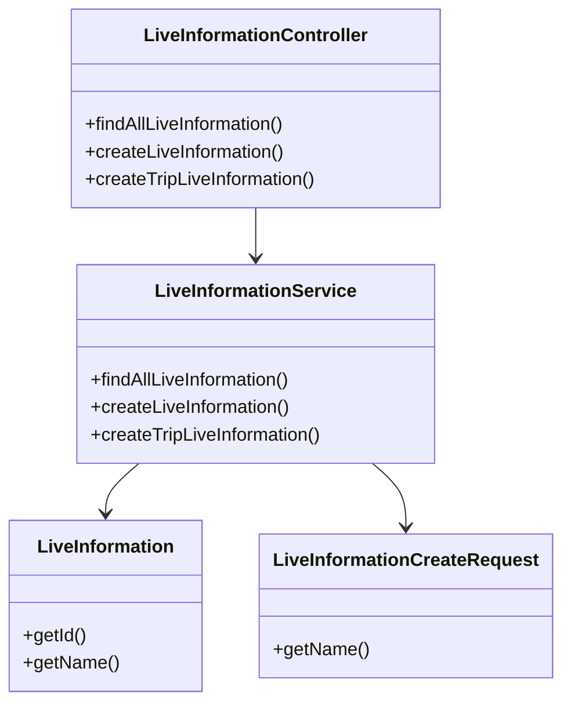
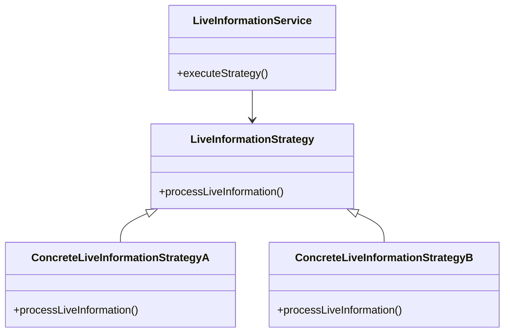
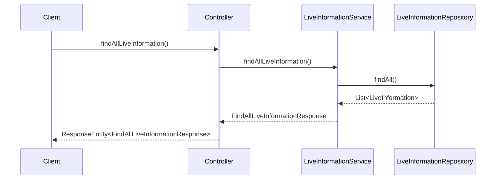

# Comprehensive Documentation for the Live Information Service Codebase

## 1. Overall Structure

### Overview
The Live Information Service codebase is designed to manage live information related to trips and members. It consists of various components, including domain models, data transfer objects (DTOs), services, and a REST controller. The primary purpose of this codebase is to provide an API for creating, retrieving, and managing live information.

### Purpose and Function
- **Domain Models**: Represent the core entities of the application, such as `LiveInformation`, `Trip`, and `Member`.
- **DTOs**: Facilitate data transfer between the client and server, encapsulating the data structure for requests and responses.
- **Services**: Contain the business logic for managing live information and member-related operations.
- **Controller**: Exposes RESTful endpoints for client interaction.

### Interaction Between Components
- The **Controller** interacts with the **Service** layer to handle incoming requests.
- The **Service** layer communicates with the **Repository** layer to perform CRUD operations on the database.
- **DTOs** are used to transfer data between the controller and service layers.

### Mermaid Diagram

## 2. Strategy Pattern Implementation

### Strategy Pattern Overview
The strategy pattern is not explicitly implemented in the provided codebase. However, if we were to implement it, we could create different strategies for handling various types of live information processing.

### Strategy Interface and Concrete Strategy Classes
- **Strategy Interface**: Define a common interface for live information processing strategies.
- **Concrete Strategy Classes**: Implement specific strategies for different types of live information.

### Context Class
- **Context Class**: The `LiveInformationService` could act as a context that uses different strategies based on the type of live information being processed.

### Class Diagram

## 3. Detailed Component Documentation

### a. Classes

#### 1. Accessor
- **Purpose**: Represents an accessor object with an ID.
- **Attributes**:
  - `Long id`: Unique identifier for the accessor.
- **Role**: Used for authentication and authorization purposes.
  
#### 2. Authentication
- **Purpose**: Custom annotation for marking parameters that require authentication.
- **Role**: Used in controller methods to indicate that a parameter should be authenticated.

#### 3. LiveInformationService
- **Purpose**: Service class for managing live information.
- **Attributes**:
  - `LiveInformationRepository liveInformationRepository`
  - `TripLiveInformationRepository tripLiveInformationRepository`
  - `TripRepository tripRepository`
- **Role**: Contains business logic for creating and retrieving live information.

#### 4. MemberLiveInformationService
- **Purpose**: Service class for managing member-specific live information.
- **Attributes**:
  - `MemberLiveInformationRepository memberLiveInformationRepository`
  - `LiveInformationRepository liveInformationRepository`
  - `MemberRepository memberRepository`
- **Role**: Contains business logic for managing member live information.

#### 5. LiveInformation
- **Purpose**: Represents live information entity.
- **Attributes**:
  - `Long id`: Unique identifier.
  - `String name`: Name of the live information.
- **Role**: Core entity representing live information.

#### 6. DTO Classes
- **FindAllLiveInformationResponse**: Encapsulates a list of live information responses.
- **FindMemberLiveInformationResponses**: Encapsulates a list of member live information responses.
- **LiveInformationCreateRequest**: Represents a request to create live information.
- **LiveInformationResponse**: Represents a response containing live information details.

### b. Methods and Functions

#### 1. LiveInformationService Methods
- **findAllLiveInformation()**
  - **Purpose**: Retrieves all live information.
  - **Return Value**: `FindAllLiveInformationResponse`
  
- **createLiveInformation(LiveInformationCreateRequest request)**
  - **Parameters**: 
    - `LiveInformationCreateRequest request`: Request object containing live information details.
  - **Return Value**: `void`
  
- **createTripLiveInformation(long tripId, long liveInfoId)**
  - **Parameters**: 
    - `long tripId`: ID of the trip.
    - `long liveInfoId`: ID of the live information.
  - **Return Value**: `void`

#### 2. MemberLiveInformationService Methods
- **updateMemberLiveInformation(long memberId, UpdateMemberLiveInformationRequest request)**
  - **Parameters**: 
    - `long memberId`: ID of the member.
    - `UpdateMemberLiveInformationRequest request`: Request object containing updated live information IDs.
  - **Return Value**: `void`

### 4. Implementation Flow

### Sequence Diagram

## Conclusion
This documentation provides a comprehensive overview of the Live Information Service codebase, detailing its structure, strategy pattern implementation, component documentation, and implementation flow. It serves as a guide for both new and experienced developers to understand and work with the code effectively.