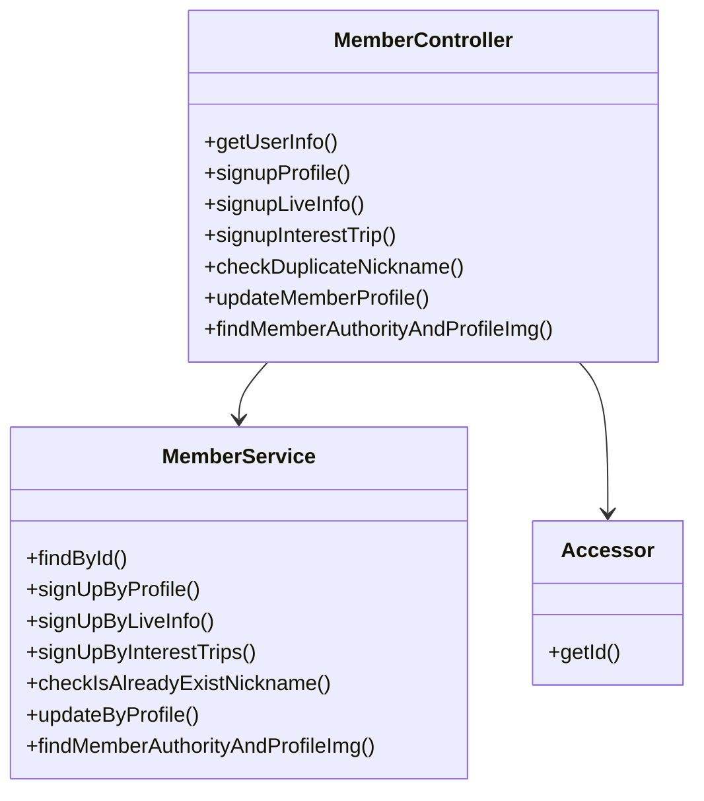
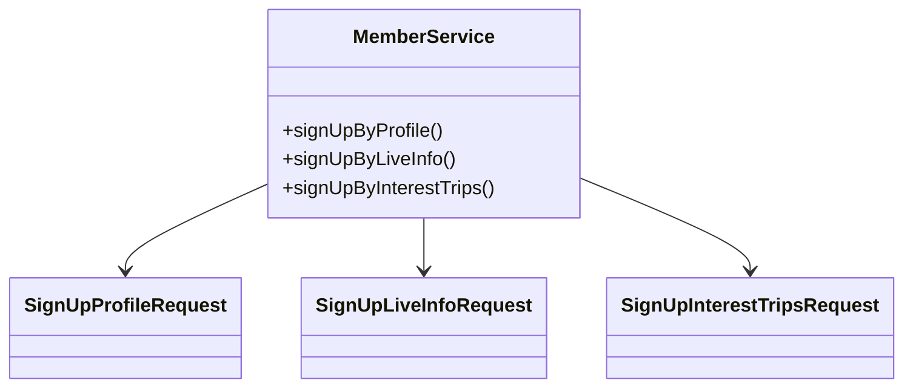
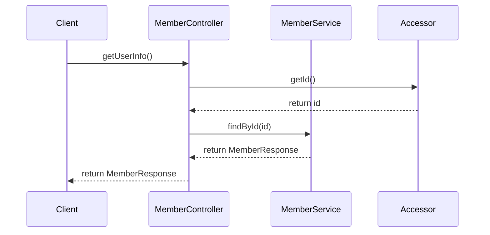

# Comprehensive Documentation for the Member Service Codebase

## 1. Overall Structure

### Overview
The Member Service codebase is part of a larger application that manages user accounts and their associated data. It provides functionalities for user registration, profile management, and authority checks. The code is structured into several packages, each serving a specific purpose.

### Purpose and Function
The primary purpose of the Member Service is to handle operations related to members, including:
- User registration and profile updates
- Checking for duplicate nicknames
- Retrieving user information and authority

### Interaction Between Components
The main components of the codebase include:
- **DTOs (Data Transfer Objects)**: Used for transferring data between layers (e.g., `MemberResponse`, `FindMemberAuthorityAndProfileResponse`).
- **Service Layer**: Contains business logic (e.g., `MemberService`).
- **Controller Layer**: Handles HTTP requests and responses (e.g., `MemberController`).
- **Annotations**: Custom annotations for authentication (`@Authentication`, `@InitAuthentication`).

### Mermaid Diagram


---

## 2. Strategy Pattern Implementation

### Strategy Pattern Overview
The strategy pattern is not explicitly implemented in the provided codebase. However, the use of different request handling methods in the `MemberService` can be seen as a form of strategy where different strategies (methods) are applied based on the type of request.

### Context Class
The `MemberService` class acts as the context that uses various strategies (methods) to handle member-related operations.

### Class Diagram


---

## 3. Detailed Component Documentation

### a. Classes

#### 1. Accessor
- **Purpose**: Represents an authenticated user's identifier.
- **Attributes**:
  - `Long id`: The unique identifier for the user.
- **Role**: Used in controller methods to retrieve the authenticated user's ID.
- **Relationships**: Used in `MemberController` for authentication.

#### 2. MemberService
- **Purpose**: Contains business logic for member-related operations.
- **Attributes**:
  - `MemberRepository memberRepository`: Repository for member data.
  - `MemberLiveInformationService memberLiveInformationService`: Service for managing live information.
  - `TripService tripService`: Service for managing trips.
  - `RecommendTripService recommendTripService`: Service for managing recommended trips.
  - `LiveInformationRepository liveInformationRepository`: Repository for live information.
  - `MemberTripRepository memberTripRepository`: Repository for member trips.
- **Role**: Central service for handling member operations.
- **Relationships**: Interacts with various repositories and services.

### b. Methods and Functions

#### 1. `findById(Long id)`
- **Purpose**: Retrieves a member by their ID.
- **Parameters**: 
  - `Long id`: The ID of the member to find.
- **Return Value**: `MemberResponse`: The response containing member details.
- **Example**:
  ```java
  MemberResponse response = memberService.findById(1L);
  ```

#### 2. `signUpByProfile(long memberId, SignUpProfileRequest request)`
- **Purpose**: Signs up a member using profile information.
- **Parameters**: 
  - `long memberId`: The ID of the member.
  - `SignUpProfileRequest request`: The request containing profile data.
- **Return Value**: `void`
- **Example**:
  ```java
  memberService.signUpByProfile(1L, new SignUpProfileRequest(...));
  ```

#### 3. `checkIsAlreadyExistNickname(String nickname)`
- **Purpose**: Checks if a nickname already exists.
- **Parameters**: 
  - `String nickname`: The nickname to check.
- **Return Value**: `void`
- **Example**:
  ```java
  memberService.checkIsAlreadyExistNickname("newNickname");
  ```

---

## 4. Implementation Flow

### Sequence Diagram


### Explanation
1. The client sends a request to `MemberController` to get user information.
2. The controller retrieves the authenticated user's ID using the `Accessor`.
3. The controller calls the `MemberService` to find the member by ID.
4. The service returns the member details encapsulated in a `MemberResponse`.
5. Finally, the controller sends the response back to the client.

---

This documentation provides a comprehensive overview of the Member Service codebase, detailing its structure, strategy pattern implementation, component documentation, and implementation flow. It is designed to assist both new and experienced developers in understanding and working with the code effectively.