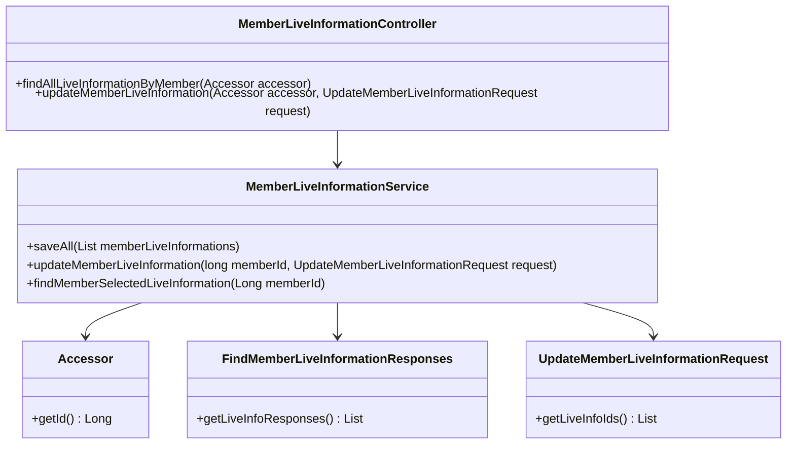
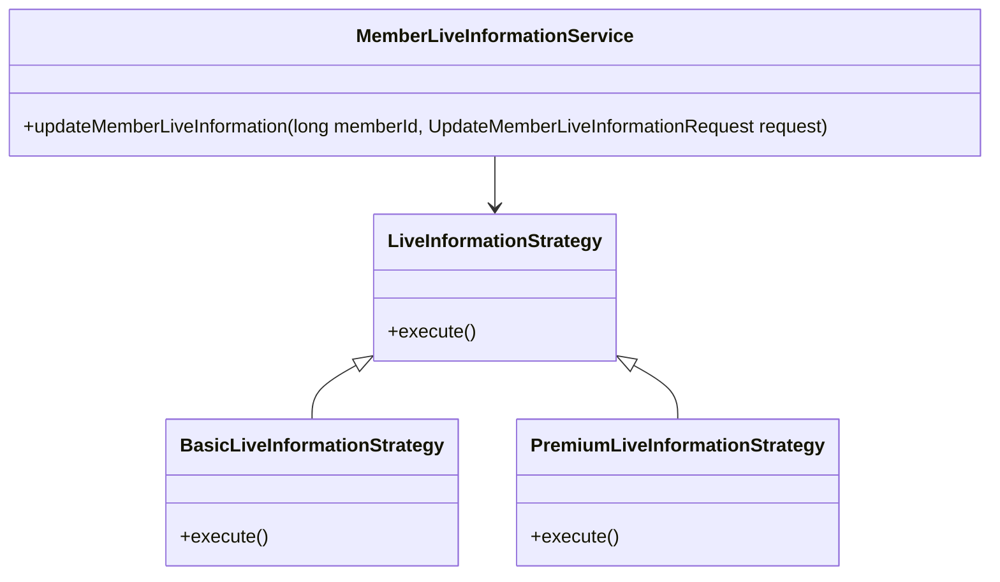
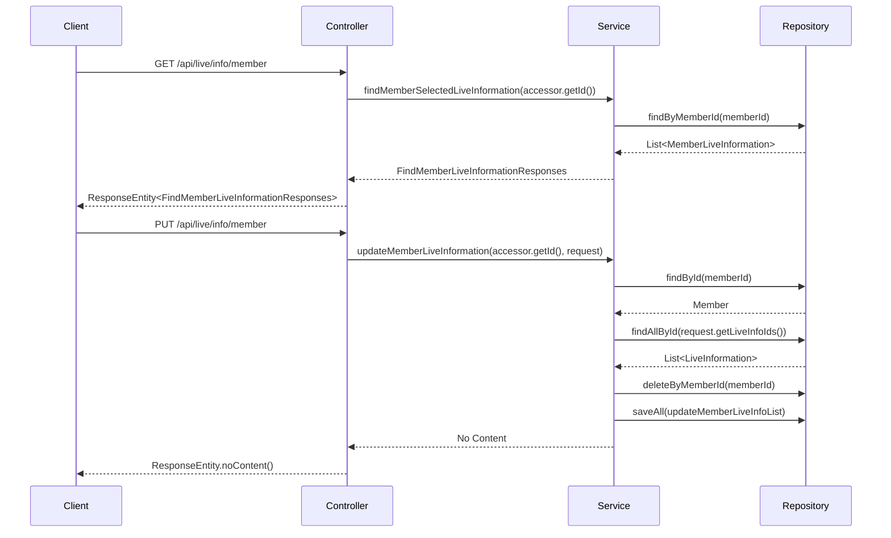

# Comprehensive Documentation for the Service Code

## 1. Overall Structure

### High-Level Overview
The service code is structured to manage member live information within a system. It includes data transfer objects (DTOs), service classes, and a controller that handles HTTP requests. The main components are:

- **DTOs**: Classes that encapsulate data for transfer between layers (e.g., `Accessor`, `FindMemberLiveInformationResponses`, `UpdateMemberLiveInformationRequest`, `LiveInfoResponse`).
- **Service Layer**: Contains business logic for managing member live information (`MemberLiveInformationService`).
- **Controller Layer**: Handles incoming HTTP requests and responses (`MemberLiveInformationController`).

### Purpose and Function
The service code is designed to:
- Retrieve and update live information associated with members.
- Validate member existence and live information before performing operations.
- Provide a RESTful API for client applications to interact with member live information.

### Interaction Between Components
- The `MemberLiveInformationController` interacts with the `MemberLiveInformationService` to process requests.
- The service uses repositories to access and manipulate data in the database.
- DTOs are used to transfer data between the controller and service layers.

### Mermaid Diagram


## 2. Strategy Pattern Implementation

### Strategy Pattern Overview
The strategy pattern is not explicitly implemented in the provided code. However, if we were to implement it, we could define different strategies for handling various types of live information updates or retrievals.

### Potential Strategy Interface and Classes
- **Strategy Interface**: `LiveInformationStrategy`
- **Concrete Strategies**: `BasicLiveInformationStrategy`, `PremiumLiveInformationStrategy`, etc.
- **Context Class**: `MemberLiveInformationService` could act as the context that uses these strategies.

### Class Diagram for Strategy Pattern


## 3. Detailed Component Documentation

### a. Classes

#### 1. Accessor
- **Purpose**: Represents an accessor object containing the member ID.
- **Attributes**:
  - `Long id`: The unique identifier for the member.
- **Role**: Used to authenticate and identify the member in requests.
- **Relationships**: Used in the `MemberLiveInformationController`.

#### 2. MemberLiveInformationService
- **Purpose**: Contains business logic for managing member live information.
- **Attributes**:
  - `MemberLiveInformationRepository memberLiveInformationRepository`
  - `LiveInformationRepository liveInformationRepository`
  - `MemberRepository memberRepository`
- **Role**: Provides methods to save, update, and retrieve member live information.
- **Relationships**: Interacts with repositories to perform database operations.

#### 3. FindMemberLiveInformationResponses
- **Purpose**: Encapsulates the response containing live information for a member.
- **Attributes**:
  - `List<LiveInfoResponse> liveInfoResponses`: List of live information responses.
- **Role**: Used to return data from the service to the controller.
- **Relationships**: Used in the `MemberLiveInformationService`.

#### 4. UpdateMemberLiveInformationRequest
- **Purpose**: Represents a request to update member live information.
- **Attributes**:
  - `List<Long> liveInfoIds`: List of live information IDs to update.
- **Role**: Used to transfer update data from the controller to the service.
- **Relationships**: Used in the `MemberLiveInformationService`.

### b. Methods and Functions

#### 1. Accessor.getId()
- **Purpose**: Retrieves the ID of the accessor.
- **Parameters**: None
- **Return Value**: `Long` - The ID of the accessor.

#### 2. MemberLiveInformationService.saveAll(List<MemberLiveInformation> memberLiveInformations)
- **Purpose**: Saves a list of member live information.
- **Parameters**:
  - `List<MemberLiveInformation> memberLiveInformations`: List of member live information to save.
- **Return Value**: None
- **Code Example**:
  ```java
  memberLiveInformationService.saveAll(memberLiveInfoList);
  ```

#### 3. MemberLiveInformationService.updateMemberLiveInformation(long memberId, UpdateMemberLiveInformationRequest request)
- **Purpose**: Updates the live information for a specific member.
- **Parameters**:
  - `long memberId`: The ID of the member.
  - `UpdateMemberLiveInformationRequest request`: The request containing live information IDs.
- **Return Value**: None
- **Code Example**:
  ```java
  memberLiveInformationService.updateMemberLiveInformation(memberId, request);
  ```

#### 4. MemberLiveInformationService.findMemberSelectedLiveInformation(Long memberId)
- **Purpose**: Finds live information selected by a member.
- **Parameters**:
  - `Long memberId`: The ID of the member.
- **Return Value**: `FindMemberLiveInformationResponses` - The response containing live information.
- **Code Example**:
  ```java
  FindMemberLiveInformationResponses responses = memberLiveInformationService.findMemberSelectedLiveInformation(memberId);
  ```

#### 5. FindMemberLiveInformationResponses.getLiveInfoResponses()
- **Purpose**: Retrieves the list of live information responses.
- **Parameters**: None
- **Return Value**: `List<LiveInfoResponse>` - The list of live information responses.

### 4. Implementation Flow

### Sequence Diagram


This documentation provides a comprehensive overview of the service code, detailing its structure, components, and interactions, along with diagrams to visualize relationships and flow. It serves as a guide for both new and experienced developers to understand and work with the code effectively.