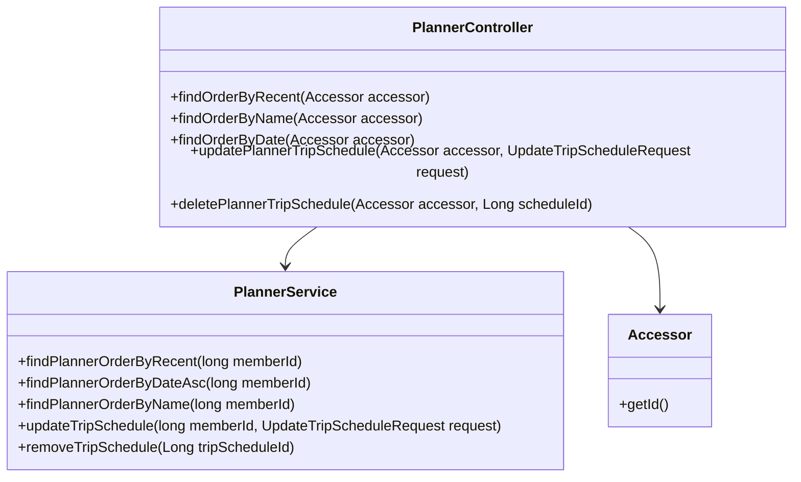
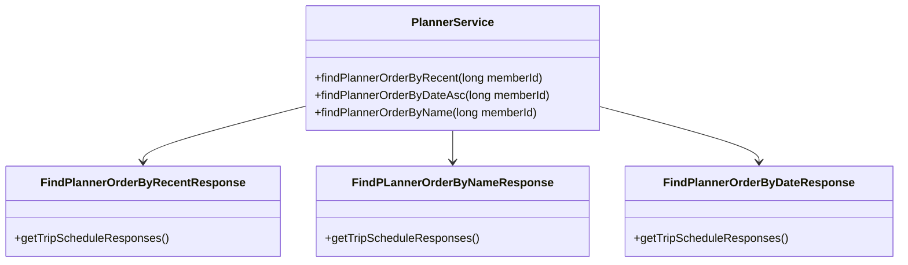
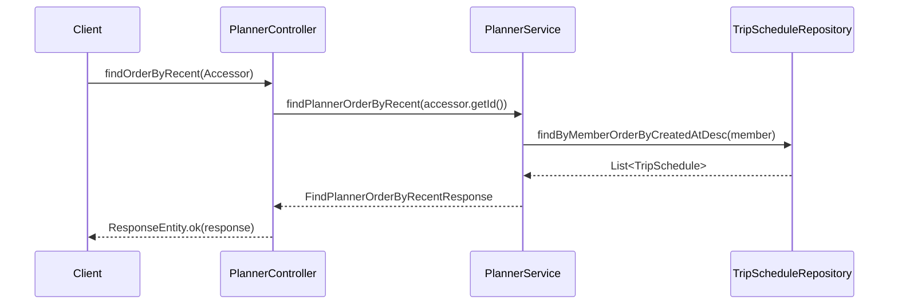

# Comprehensive Documentation for the Service Code

## 1. Overall Structure

### High-Level Overview
The service code is structured around a RESTful API for managing trip schedules within a planner application. It consists of several components, including DTOs (Data Transfer Objects), service classes, and a controller that handles HTTP requests.

### Purpose and Function
The primary purpose of the service code is to provide an interface for clients to interact with trip schedules. This includes retrieving schedules based on different criteria, updating existing schedules, and deleting schedules.

### Interaction Between Components
- **Controller**: The `PlannerController` handles incoming HTTP requests and delegates the business logic to the `PlannerService`.
- **Service**: The `PlannerService` contains the core business logic for managing trip schedules and interacts with repositories to perform CRUD operations.
- **DTOs**: Data Transfer Objects like `FindPlannerOrderByRecentResponse`, `FindPLannerOrderByNameResponse`, and `UpdateTripScheduleRequest` are used to encapsulate data being transferred between the client and server.

### Mermaid Diagram


## 2. Strategy Pattern Implementation

### Strategy Pattern Overview
The strategy pattern is not explicitly implemented in the provided code. However, the service methods can be seen as different strategies for retrieving trip schedules based on various criteria (recent, name, date).

### Context Class
The `PlannerService` acts as the context that utilizes different strategies (methods) to retrieve trip schedules.

### Class Diagram


## 3. Detailed Component Documentation

### a. Classes

#### 1. Accessor
- **Purpose**: Represents an authenticated user or member accessing the planner.
- **Attributes**:
  - `Long id`: Unique identifier for the accessor.
- **Role**: Provides the ID of the authenticated user for service methods.
  
#### 2. PlannerService
- **Purpose**: Contains business logic for managing trip schedules.
- **Attributes**:
  - `TripScheduleRepository tripScheduleRepository`: Repository for trip schedules.
  - `MemberRepository memberRepository`: Repository for members.
  - `TripScheduleRegistryRepository tripScheduleRegistryRepository`: Repository for trip schedule registrations.
- **Role**: Handles operations related to trip schedules, including retrieval, updating, and deletion.

#### 3. FindPLannerOrderByNameResponse
- **Purpose**: Encapsulates the response for finding planners by name.
- **Attributes**:
  - `List<TripScheduleResponse> tripScheduleResponses`: List of trip schedule responses.
- **Role**: Transforms trip schedules into a response format.

#### 4. FindPlannerOrderByDateResponse
- **Purpose**: Encapsulates the response for finding planners by date.
- **Attributes**:
  - `List<TripScheduleResponse> tripScheduleResponses`: List of trip schedule responses.
- **Role**: Transforms trip schedules into a response format.

#### 5. FindPlannerOrderByRecentResponse
- **Purpose**: Encapsulates the response for finding planners by recent schedules.
- **Attributes**:
  - `List<TripScheduleResponse> tripScheduleResponses`: List of trip schedule responses.
- **Role**: Transforms trip schedules into a response format.

#### 6. UpdateTripScheduleRequest
- **Purpose**: Represents a request to update a trip schedule.
- **Attributes**:
  - `Long scheduleId`: ID of the schedule to update.
  - `String scheduleName`: New name for the schedule.
  - `LocalDate startDate`: New start date for the schedule.
  - `LocalDate endDate`: New end date for the schedule.
- **Role**: Encapsulates data needed to update a trip schedule.

### b. Methods and Functions

#### 1. `findPlannerOrderByRecent`
- **Purpose**: Retrieves trip schedules for a member ordered by the most recent.
- **Parameters**:
  - `long memberId`: ID of the member.
- **Return Value**: `FindPlannerOrderByRecentResponse`: Response containing the list of trip schedules.
- **Code Example**:
  ```java
  FindPlannerOrderByRecentResponse response = plannerService.findPlannerOrderByRecent(memberId);
  ```

#### 2. `updateTripSchedule`
- **Purpose**: Updates an existing trip schedule.
- **Parameters**:
  - `long memberId`: ID of the member.
  - `UpdateTripScheduleRequest updateTripScheduleRequest`: Request object containing updated schedule data.
- **Return Value**: `void`
- **Code Example**:
  ```java
  plannerService.updateTripSchedule(memberId, updateTripScheduleRequest);
  ```

## 4. Implementation Flow

### Sequence Diagram


This documentation provides a comprehensive overview of the service code, detailing its structure, components, and interactions. It serves as a guide for both new and experienced developers to understand and work with the code effectively.