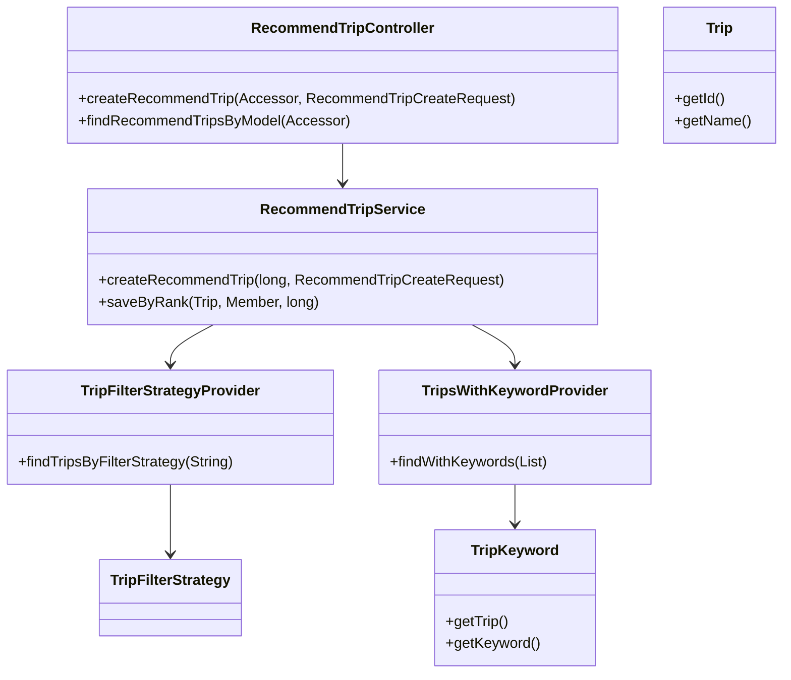
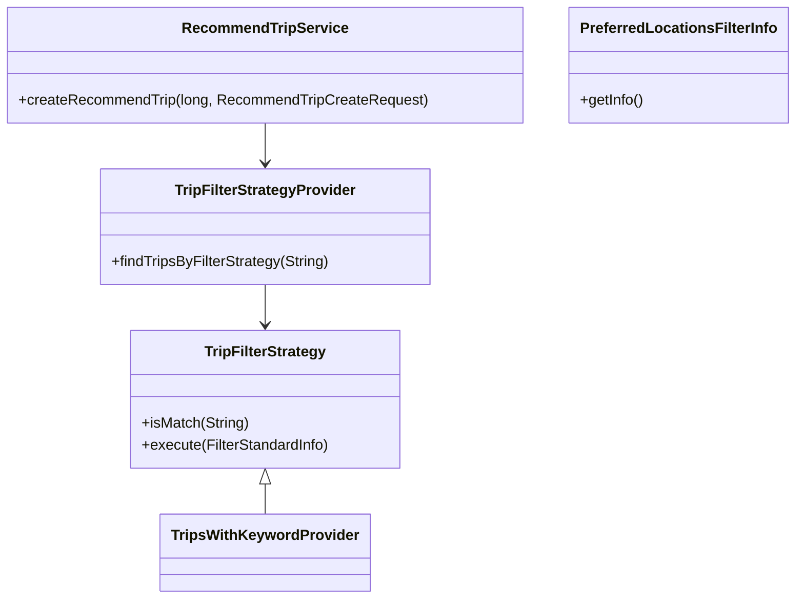
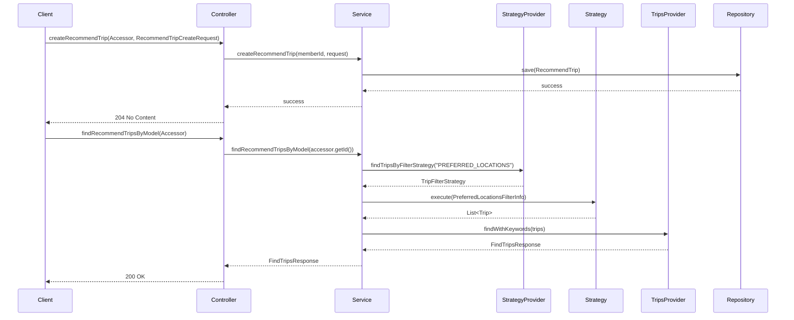

# Comprehensive Documentation for the RecommendTrip Service Code

## 1. Overall Structure

### High-Level Overview
The `RecommendTrip` service is part of a travel recommendation system that allows users to create and retrieve recommended trips based on various filtering strategies. The service is structured around a layered architecture, including DTOs, domain models, repositories, and a presentation layer.

### Purpose and Function
The primary purpose of the `RecommendTrip` service is to manage the recommendation of trips to users based on their preferences and interactions. It utilizes the Strategy Pattern to apply different filtering strategies for trip recommendations.

### Interaction Between Components
- **Controller Layer**: The `RecommendTripController` handles HTTP requests and responses, delegating business logic to the `RecommendTripService`.
- **Service Layer**: The `RecommendTripService` contains the core business logic for creating and retrieving recommended trips.
- **Domain Layer**: The domain models (`Trip`, `TripKeyword`, etc.) represent the core entities of the application.
- **Repository Layer**: Repositories are used to interact with the database, fetching and saving entities.

### Mermaid Diagram


---

## 2. Strategy Pattern Implementation

### Strategy Pattern Overview
The Strategy Pattern is implemented in the `RecommendTrip` service to allow dynamic selection of trip filtering strategies based on user preferences.

### Strategy Interface and Concrete Strategy Classes
- **Interface**: `TripFilterStrategy`
  - Method `isMatch(String strategyName)`: Determines if the strategy matches the given name.
  - Method `execute(FilterStandardInfo filterStandardInfo)`: Executes the filtering logic based on the provided information.

- **Concrete Strategy**: `TripsWithKeywordProvider` and other potential strategies that implement `TripFilterStrategy`.

### Context Class
- **Context**: `RecommendTripService`
  - Uses `TripFilterStrategyProvider` to retrieve the appropriate strategy based on the user's request.

### Class Diagram


---

## 3. Detailed Component Documentation

### a. Classes

#### 1. Accessor
- **Purpose**: Represents an authenticated user accessor.
- **Attributes**:
  - `Long id`: Unique identifier for the accessor.
- **Role**: Used in the controller to retrieve the user's ID for trip recommendations.

#### 2. TripKeyword
- **Purpose**: Represents a keyword associated with a trip.
- **Attributes**:
  - `Long id`: Unique identifier.
  - `Trip trip`: The trip associated with this keyword.
  - `Keyword keyword`: The keyword itself.
- **Role**: Used to link trips with their associated keywords.

#### 3. RecommendTripService
- **Purpose**: Contains business logic for recommending trips.
- **Attributes**:
  - `TripFilterStrategyProvider tripFilterStrategyProvider`: Provides filtering strategies.
  - `RecommendTripRepository recommendTripRepository`: Repository for saving recommended trips.
  - `MemberRepository memberRepository`: Repository for member data.
  - `TripRepository tripRepository`: Repository for trip data.
  - `TripKeywordRepository tripKeywordRepository`: Repository for trip keywords.
- **Role**: Central service for managing trip recommendations.

### b. Methods and Functions

#### 1. `createRecommendTrip`
- **Purpose**: Creates a recommended trip for a member.
- **Parameters**:
  - `long memberId`: ID of the member.
  - `RecommendTripCreateRequest request`: Request containing trip details.
- **Return Value**: `void`
- **Example**:
  ```java
  recommendTripService.createRecommendTrip(memberId, new RecommendTripCreateRequest(tripId));
  ```

#### 2. `findTripsByFilterStrategy`
- **Purpose**: Finds trips based on the specified filter strategy.
- **Parameters**:
  - `String filterStrategyName`: Name of the filter strategy.
- **Return Value**: `TripFilterStrategy`
- **Example**:
  ```java
  TripFilterStrategy strategy = tripFilterStrategyProvider.findTripsByFilterStrategy("PREFERRED_LOCATIONS");
  ```

---

## 4. Implementation Flow

### Sequence Diagram


---

This documentation provides a comprehensive overview of the `RecommendTrip` service code, detailing its structure, strategy pattern implementation, component documentation, and implementation flow. It aims to assist both new and experienced developers in understanding and working with the code effectively.