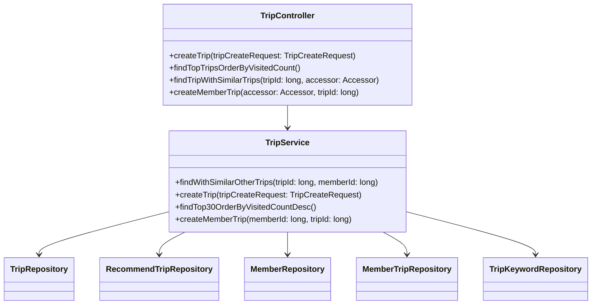
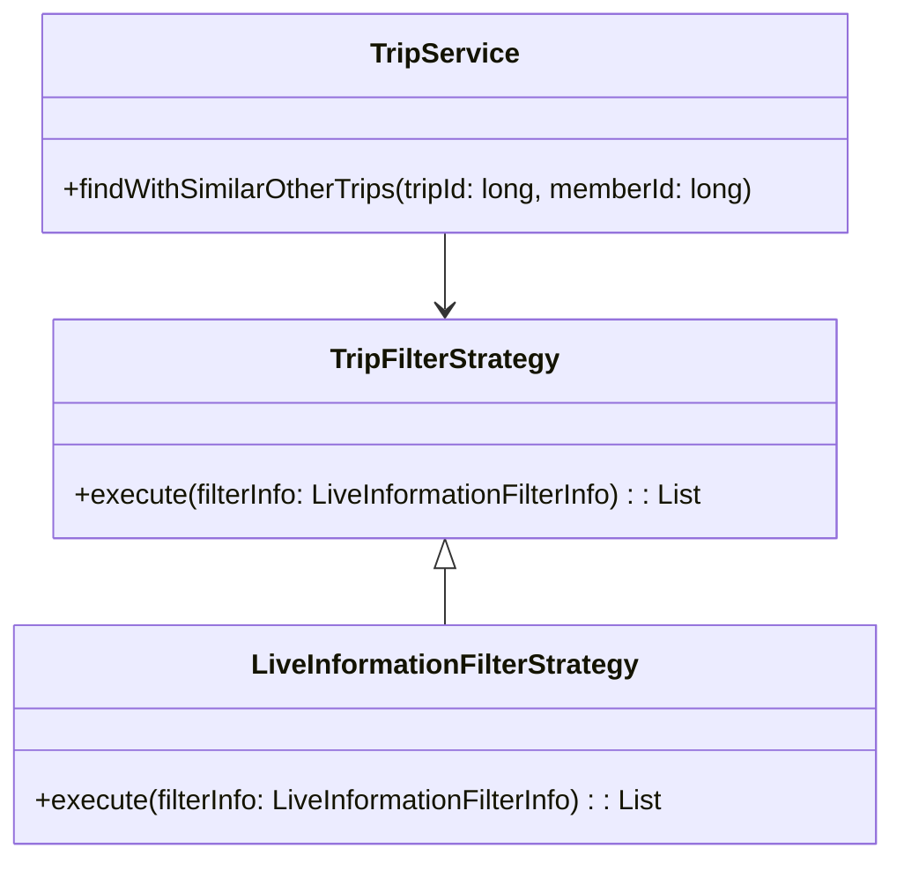
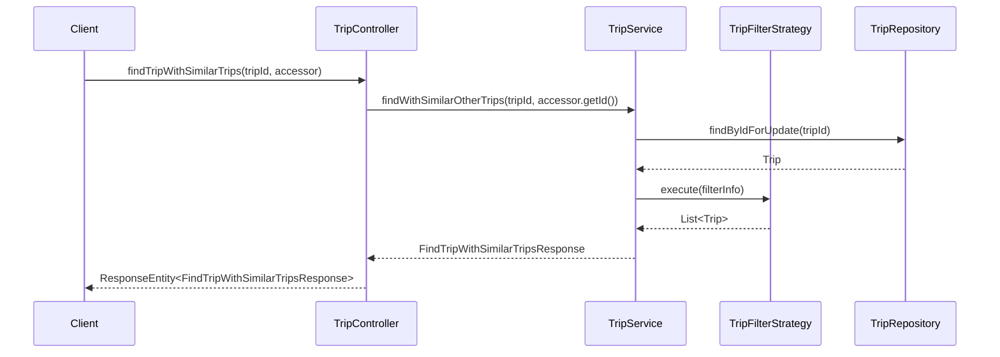

# Comprehensive Documentation for the Trip Service Codebase

## 1. Overall Structure

### High-Level Overview
The Trip Service codebase is structured to manage trip-related functionalities within an application. It includes various components such as DTOs (Data Transfer Objects), services, repositories, and controllers that work together to provide a cohesive experience for users interacting with trip data.

### Purpose and Function
The primary purpose of the Trip Service is to handle operations related to trips, including creating trips, retrieving trip information, and managing user interactions with trips. It utilizes the Strategy Pattern to filter and recommend trips based on user preferences.

### Interaction Between Components
- **Controllers** handle incoming HTTP requests and delegate processing to the **Service** layer.
- **Services** contain the business logic and interact with **Repositories** to perform CRUD operations on trip data.
- **DTOs** are used to transfer data between the client and server, ensuring a clean separation of concerns.

### Mermaid Diagram


## 2. Strategy Pattern Implementation

### Strategy Pattern Overview
The Strategy Pattern is implemented in the Trip Service to allow for dynamic selection of trip filtering strategies based on user preferences. This enables the application to adapt its behavior without modifying the core logic.

### Strategy Interface and Concrete Strategy Classes
- **TripFilterStrategy**: This interface defines the method for executing a filtering strategy.
- **Concrete Strategies**: Implementations of the `TripFilterStrategy` interface that provide specific filtering logic (e.g., `LiveInformationFilterStrategy`).

### Context Class
- **TripService**: The context class that utilizes the strategies to filter trips based on the selected strategy.

### Class Diagram


## 3. Detailed Component Documentation

### a. Classes

#### 1. Accessor
- **Purpose**: Represents an authenticated user accessor.
- **Attributes**:
  - `Long id`: Unique identifier for the accessor.
- **Role**: Used to retrieve the ID of the authenticated user in the context of trip operations.

#### 2. TripService
- **Purpose**: Contains business logic for managing trips.
- **Attributes**:
  - Various repositories for accessing trip-related data.
- **Role**: Acts as the main service layer for trip operations, coordinating between repositories and applying business rules.

#### 3. FindTripWithSimilarTripsResponse
- **Purpose**: DTO for returning trip details along with similar trips.
- **Attributes**:
  - `FindTripResponse findTripResponse`
  - `SimilarTripResponses similarTripResponses`
- **Role**: Encapsulates the response structure for trip queries.

#### 4. FindTripsResponse
- **Purpose**: DTO for returning a list of trips.
- **Attributes**:
  - `List<FindTripResponse> findTripResponses`
- **Role**: Provides a structured response for retrieving multiple trips.

#### 5. TripCreateRequest
- **Purpose**: DTO for creating a new trip.
- **Attributes**:
  - `String name`
  - `String placeName`
  - `Long contentId`
  - `String description`
  - `String tripImageUrl`
- **Role**: Encapsulates the data required to create a new trip.

### b. Methods and Functions

#### 1. TripService.findWithSimilarOtherTrips
- **Purpose**: Finds a trip and retrieves similar trips based on a filtering strategy.
- **Parameters**:
  - `long tripId`: ID of the trip to find.
  - `long memberId`: ID of the member requesting the trip.
- **Return Value**: `FindTripWithSimilarTripsResponse`: Contains the found trip and similar trips.
- **Code Example**:
  ```java
  FindTripWithSimilarTripsResponse response = tripService.findWithSimilarOtherTrips(tripId, memberId);
  ```

#### 2. TripService.createTrip
- **Purpose**: Creates a new trip based on the provided request.
- **Parameters**:
  - `TripCreateRequest tripCreateRequest`: DTO containing trip details.
- **Return Value**: `void`
- **Code Example**:
  ```java
  tripService.createTrip(new TripCreateRequest("Trip Name", "Place Name", 123L, "Description", "imageUrl"));
  ```

#### 3. TripController.createTrip
- **Purpose**: HTTP endpoint to create a new trip.
- **Parameters**:
  - `TripCreateRequest tripCreateRequest`: DTO containing trip details.
- **Return Value**: `ResponseEntity<Void>`
- **Code Example**:
  ```java
  @PostMapping
  public ResponseEntity<Void> createTrip(@RequestBody final TripCreateRequest tripCreateRequest) {
      tripService.createTrip(tripCreateRequest);
      return ResponseEntity.noContent().build();
  }
  ```

## 4. Implementation Flow

### Sequence Diagram


This documentation provides a comprehensive overview of the Trip Service codebase, detailing its structure, strategy pattern implementation, and individual components. It serves as a guide for both new and experienced developers to understand and work with the code effectively.