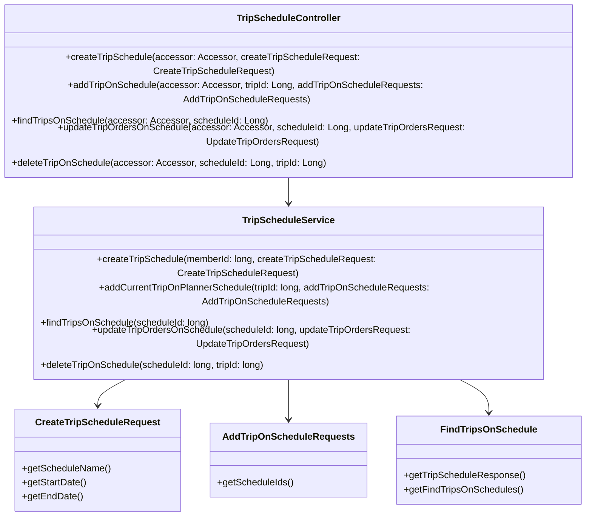
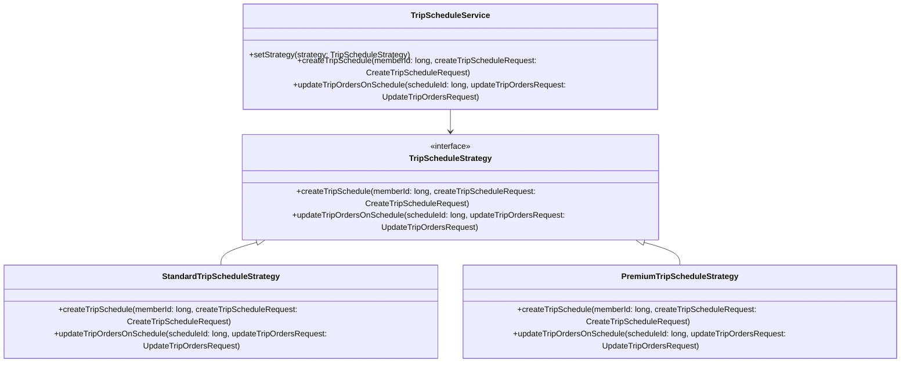
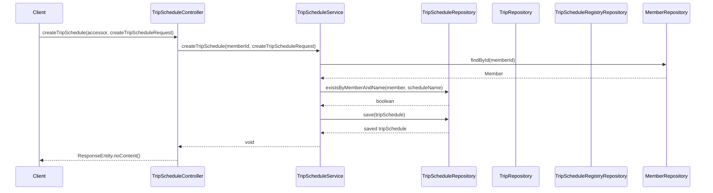

# Comprehensive Documentation for the Trip Schedule Service Code

## 1. Overall Structure

### High-Level Overview
The Trip Schedule Service codebase is structured to manage trip schedules for users. It consists of several components, including DTOs (Data Transfer Objects), service classes, and a REST controller. The main purpose of the service is to allow users to create, update, and manage their trip schedules effectively.

### Purpose and Function
The `TripScheduleService` class is the core of the application, handling business logic related to trip schedules. It interacts with various repositories to perform CRUD operations on trip schedules and their associated trips.

### Interaction Between Components
- **DTOs**: These classes (`CreateTripScheduleRequest`, `AddTripOnScheduleRequests`, etc.) are used to transfer data between the client and the server.
- **Service**: The `TripScheduleService` contains methods that implement the business logic for managing trip schedules.
- **Controller**: The `TripScheduleController` exposes RESTful endpoints that allow clients to interact with the service.

### Mermaid Diagram


## 2. Strategy Pattern Implementation

### Strategy Pattern Overview
The strategy pattern is not explicitly implemented in the provided code. However, if we were to implement it, we could create different strategies for handling various trip scheduling behaviors (e.g., different ways to create or update schedules).

### Potential Strategy Interface and Classes
- **Strategy Interface**: `TripScheduleStrategy`
- **Concrete Strategies**: `StandardTripScheduleStrategy`, `PremiumTripScheduleStrategy`, etc.
- **Context Class**: `TripScheduleService` could act as the context that uses the strategies.

### Class Diagram for Strategy Pattern


## 3. Detailed Component Documentation

### a. Classes

#### 1. Accessor
- **Purpose**: Represents an accessor for authentication purposes.
- **Attributes**:
  - `Long id`: Unique identifier for the accessor.
- **Role**: Used to retrieve the ID of the authenticated user.
- **Relationships**: None.

#### 2. TripScheduleService
- **Purpose**: Manages trip schedules and their associated operations.
- **Attributes**:
  - `MemberRepository memberRepository`: Repository for member data.
  - `TripScheduleRepository tripScheduleRepository`: Repository for trip schedules.
  - `TripRepository tripRepository`: Repository for trips.
  - `TripScheduleRegistryRepository tripScheduleRegistryRepository`: Repository for trip schedule registries.
- **Role**: Contains business logic for creating, updating, and managing trip schedules.
- **Relationships**: Interacts with multiple repositories.

### b. Methods and Functions

#### 1. createTripSchedule
- **Purpose**: Creates a new trip schedule.
- **Parameters**:
  - `long memberId`: ID of the member creating the schedule.
  - `CreateTripScheduleRequest createTripScheduleRequest`: Request object containing schedule details.
- **Return Value**: `void`
- **Code Example**:
  ```java
  tripScheduleService.createTripSchedule(memberId, new CreateTripScheduleRequest("Vacation", LocalDate.now(), LocalDate.now().plusDays(7)));
  ```

#### 2. addCurrentTripOnPlannerSchedule
- **Purpose**: Adds a trip to an existing schedule.
- **Parameters**:
  - `long tripId`: ID of the trip to add.
  - `AddTripOnScheduleRequests addTripOnScheduleRequests`: Request object containing schedule IDs.
- **Return Value**: `void`
- **Code Example**:
  ```java
  tripScheduleService.addCurrentTripOnPlannerSchedule(tripId, new AddTripOnScheduleRequests(Arrays.asList(1L, 2L)));
  ```

#### 3. findTripsOnSchedule
- **Purpose**: Retrieves trips associated with a specific schedule.
- **Parameters**:
  - `long scheduleId`: ID of the schedule to find trips for.
- **Return Value**: `FindTripsOnSchedule`
- **Code Example**:
  ```java
  FindTripsOnSchedule trips = tripScheduleService.findTripsOnSchedule(scheduleId);
  ```

#### 4. updateTripOrdersOnSchedule
- **Purpose**: Updates the order of trips in a schedule.
- **Parameters**:
  - `long scheduleId`: ID of the schedule to update.
  - `UpdateTripOrdersRequest updateTripOrdersRequest`: Request object containing new trip order.
- **Return Value**: `void`
- **Code Example**:
  ```java
  tripScheduleService.updateTripOrdersOnSchedule(scheduleId, new UpdateTripOrdersRequest(Arrays.asList(1L, 2L, 3L)));
  ```

#### 5. deleteTripOnSchedule
- **Purpose**: Deletes a trip from a schedule.
- **Parameters**:
  - `long scheduleId`: ID of the schedule.
  - `long tripId`: ID of the trip to delete.
- **Return Value**: `void`
- **Code Example**:
  ```java
  tripScheduleService.deleteTripOnSchedule(scheduleId, tripId);
  ```

## 4. Implementation Flow

### Sequence Diagram


### Summary
This documentation provides a comprehensive overview of the Trip Schedule Service codebase, detailing its structure, components, and interactions. It serves as a guide for both new and experienced developers to understand and work with the code effectively.