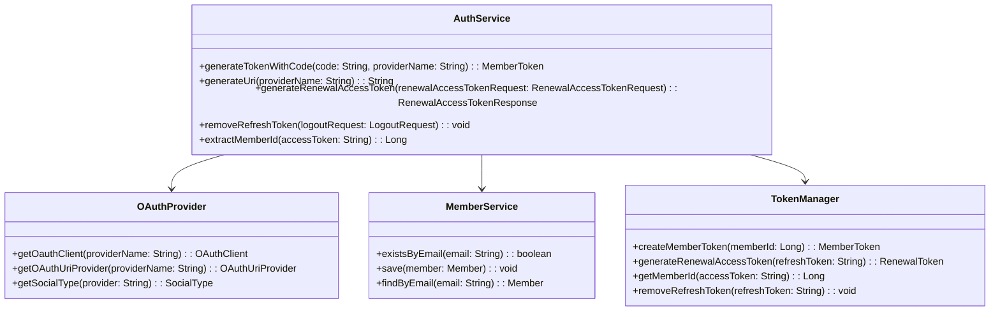
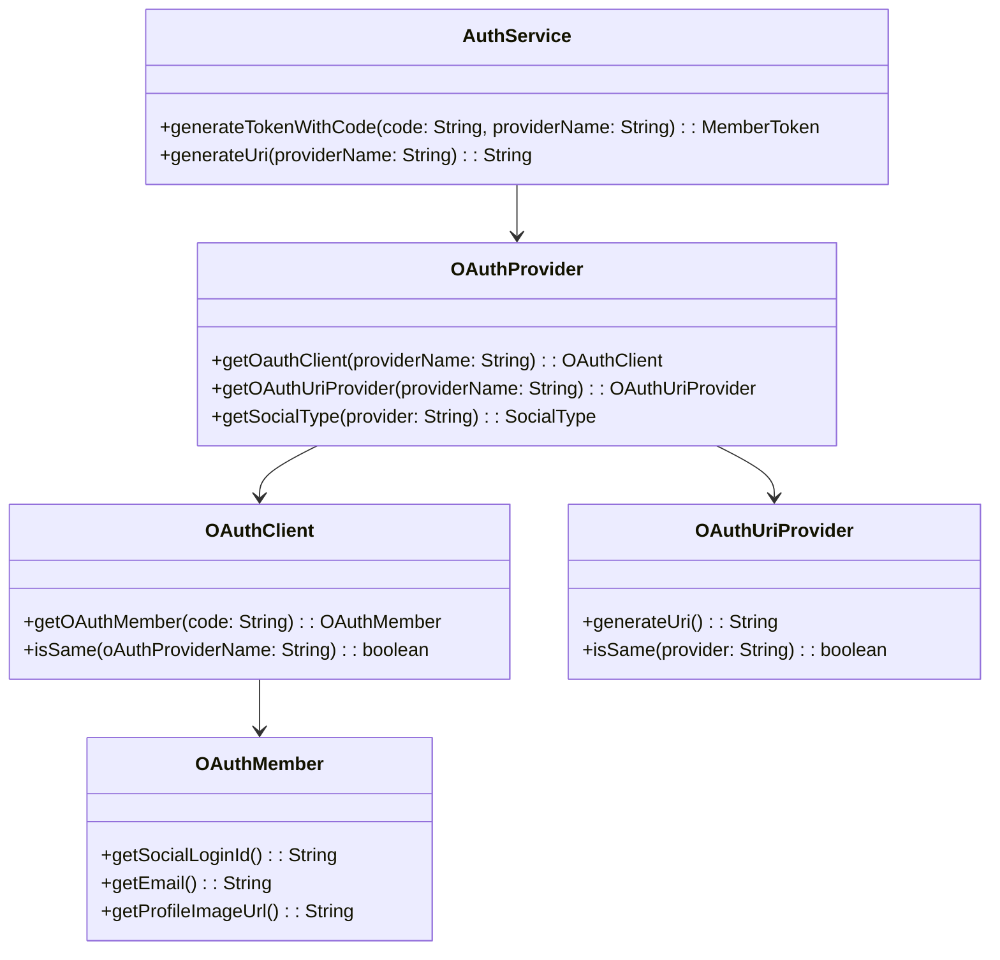
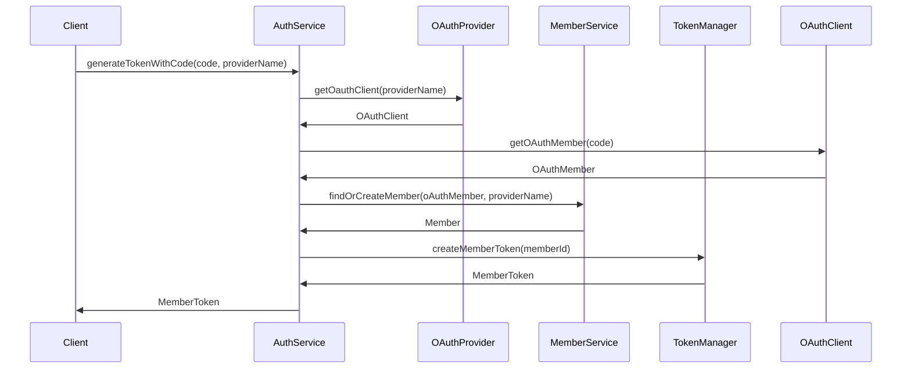

# Comprehensive Documentation for the Auth Service Code

## 1. Overall Structure

### High-Level Overview
The `AuthService` codebase is part of an authentication module that integrates with various OAuth providers to manage user authentication and token generation. It interacts with member services to create or retrieve user accounts based on OAuth member information.

### Purpose and Function
The primary purpose of the `AuthService` is to handle authentication processes, including:
- Generating tokens using OAuth codes.
- Creating or retrieving members based on OAuth member data.
- Generating OAuth URIs for login.
- Renewing access tokens and managing refresh tokens.

### Interaction Between Components
- **OAuthProvider**: Provides the necessary OAuth client and URI provider based on the provider name.
- **MemberService**: Manages member-related operations, such as saving new members and checking for existing members.
- **TokenManager**: Handles the creation and management of access and refresh tokens.

### Mermaid Diagram


## 2. Strategy Pattern Implementation

### Strategy Pattern Overview
The strategy pattern is implemented through the use of interfaces for OAuth clients and URI providers, allowing for different implementations based on the OAuth provider.

### Strategy Interface and Concrete Classes
- **OAuthClient**: Interface for OAuth clients that defines methods for retrieving OAuth member information.
- **OAuthMember**: Interface representing an OAuth member with methods to get social login ID, email, and profile image URL.
- **OAuthProvider**: Interface that provides methods to get specific OAuth clients and URI providers based on the provider name.
- **OAuthUriProvider**: Interface for generating OAuth URIs.

### Context Class
- **AuthService**: Acts as the context that uses the strategy interfaces to perform authentication tasks.

### Class Diagram


## 3. Detailed Component Documentation

### a. Classes

#### 1. `AuthService`
- **Purpose**: Manages authentication processes using OAuth providers.
- **Attributes**:
  - `OAuthProvider oAuthProvider`: Interface for obtaining OAuth clients and URIs.
  - `MemberService memberService`: Service for managing member data.
  - `TokenManager tokenManager`: Service for managing tokens.
- **Role**: Acts as the main service for authentication, coordinating between OAuth providers and member services.

#### 2. `OAuthClient`
- **Purpose**: Interface for OAuth clients.
- **Methods**:
  - `OAuthMember getOAuthMember(final String code)`: Retrieves an OAuth member based on the provided code.
  - `boolean isSame(final String oAuthProviderName)`: Checks if the client is the same as the given provider name.

#### 3. `OAuthMember`
- **Purpose**: Represents an OAuth member.
- **Methods**:
  - `String getSocialLoginId()`: Returns the social login ID.
  - `String getEmail()`: Returns the email of the member.
  - `String getProfileImageUrl()`: Returns the profile image URL.

#### 4. `OAuthProvider`
- **Purpose**: Provides OAuth clients and URI providers.
- **Methods**:
  - `OAuthClient getOauthClient(final String providerName)`: Returns the OAuth client for the specified provider.
  - `OAuthUriProvider getOAuthUriProvider(final String providerName)`: Returns the URI provider for the specified provider.
  - `SocialType getSocialType(final String provider)`: Returns the social type for the specified provider.

#### 5. `OAuthUriProvider`
- **Purpose**: Generates OAuth URIs.
- **Methods**:
  - `String generateUri()`: Generates the OAuth URI.
  - `boolean isSame(final String provider)`: Checks if the provider matches.

### b. Methods and Functions

#### 1. `generateTokenWithCode`
- **Purpose**: Generates a member token using an OAuth code.
- **Parameters**:
  - `String code`: The OAuth code received from the provider.
  - `String providerName`: The name of the OAuth provider.
- **Return Value**: `MemberToken`: The generated member token.
- **Code Example**:
```java
MemberToken token = authService.generateTokenWithCode("oauth_code", "google");
```

#### 2. `generateUri`
- **Purpose**: Generates an OAuth URI for login.
- **Parameters**:
  - `String providerName`: The name of the OAuth provider.
- **Return Value**: `String`: The generated OAuth URI.
- **Code Example**:
```java
String uri = authService.generateUri("google");
```

#### 3. `generateRenewalAccessToken`
- **Purpose**: Generates a new access token using a refresh token.
- **Parameters**:
  - `RenewalAccessTokenRequest renewalAccessTokenRequest`: The request containing the refresh token.
- **Return Value**: `RenewalAccessTokenResponse`: The response containing the new access token.
- **Code Example**:
```java
RenewalAccessTokenResponse response = authService.generateRenewalAccessToken(new RenewalAccessTokenRequest("refresh_token"));
```

#### 4. `removeRefreshToken`
- **Purpose**: Removes a refresh token.
- **Parameters**:
  - `LogoutRequest logoutRequest`: The request containing the refresh token to be removed.
- **Return Value**: `void`
- **Code Example**:
```java
authService.removeRefreshToken(new LogoutRequest("refresh_token"));
```

#### 5. `extractMemberId`
- **Purpose**: Extracts the member ID from an access token.
- **Parameters**:
  - `String accessToken`: The access token from which to extract the member ID.
- **Return Value**: `Long`: The extracted member ID.
- **Code Example**:
```java
Long memberId = authService.extractMemberId("access_token");
```

## 4. Implementation Flow

### Sequence Diagram


### Explanation of Flow
1. The client requests a token by calling `generateTokenWithCode` on the `AuthService`.
2. The `AuthService` retrieves the appropriate `OAuthClient` from the `OAuthProvider`.
3. The `AuthService` uses the `OAuthClient` to get the `OAuthMember` using the provided code.
4. The `AuthService` checks if the member exists or creates a new member using the `MemberService`.
5. Finally, the `AuthService` generates a member token using the `TokenManager` and returns it to the client.

This documentation provides a comprehensive overview of the `AuthService` codebase, detailing its structure, strategy pattern implementation, component documentation, and implementation flow. It serves as a guide for both new and experienced developers to understand and work with the code effectively.