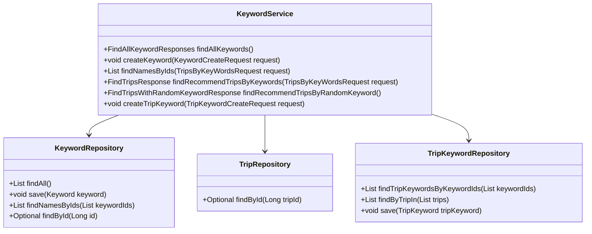
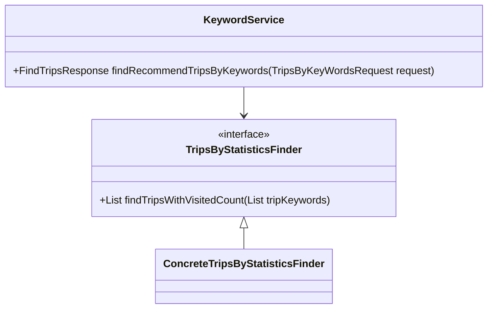
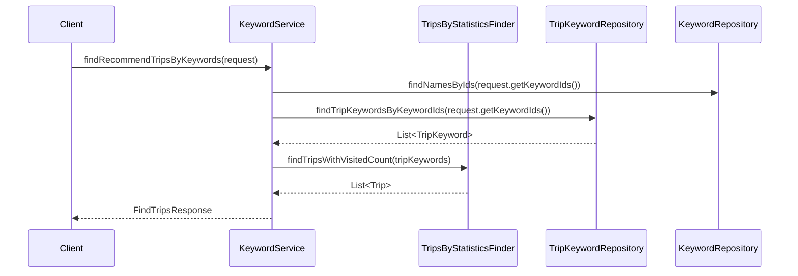

# Comprehensive Documentation for KeywordService

## 1. Overall Structure

### High-Level Overview
The `KeywordService` class is part of the `moheng.keyword.application` package and serves as the main service layer for managing keywords and their associated trips. It interacts with various repositories and utilizes strategies to provide functionality related to keywords and trips.

### Purpose and Function
The `KeywordService` is responsible for:
- Managing keyword creation and retrieval.
- Finding trips associated with keywords.
- Validating the existence of keywords.
- Generating random keywords and recommending trips based on them.

### Interaction Between Components
- **Repositories**: The service interacts with `KeywordRepository`, `TripRepository`, and `TripKeywordRepository` to perform CRUD operations and queries.
- **DTOs**: Data Transfer Objects (DTOs) like `FindAllKeywordResponses`, `FindTripsWithRandomKeywordResponse`, and `KeywordCreateRequest` are used to encapsulate data for requests and responses.
- **Strategies**: The service uses `TripsByStatisticsFinder` to find trips based on visit counts and `RandomKeywordGeneratable` to generate random keywords.

### Mermaid Diagram

---

## 2. Strategy Pattern Implementation

### Strategy Pattern Overview
The strategy pattern is implemented in the `KeywordService` through the use of interfaces for different strategies, allowing for interchangeable algorithms for finding trips based on keywords.

### Strategy Interface and Concrete Classes
- **Interface**: `TripsByStatisticsFinder`
  - Method: `List<Trip> findTripsWithVisitedCount(List<TripKeyword> tripKeywords)`

- **Concrete Strategy**: Implementations of `TripsByStatisticsFinder` would provide specific algorithms for finding trips based on visit counts.

### Context Class
- **Context**: `KeywordService`
  - Uses `TripsByStatisticsFinder` to find trips based on the statistics of keywords.

### Class Diagram

---

## 3. Detailed Component Documentation

### a. Classes

#### KeywordService
- **Purpose**: Manages keyword-related operations and trip recommendations.
- **Attributes**:
  - `tripsByStatisticsFinder`: Strategy for finding trips based on statistics.
  - `randomKeywordGeneratable`: Strategy for generating random keywords.
  - `keywordRepository`: Repository for keyword operations.
  - `tripRepository`: Repository for trip operations.
  - `tripKeywordRepository`: Repository for trip-keyword associations.

#### Keyword
- **Purpose**: Represents a keyword entity.
- **Attributes**:
  - `id`: Unique identifier for the keyword.
  - `name`: The name of the keyword.

#### TripKeyword
- **Purpose**: Represents the association between a trip and a keyword.
- **Attributes**:
  - `trip`: The associated trip.
  - `keyword`: The associated keyword.

### b. Methods and Functions

#### `findAllKeywords()`
- **Purpose**: Retrieves all keywords.
- **Return Value**: `FindAllKeywordResponses` - DTO containing a list of all keywords.

#### `createKeyword(KeywordCreateRequest request)`
- **Purpose**: Creates a new keyword.
- **Parameters**:
  - `request`: `KeywordCreateRequest` - DTO containing the keyword to create.
- **Return Value**: None.

#### `findNamesByIds(TripsByKeyWordsRequest request)`
- **Purpose**: Finds keyword names by their IDs.
- **Parameters**:
  - `request`: `TripsByKeyWordsRequest` - DTO containing a list of keyword IDs.
- **Return Value**: `List<String>` - List of keyword names.

#### `findRecommendTripsByKeywords(TripsByKeyWordsRequest request)`
- **Purpose**: Finds recommended trips based on provided keyword IDs.
- **Parameters**:
  - `request`: `TripsByKeyWordsRequest` - DTO containing keyword IDs.
- **Return Value**: `FindTripsResponse` - DTO containing recommended trips.

#### `createTripKeyword(TripKeywordCreateRequest request)`
- **Purpose**: Creates a new trip-keyword association.
- **Parameters**:
  - `request`: `TripKeywordCreateRequest` - DTO containing trip and keyword IDs.
- **Return Value**: None.

---

## 4. Implementation Flow

### Sequence Diagram

---

This documentation provides a comprehensive overview of the `KeywordService` class, its components, and how it interacts with other parts of the system. It serves as a guide for both new and experienced developers to understand and work with the code effectively.