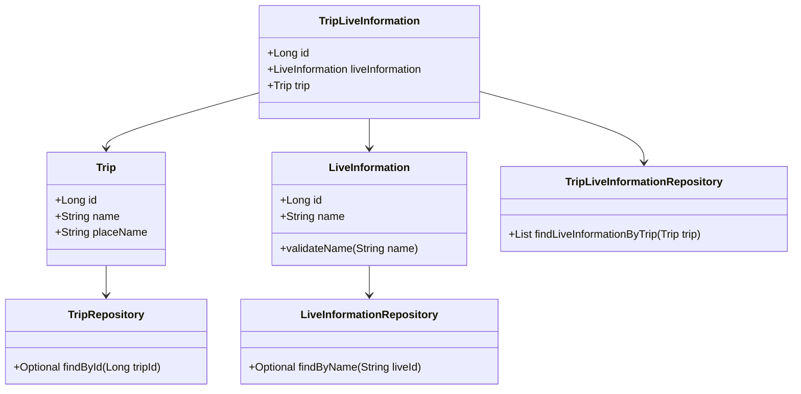
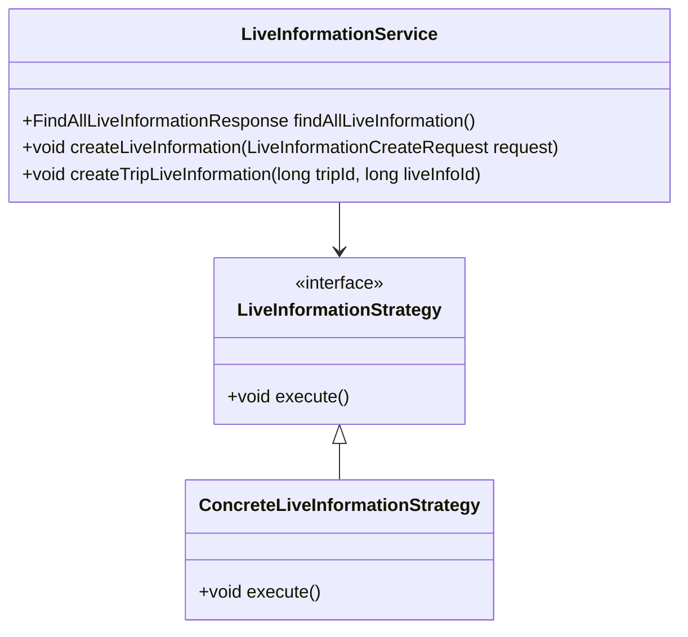
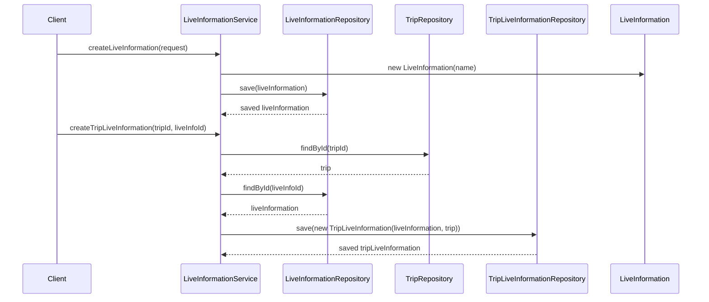

# Comprehensive Documentation for LiveInformation Service Code

## 1. Overall Structure

### High-Level Overview
The `LiveInformation` service code is part of a larger application that manages live information related to trips. It interacts with various domain entities, repositories, and DTOs to provide functionalities such as creating live information, associating it with trips, and retrieving live information.

### Purpose and Function
The `LiveInformationService` class provides methods to manage live information, including:
- Retrieving all live information.
- Creating new live information.
- Associating live information with trips.

### Interaction Between Components
- **Entities**: `LiveInformation`, `Trip`, and `TripLiveInformation` represent the core data models.
- **Repositories**: `LiveInformationRepository`, `TripLiveInformationRepository`, and `TripRepository` handle data access and persistence.
- **DTOs**: `FindAllLiveInformationResponse` and `LiveInformationCreateRequest` are used for data transfer between layers.
- **Exceptions**: Custom exceptions like `NoExistLiveInformationException` and `NoExistTripException` are thrown for error handling.

### Mermaid Diagram


## 2. Strategy Pattern Implementation

### Strategy Pattern Overview
The strategy pattern is not explicitly implemented in the provided code. However, the service can be designed to use different strategies for handling live information and trip associations based on varying business rules.

### Context Class
The `LiveInformationService` can act as a context class that utilizes different strategies for creating and managing live information.

### Class Diagram


## 3. Detailed Component Documentation

### a. Classes

#### LiveInformation
- **Purpose**: Represents live information with a name.
- **Attributes**:
  - `Long id`: Unique identifier for the live information.
  - `String name`: Name of the live information.
- **Role**: Core entity representing live information in the system.
- **Relationships**: 
  - Inherits from `BaseEntity`.

#### Trip
- **Purpose**: Represents a trip with various attributes.
- **Attributes**:
  - `Long id`: Unique identifier for the trip.
  - `String name`: Name of the trip.
  - `String placeName`: Location of the trip.
  - `Long contentId`: Content identifier.
  - `String description`: Description of the trip.
  - `String tripImageUrl`: URL of the trip image.
  - `Long visitedCount`: Count of visits.
  - `Double coordinateX`: X coordinate.
  - `Double coordinateY`: Y coordinate.
- **Role**: Core entity representing trips in the system.
- **Relationships**: 
  - Inherits from `BaseEntity`.

#### TripLiveInformation
- **Purpose**: Represents the association between a trip and live information.
- **Attributes**:
  - `Long id`: Unique identifier for the association.
  - `LiveInformation liveInformation`: Associated live information.
  - `Trip trip`: Associated trip.
- **Role**: Represents the relationship between trips and live information.
- **Relationships**: 
  - Inherits from `BaseEntity`.

#### LiveInformationService
- **Purpose**: Service class for managing live information.
- **Attributes**:
  - `LiveInformationRepository liveInformationRepository`: Repository for live information.
  - `TripLiveInformationRepository tripLiveInformationRepository`: Repository for trip live information.
  - `TripRepository tripRepository`: Repository for trips.
- **Role**: Provides methods to manage live information and its association with trips.

### b. Methods and Functions

#### LiveInformationService Methods

1. **findAllLiveInformation**
   - **Purpose**: Retrieves all live information.
   - **Return Value**: `FindAllLiveInformationResponse`: A response object containing a list of live information.
   - **Code Example**:
     ```java
     FindAllLiveInformationResponse response = liveInformationService.findAllLiveInformation();
     ```

2. **createLiveInformation**
   - **Purpose**: Creates a new live information entry.
   - **Parameters**:
     - `LiveInformationCreateRequest request`: DTO containing the name of the live information.
   - **Return Value**: `void`
   - **Code Example**:
     ```java
     LiveInformationCreateRequest request = new LiveInformationCreateRequest("New Live Info");
     liveInformationService.createLiveInformation(request);
     ```

3. **createTripLiveInformation**
   - **Purpose**: Associates live information with a trip.
   - **Parameters**:
     - `long tripId`: ID of the trip.
     - `long liveInfoId`: ID of the live information.
   - **Return Value**: `void`
   - **Code Example**:
     ```java
     liveInformationService.createTripLiveInformation(tripId, liveInfoId);
     ```

4. **findByName**
   - **Purpose**: Finds live information by name.
   - **Parameters**:
     - `String liveTypeName`: Name of the live information.
   - **Return Value**: `LiveInformation`: The found live information.
   - **Code Example**:
     ```java
     LiveInformation liveInfo = liveInformationService.findByName("Live Info Name");
     ```

## 4. Implementation Flow

### Sequence Diagram


This documentation provides a comprehensive overview of the `LiveInformationService` code, detailing its structure, components, and interactions, while also illustrating the implementation flow and design patterns used.