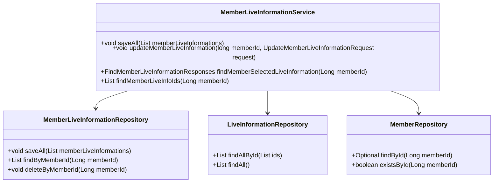
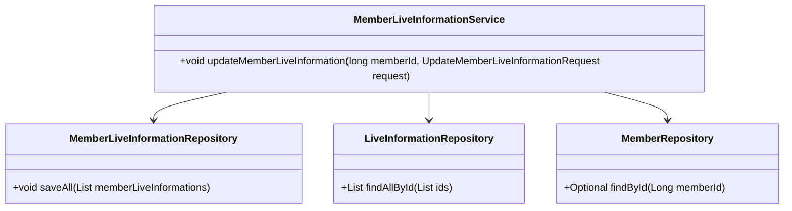
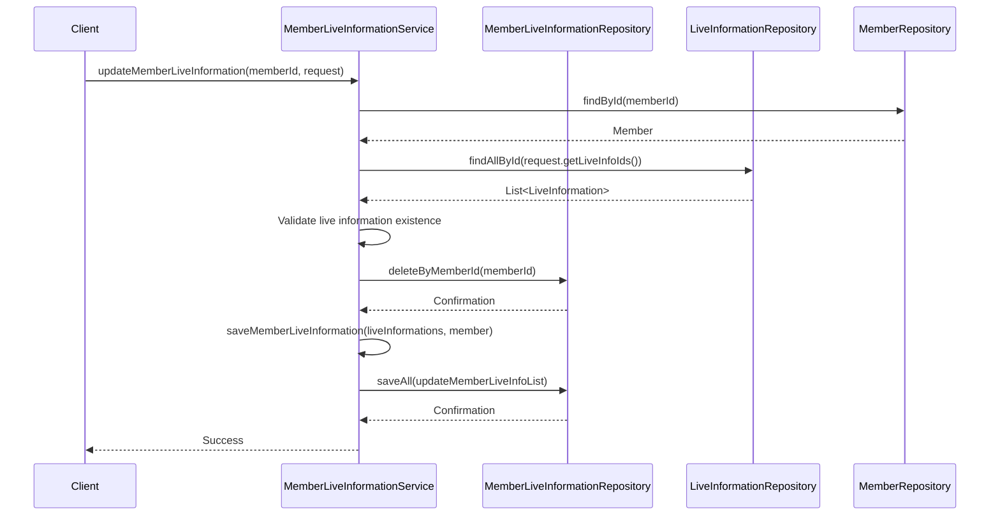

# Comprehensive Documentation for `MemberLiveInformationService`

## 1. Overall Structure

### High-Level Overview
The `MemberLiveInformationService` is part of the `moheng.liveinformation.application` package, which manages the interaction between members and their associated live information. The service interacts with repositories to perform CRUD operations and business logic related to live information for members.

### Purpose and Function
The primary purpose of the `MemberLiveInformationService` is to handle operations related to the association between members and live information. This includes saving, updating, and retrieving live information for members.

### Interaction Between Components
- **Repositories**: The service uses three repositories:
  - `MemberLiveInformationRepository`: Manages the persistence of `MemberLiveInformation` entities.
  - `LiveInformationRepository`: Handles operations related to `LiveInformation` entities.
  - `MemberRepository`: Manages `Member` entities.
  
- **Entities**: The service operates on the following entities:
  - `Member`: Represents a user in the system.
  - `LiveInformation`: Represents live information that can be associated with members.
  - `MemberLiveInformation`: Represents the association between a member and live information.

### Mermaid Diagram


## 2. Strategy Pattern Implementation

### Strategy Pattern Overview
The service does not explicitly implement the Strategy Pattern. However, it utilizes repositories to abstract the data access layer, allowing for flexibility in how data is retrieved and manipulated.

### Context Class
The `MemberLiveInformationService` acts as the context that uses the repositories (strategies) to perform operations.

### Class Diagram


## 3. Detailed Component Documentation

### a. Classes

#### 1. `MemberLiveInformationService`
- **Purpose**: Manages the association between members and live information.
- **Attributes**:
  - `memberLiveInformationRepository`: Repository for `MemberLiveInformation`.
  - `liveInformationRepository`: Repository for `LiveInformation`.
  - `memberRepository`: Repository for `Member`.
- **Role**: Acts as a service layer to handle business logic and data persistence.

#### 2. `MemberLiveInformationRepository`
- **Purpose**: Data access layer for `MemberLiveInformation`.
- **Methods**:
  - `saveAll(List<MemberLiveInformation> memberLiveInformations)`: Saves a list of `MemberLiveInformation`.
  - `findByMemberId(Long memberId)`: Retrieves live information associated with a member.
  - `deleteByMemberId(Long memberId)`: Deletes all live information associated with a member.

#### 3. `LiveInformationRepository`
- **Purpose**: Data access layer for `LiveInformation`.
- **Methods**:
  - `findAllById(List<Long> ids)`: Retrieves a list of `LiveInformation` by their IDs.
  - `findAll()`: Retrieves all `LiveInformation`.

#### 4. `MemberRepository`
- **Purpose**: Data access layer for `Member`.
- **Methods**:
  - `findById(Long memberId)`: Retrieves a member by ID.
  - `existsById(Long memberId)`: Checks if a member exists by ID.

### b. Methods and Functions

#### 1. `updateMemberLiveInformation`
- **Purpose**: Updates the live information associated with a member.
- **Parameters**:
  - `long memberId`: The ID of the member.
  - `UpdateMemberLiveInformationRequest request`: The request containing live information IDs.
- **Return Value**: None.
- **Code Example**:
  ```java
  memberLiveInformationService.updateMemberLiveInformation(memberId, request);
  ```

#### 2. `findMemberSelectedLiveInformation`
- **Purpose**: Retrieves the selected live information for a member.
- **Parameters**:
  - `Long memberId`: The ID of the member.
- **Return Value**: `FindMemberLiveInformationResponses` containing the selected live information.
- **Code Example**:
  ```java
  FindMemberLiveInformationResponses responses = memberLiveInformationService.findMemberSelectedLiveInformation(memberId);
  ```

#### 3. `findMemberLiveInfoIds`
- **Purpose**: Retrieves the IDs of live information associated with a member.
- **Parameters**:
  - `Long memberId`: The ID of the member.
- **Return Value**: `List<Long>` containing the IDs of live information.
- **Code Example**:
  ```java
  List<Long> liveInfoIds = memberLiveInformationService.findMemberLiveInfoIds(memberId);
  ```

## 4. Implementation Flow

### Sequence Diagram


This documentation provides a comprehensive overview of the `MemberLiveInformationService`, detailing its structure, purpose, and interactions with other components in the system. It serves as a guide for both new and experienced developers to understand and work with the code effectively.