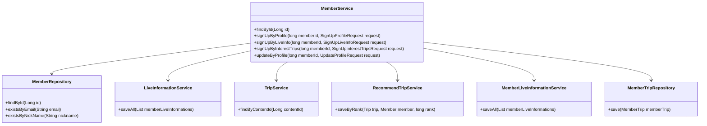
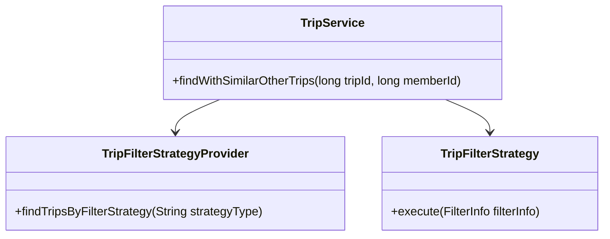
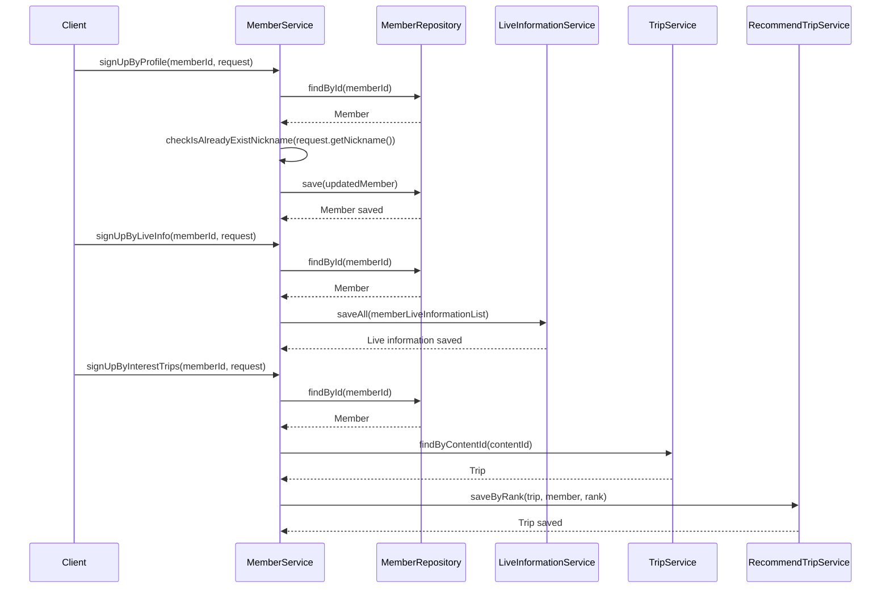

# Comprehensive Documentation for the Service Code

## 1. Overall Structure

### High-Level Overview
The service code is part of a larger application that manages members, trips, and live information. It provides functionalities for member registration, profile updates, and managing member interests in trips and live information.

### Purpose and Function
The `MemberService` class is responsible for handling member-related operations, including:
- Finding members by ID or email.
- Signing up members with profiles, live information, and interests in trips.
- Updating member profiles.
- Managing member privileges.

### Interaction Between Components
- **MemberService** interacts with:
  - **MemberRepository**: For CRUD operations on members.
  - **LiveInformationService**: To manage live information related to members.
  - **TripService**: To handle trips associated with members.
  - **RecommendTripService**: To manage recommended trips for members.
  - **MemberLiveInformationService**: To save live information for members.
  - **MemberTripRepository**: To manage member-trip relationships.

### Mermaid Diagram


## 2. Strategy Pattern Implementation

### Strategy Pattern Overview
The strategy pattern is used to define a family of algorithms, encapsulate each one, and make them interchangeable. In this codebase, the strategy pattern is applied in the context of trip filtering and recommendation strategies.

### Strategy Interface and Concrete Strategy Classes
- **TripFilterStrategy**: An interface that defines the method for executing a filtering strategy.
- **TripFilterStrategyProvider**: A provider class that returns the appropriate strategy based on the given criteria.

### Context Class
- **TripService**: This class uses the `TripFilterStrategyProvider` to obtain the appropriate filtering strategy and execute it based on the current context (e.g., finding similar trips).

### Class Diagram


## 3. Detailed Component Documentation

### a. Classes

#### MemberService
- **Purpose**: Manages member-related operations.
- **Attributes**:
  - `memberRepository`: Repository for member data.
  - `memberLiveInformationService`: Service for managing member live information.
  - `tripService`: Service for managing trips.
  - `recommendTripService`: Service for managing recommended trips.
  - `liveInformationRepository`: Repository for live information.
  - `memberTripRepository`: Repository for member-trip relationships.
- **Role**: Acts as a facade for member-related operations, coordinating between various repositories and services.

#### Member
- **Purpose**: Represents a member in the system.
- **Attributes**:
  - `id`: Unique identifier for the member.
  - `email`: Email address of the member.
  - `nickName`: Nickname of the member.
  - `profileImageUrl`: URL of the member's profile image.
  - `socialType`: Type of social login used by the member.
  - `birthday`: Birthday of the member.
  - `genderType`: Gender of the member.
  - `authority`: Authority level of the member.
- **Role**: Encapsulates member data and behavior.

### b. Methods and Functions

#### findById
- **Purpose**: Retrieves a member by their ID.
- **Parameters**:
  - `id` (Long): The ID of the member to find.
- **Return Value**: `MemberResponse`: A response object containing member details.
- **Example**:
  ```java
  MemberResponse response = memberService.findById(1L);
  ```

#### signUpByProfile
- **Purpose**: Updates a member's profile.
- **Parameters**:
  - `memberId` (long): The ID of the member to update.
  - `request` (SignUpProfileRequest): The profile update request containing new details.
- **Return Value**: None.
- **Example**:
  ```java
  memberService.signUpByProfile(1L, new SignUpProfileRequest("newNickname", LocalDate.now(), GenderType.MALE));
  ```

#### signUpByLiveInfo
- **Purpose**: Associates live information with a member.
- **Parameters**:
  - `memberId` (long): The ID of the member.
  - `request` (SignUpLiveInfoRequest): The request containing live information names.
- **Return Value**: None.
- **Example**:
  ```java
  memberService.signUpByLiveInfo(1L, new SignUpLiveInfoRequest(Arrays.asList("LiveInfo1", "LiveInfo2")));
  ```

#### signUpByInterestTrips
- **Purpose**: Associates interest trips with a member.
- **Parameters**:
  - `memberId` (long): The ID of the member.
  - `request` (SignUpInterestTripsRequest): The request containing content IDs of interest trips.
- **Return Value**: None.
- **Example**:
  ```java
  memberService.signUpByInterestTrips(1L, new SignUpInterestTripsRequest(Arrays.asList(101L, 102L)));
  ```

## 4. Implementation Flow

### Sequence Diagram


This documentation provides a comprehensive overview of the service code, detailing its structure, strategy pattern implementation, component documentation, and implementation flow. It serves as a guide for both new and experienced developers to understand and work with the code effectively.