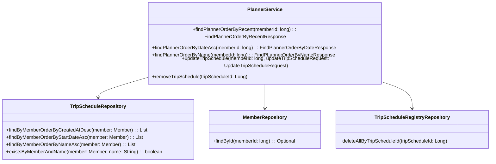
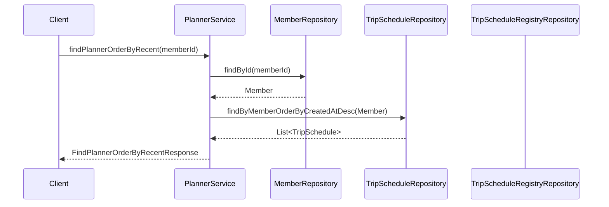

# Comprehensive Documentation for the PlannerService Code

## 1. Overall Structure

### High-Level Overview
The `PlannerService` class is part of the `moheng.planner.application` package and is responsible for managing trip schedules for members. It interacts with the `TripScheduleRepository`, `MemberRepository`, and `TripScheduleRegistryRepository` to perform CRUD operations on trip schedules and to retrieve schedules based on different criteria.

### Purpose and Function
The primary function of the `PlannerService` is to provide an interface for managing trip schedules, including finding schedules by various criteria, updating existing schedules, and removing schedules. It ensures that operations are performed in a transactional context and handles exceptions related to members and trip schedules.

### Interaction Between Components
- **Repositories**: The service interacts with three repositories to perform database operations.
- **DTOs**: The service uses Data Transfer Objects (DTOs) to encapsulate the data being transferred between the service and the client.
- **Exceptions**: Custom exceptions are thrown to handle specific error scenarios.

### Mermaid Diagram


## 2. Strategy Pattern Implementation
The `PlannerService` does not explicitly implement the Strategy Pattern. However, it utilizes repositories to abstract the data access layer, which can be seen as a form of strategy for managing different data sources.

### Context Class
The `PlannerService` acts as the context class that uses various repository strategies to perform operations.

### Class Diagram


## 3. Detailed Component Documentation

### a. Classes

#### PlannerService
- **Purpose**: Manages trip schedules for members.
- **Attributes**:
  - `tripScheduleRepository`: Repository for trip schedules.
  - `memberRepository`: Repository for members.
  - `tripScheduleRegistryRepository`: Repository for trip schedule registries.
- **Role**: Acts as a service layer to handle business logic related to trip schedules.

### b. Methods and Functions

#### findPlannerOrderByRecent
- **Purpose**: Retrieves trip schedules for a member ordered by creation date (most recent first).
- **Parameters**:
  - `memberId` (long): The ID of the member.
- **Return Value**: `FindPlannerOrderByRecentResponse`: Contains a list of trip schedules.
- **Code Example**:
  ```java
  FindPlannerOrderByRecentResponse response = plannerService.findPlannerOrderByRecent(memberId);
  ```

#### findPlannerOrderByDateAsc
- **Purpose**: Retrieves trip schedules for a member ordered by start date (ascending).
- **Parameters**:
  - `memberId` (long): The ID of the member.
- **Return Value**: `FindPlannerOrderByDateResponse`: Contains a list of trip schedules.
- **Code Example**:
  ```java
  FindPlannerOrderByDateResponse response = plannerService.findPlannerOrderByDateAsc(memberId);
  ```

#### findPlannerOrderByName
- **Purpose**: Retrieves trip schedules for a member ordered by name (alphabetically).
- **Parameters**:
  - `memberId` (long): The ID of the member.
- **Return Value**: `FindPLannerOrderByNameResponse`: Contains a list of trip schedules.
- **Code Example**:
  ```java
  FindPLannerOrderByNameResponse response = plannerService.findPlannerOrderByName(memberId);
  ```

#### updateTripSchedule
- **Purpose**: Updates an existing trip schedule.
- **Parameters**:
  - `memberId` (long): The ID of the member.
  - `updateTripScheduleRequest` (UpdateTripScheduleRequest): DTO containing updated schedule information.
- **Return Value**: void
- **Code Example**:
  ```java
  plannerService.updateTripSchedule(memberId, updateRequest);
  ```

#### removeTripSchedule
- **Purpose**: Removes a trip schedule by ID.
- **Parameters**:
  - `tripScheduleId` (Long): The ID of the trip schedule to remove.
- **Return Value**: void
- **Code Example**:
  ```java
  plannerService.removeTripSchedule(tripScheduleId);
  ```

## 4. Implementation Flow

### Sequence Diagram


### Explanation of Flow
1. The client calls `findPlannerOrderByRecent` on the `PlannerService`.
2. The service retrieves the member using `MemberRepository`.
3. The service fetches the trip schedules for the member ordered by creation date from `TripScheduleRepository`.
4. Finally, the service returns a response containing the list of trip schedules to the client.

This documentation provides a comprehensive overview of the `PlannerService` code, detailing its structure, functionality, and interactions with other components in the system.