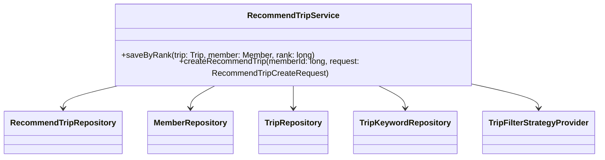
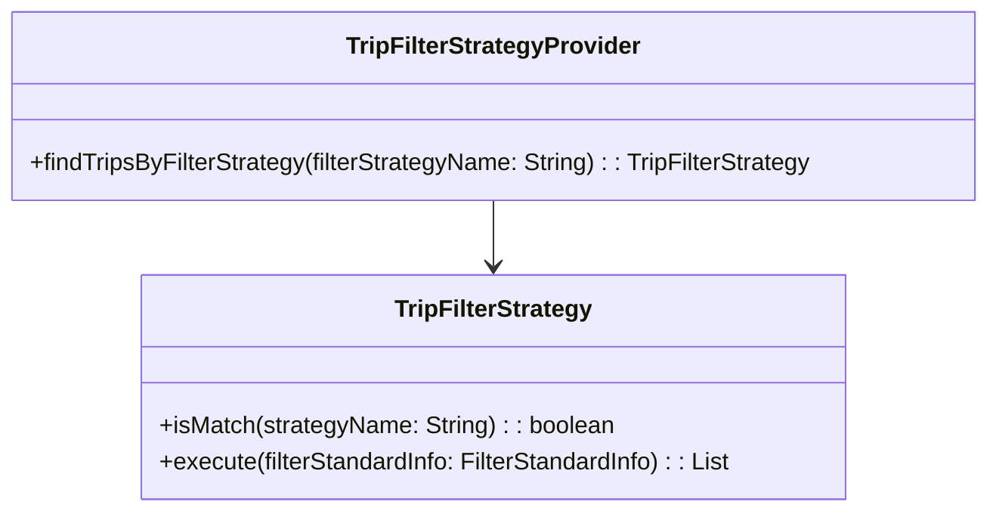
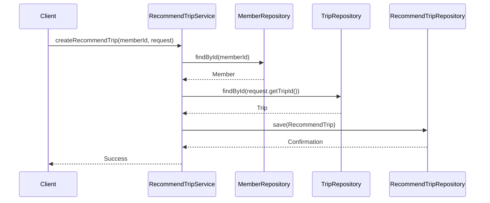

# Comprehensive Documentation for the RecommendTripService Code

## 1. Overall Structure

### High-Level Overview
The `RecommendTripService` class is part of a larger application that manages trip recommendations for users (members). It interacts with various repositories to fetch and save data related to trips and members, utilizing the strategy pattern to filter trips based on user preferences.

### Purpose and Function
The `RecommendTripService` is responsible for:
- Saving recommended trips for members.
- Creating new recommendations based on member IDs and trip IDs.
- Utilizing different filtering strategies to recommend trips.

### Interaction Between Components
- **Repositories**: The service interacts with `RecommendTripRepository`, `MemberRepository`, `TripRepository`, and `TripKeywordRepository` to perform CRUD operations.
- **Filter Strategies**: It uses `TripFilterStrategyProvider` to obtain the appropriate filtering strategy based on the user's preferences.

### Mermaid Diagram


## 2. Strategy Pattern Implementation

### Strategy Pattern Overview
The strategy pattern is implemented to allow dynamic selection of filtering strategies for recommending trips based on user preferences.

### Strategy Interface and Concrete Strategy Classes
- **Interface**: `TripFilterStrategy`
  - Method `isMatch(String strategyName)`: Determines if the strategy matches the given name.
  - Method `execute(FilterStandardInfo filterStandardInfo)`: Executes the filtering logic based on the provided information.

### Context Class
- **Class**: `TripFilterStrategyProvider`
  - Responsible for providing the appropriate strategy based on the filter strategy name.

### Class Diagram


## 3. Detailed Component Documentation

### a. Classes

#### 1. RecommendTripService
- **Purpose**: Manages the recommendation of trips for members.
- **Attributes**:
  - `tripFilterStrategyProvider`: Provides filtering strategies.
  - `recommendTripRepository`: Repository for managing recommended trips.
  - `memberRepository`: Repository for managing members.
  - `tripRepository`: Repository for managing trips.
  - `tripKeywordRepository`: Repository for managing trip keywords.

#### 2. TripFilterStrategyProvider
- **Purpose**: Provides the appropriate trip filter strategy based on the strategy name.
- **Attributes**:
  - `tripFilterStrategies`: List of available trip filter strategies.

### b. Methods and Functions

#### 1. `saveByRank`
- **Purpose**: Saves a recommended trip with a specified ranking.
- **Parameters**:
  - `trip`: `Trip` - The trip to be recommended.
  - `member`: `Member` - The member for whom the trip is recommended.
  - `rank`: `long` - The ranking of the recommendation.
- **Return Value**: `void`
- **Code Example**:
  ```java
  recommendTripService.saveByRank(trip, member, 1);
  ```

#### 2. `createRecommendTrip`
- **Purpose**: Creates a new recommended trip for a member.
- **Parameters**:
  - `memberId`: `long` - The ID of the member.
  - `request`: `RecommendTripCreateRequest` - The request containing trip ID.
- **Return Value**: `void`
- **Code Example**:
  ```java
  recommendTripService.createRecommendTrip(memberId, new RecommendTripCreateRequest(tripId));
  ```

## 4. Implementation Flow

### Sequence Diagram


This documentation provides a comprehensive overview of the `RecommendTripService` code, detailing its structure, strategy pattern implementation, and the flow of operations. It is designed to assist both new and experienced developers in understanding and working with the code effectively.