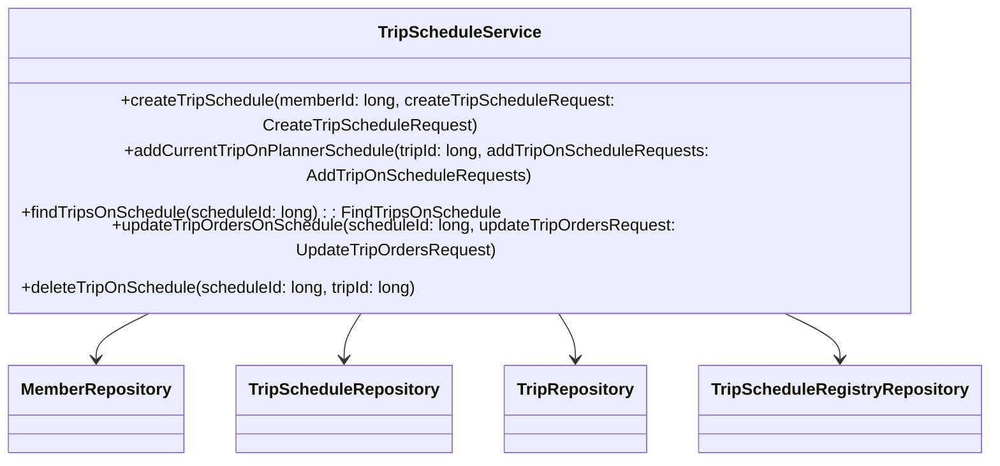
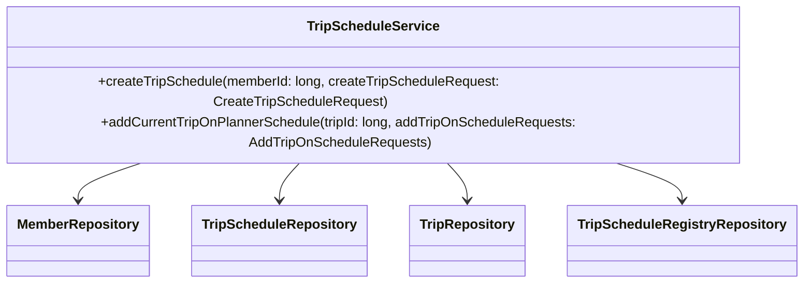
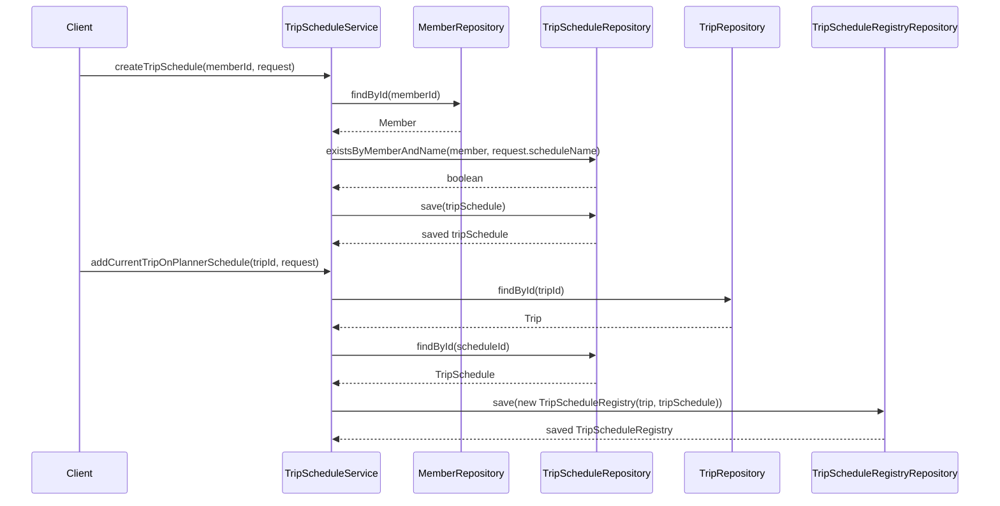

# Comprehensive Documentation for the TripScheduleService Code

## 1. Overall Structure

### High-Level Overview
The `TripScheduleService` class is part of the `moheng.planner.application` package and is responsible for managing trip schedules within the application. It interacts with various repositories to perform CRUD operations related to trip schedules, members, and trips.

### Purpose and Function
The primary purpose of the `TripScheduleService` is to provide a service layer that handles business logic for creating, updating, and retrieving trip schedules. It ensures that the operations are performed in a transactional context and validates the data before performing any actions.

### Interaction Between Components
- **Repositories**: The service interacts with `MemberRepository`, `TripScheduleRepository`, `TripRepository`, and `TripScheduleRegistryRepository` to perform database operations.
- **DTOs**: The service uses Data Transfer Objects (DTOs) like `CreateTripScheduleRequest`, `AddTripOnScheduleRequests`, and `UpdateTripOrdersRequest` to encapsulate data for requests.
- **Exceptions**: Custom exceptions are thrown to handle various error scenarios, ensuring that the service responds appropriately to invalid operations.

### Mermaid Diagram


## 2. Strategy Pattern Implementation

### Strategy Pattern Overview
The `TripScheduleService` does not explicitly implement the Strategy Pattern. However, it utilizes various repositories to encapsulate the data access logic, which can be seen as a form of strategy where different data access strategies are employed based on the context of the operation.

### Context Class
The `TripScheduleService` acts as the context class that uses different strategies (repositories) to perform operations.

### Class Diagram


## 3. Detailed Component Documentation

### a. Classes

#### TripScheduleService
- **Purpose**: Manages trip schedules and their associated operations.
- **Attributes**:
  - `memberRepository`: Repository for member data.
  - `tripScheduleRepository`: Repository for trip schedule data.
  - `tripRepository`: Repository for trip data.
  - `tripScheduleRegistryRepository`: Repository for trip schedule registry data.
- **Role**: Acts as a service layer to handle business logic related to trip schedules.

### b. Methods and Functions

#### createTripSchedule
- **Purpose**: Creates a new trip schedule for a member.
- **Parameters**:
  - `memberId` (long): The ID of the member creating the schedule.
  - `createTripScheduleRequest` (CreateTripScheduleRequest): DTO containing schedule details.
- **Return Value**: None.
- **Code Example**:
  ```java
  tripScheduleService.createTripSchedule(memberId, createTripScheduleRequest);
  ```

#### addCurrentTripOnPlannerSchedule
- **Purpose**: Adds a trip to an existing planner schedule.
- **Parameters**:
  - `tripId` (long): The ID of the trip to add.
  - `addTripOnScheduleRequests` (AddTripOnScheduleRequests): DTO containing schedule IDs.
- **Return Value**: None.
- **Code Example**:
  ```java
  tripScheduleService.addCurrentTripOnPlannerSchedule(tripId, addTripOnScheduleRequests);
  ```

#### findTripsOnSchedule
- **Purpose**: Retrieves trips associated with a specific schedule.
- **Parameters**:
  - `scheduleId` (long): The ID of the schedule to query.
- **Return Value**: `FindTripsOnSchedule`: DTO containing the schedule and associated trips.
- **Code Example**:
  ```java
  FindTripsOnSchedule tripsOnSchedule = tripScheduleService.findTripsOnSchedule(scheduleId);
  ```

#### updateTripOrdersOnSchedule
- **Purpose**: Updates the order of trips on a schedule.
- **Parameters**:
  - `scheduleId` (long): The ID of the schedule to update.
  - `updateTripOrdersRequest` (UpdateTripOrdersRequest): DTO containing new trip IDs.
- **Return Value**: None.
- **Code Example**:
  ```java
  tripScheduleService.updateTripOrdersOnSchedule(scheduleId, updateTripOrdersRequest);
  ```

#### deleteTripOnSchedule
- **Purpose**: Deletes a trip from a schedule.
- **Parameters**:
  - `scheduleId` (long): The ID of the schedule.
  - `tripId` (long): The ID of the trip to delete.
- **Return Value**: None.
- **Code Example**:
  ```java
  tripScheduleService.deleteTripOnSchedule(scheduleId, tripId);
  ```

## 4. Implementation Flow

### Sequence Diagram


This documentation provides a comprehensive overview of the `TripScheduleService` code, detailing its structure, purpose, and interactions with other components, along with specific method documentation and flow diagrams to illustrate its functionality.