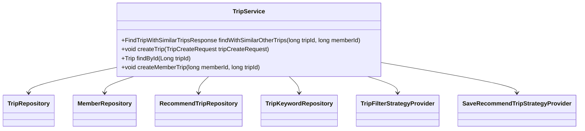
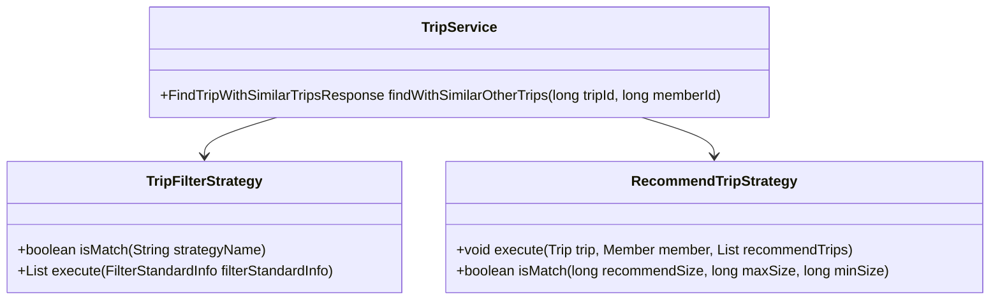
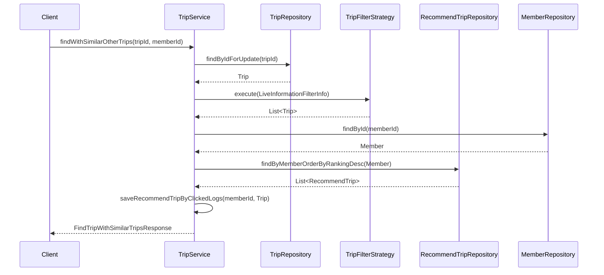

# Comprehensive Documentation for TripService Code

## 1. Overall Structure

### High-Level Overview
The `TripService` class is part of the `moheng.trip.application` package and serves as a service layer for managing trips in the application. It interacts with various repositories to perform operations related to trips, members, and recommendations.

### Purpose and Function
The `TripService` class provides methods to:
- Find trips with similar options based on filters.
- Create new trips and manage member-trip relationships.
- Handle recommendations for trips based on user interactions.

### Interaction Between Components
- **Repositories**: The service interacts with multiple repositories (`TripRepository`, `MemberRepository`, `RecommendTripRepository`, etc.) to fetch and persist data.
- **Strategies**: It utilizes the Strategy Pattern to apply different filtering and recommendation strategies dynamically.
- **Entities**: The service operates on entities like `Trip`, `Member`, `RecommendTrip`, and `TripKeyword`.

### Mermaid Diagram


---

## 2. Strategy Pattern Implementation

### Strategy Pattern Overview
The Strategy Pattern is implemented in the `TripService` through the use of `TripFilterStrategy` and `RecommendTripStrategy`. This allows the service to dynamically choose the appropriate filtering and recommendation strategies based on the context.

### Strategy Interface and Concrete Strategy Classes
- **TripFilterStrategy**: An interface that defines methods for filtering trips based on specific criteria.
- **RecommendTripStrategy**: An interface that defines methods for executing recommendation logic for trips.

### Context Class
The `TripService` class acts as the context that utilizes the strategies. It calls the appropriate strategy methods based on the current operation.

### Class Diagram


---

## 3. Detailed Component Documentation

### a. Classes

#### TripService
- **Purpose**: Manages trip-related operations and interactions with repositories.
- **Attributes**:
  - `tripFilterStrategyProvider`: Provides filtering strategies.
  - `saveRecommendTripStrategyProvider`: Provides recommendation strategies.
  - Various repository instances for data access.
- **Role**: Acts as a mediator between the application layer and the data layer, orchestrating the flow of data and business logic.

### b. Methods and Functions

#### findWithSimilarOtherTrips
- **Purpose**: Finds a trip by ID and retrieves similar trips based on a filter strategy.
- **Parameters**:
  - `tripId` (long): The ID of the trip to find.
  - `memberId` (long): The ID of the member requesting the trip.
- **Return Value**: `FindTripWithSimilarTripsResponse`: Contains the trip and similar trips.
- **Code Example**:
  ```java
  FindTripWithSimilarTripsResponse response = tripService.findWithSimilarOtherTrips(tripId, memberId);
  ```

#### createTrip
- **Purpose**: Creates a new trip based on the provided request data.
- **Parameters**:
  - `tripCreateRequest` (TripCreateRequest): The request object containing trip details.
- **Return Value**: None.
- **Code Example**:
  ```java
  tripService.createTrip(new TripCreateRequest("Trip Name", "Place Name", 123L, "Description", "Image URL"));
  ```

#### findById
- **Purpose**: Retrieves a trip by its ID.
- **Parameters**:
  - `tripId` (Long): The ID of the trip to find.
- **Return Value**: `Trip`: The found trip entity.
- **Code Example**:
  ```java
  Trip trip = tripService.findById(tripId);
  ```

#### createMemberTrip
- **Purpose**: Creates a relationship between a member and a trip.
- **Parameters**:
  - `memberId` (long): The ID of the member.
  - `tripId` (long): The ID of the trip.
- **Return Value**: None.
- **Code Example**:
  ```java
  tripService.createMemberTrip(memberId, tripId);
  ```

---

## 4. Implementation Flow

### Sequence Diagram


---

This documentation provides a comprehensive overview of the `TripService` class, its interactions, and the implementation of the Strategy Pattern. It serves as a guide for both new and experienced developers to understand and work with the code effectively.