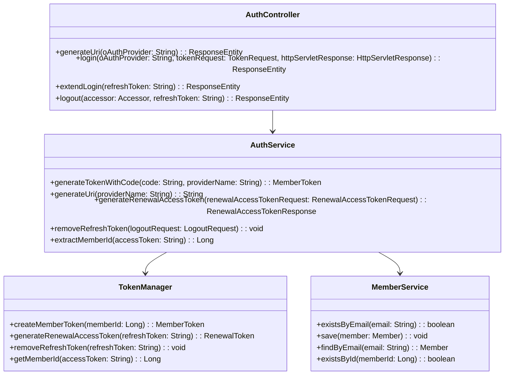
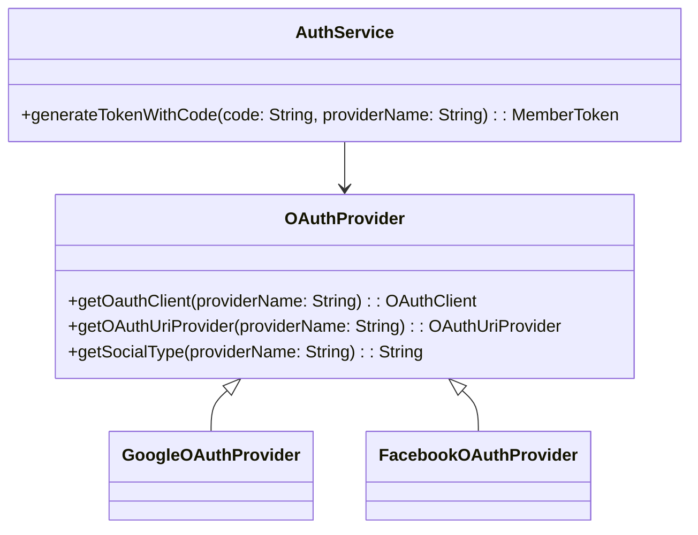
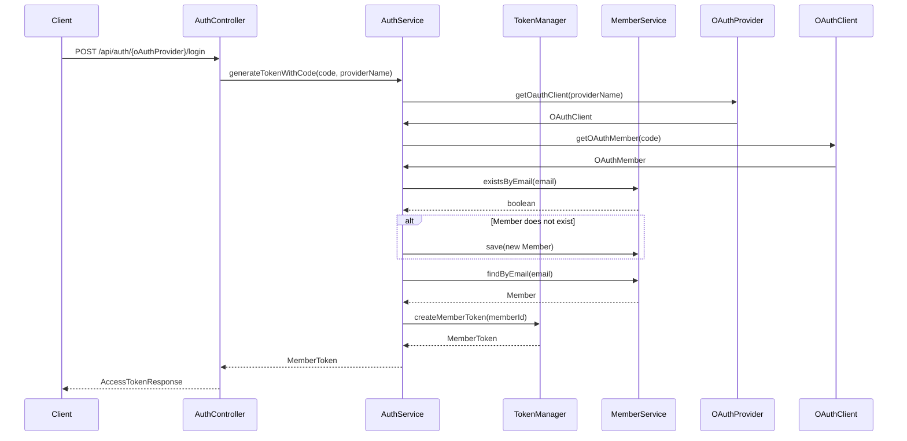

# Documentation for AuthService Codebase

## 1. Overall Structure

### High-Level Overview
The codebase is structured into several packages, primarily focusing on authentication services. The main components include:
- **Application Layer**: Contains the `AuthService` which handles authentication logic.
- **Domain Layer**: Contains domain models such as `MemberToken`, `OAuthMember`, and `TokenManager`.
- **Presentation Layer**: Contains the `AuthController` which exposes RESTful endpoints for authentication.

### Purpose and Function of Service Code
The `AuthService` class is responsible for managing authentication processes, including generating tokens, handling OAuth login, and managing refresh tokens. It interacts with various domain models and services to facilitate these operations.

### Interaction Between Components
- The `AuthController` receives HTTP requests and delegates authentication tasks to the `AuthService`.
- The `AuthService` interacts with the `TokenManager` for token operations and the `MemberService` for member management.
- The `OAuthProvider` is used to handle OAuth-specific operations, such as retrieving OAuth clients and generating URIs.

### Mermaid Diagram


## 2. Strategy Pattern Implementation

### Strategy Pattern Overview
The strategy pattern is not explicitly implemented in the provided code, but it can be inferred that the `OAuthProvider` could serve as a strategy interface for different OAuth providers. Each provider could implement its own strategy for handling OAuth operations.

### Strategy Interface and Concrete Strategy Classes
- **Strategy Interface**: `OAuthProvider` can be considered as an interface that defines methods for getting OAuth clients and generating URIs.
- **Concrete Strategy Classes**: Different implementations of `OAuthProvider` for various OAuth services (e.g., Google, Facebook).

### Context Class
- **Context Class**: `AuthService` acts as the context that uses the `OAuthProvider` strategies to perform authentication tasks.

### Class Diagram


## 3. Detailed Component Documentation

### a. Classes

#### AuthService
- **Purpose**: Manages authentication processes including token generation and member management.
- **Attributes**:
  - `OAuthProvider oAuthProvider`: Interface for OAuth operations.
  - `MemberService memberService`: Service for member-related operations.
  - `TokenManager tokenManager`: Manages token creation and validation.
- **Role in System**: Central service for handling authentication logic.
- **Relationships**: Uses `OAuthProvider`, `MemberService`, and `TokenManager`.

#### MemberToken
- **Purpose**: Represents a token containing access and refresh tokens.
- **Attributes**:
  - `String accessToken`: The access token for authentication.
  - `String refreshToken`: The refresh token for renewing access tokens.
- **Role in System**: Encapsulates token information returned to clients.

#### AuthController
- **Purpose**: Exposes RESTful endpoints for authentication operations.
- **Attributes**:
  - `AuthService authService`: Service for handling authentication logic.
- **Role in System**: Acts as the entry point for authentication requests from clients.

### b. Methods and Functions

#### AuthService Methods

1. **generateTokenWithCode**
   - **Purpose**: Generates a member token using an OAuth code.
   - **Parameters**:
     - `code` (String): The OAuth code received from the provider.
     - `providerName` (String): The name of the OAuth provider.
   - **Return Value**: `MemberToken`: The generated member token.
   - **Example**:
     ```java
     MemberToken token = authService.generateTokenWithCode("oauth_code", "google");
     ```

2. **generateUri**
   - **Purpose**: Generates the OAuth URI for a given provider.
   - **Parameters**:
     - `providerName` (String): The name of the OAuth provider.
   - **Return Value**: `String`: The generated OAuth URI.
   - **Example**:
     ```java
     String uri = authService.generateUri("google");
     ```

3. **generateRenewalAccessToken**
   - **Purpose**: Generates a new access token using a refresh token.
   - **Parameters**:
     - `renewalAccessTokenRequest` (RenewalAccessTokenRequest): Request containing the refresh token.
   - **Return Value**: `RenewalAccessTokenResponse`: Response containing the new access token.
   - **Example**:
     ```java
     RenewalAccessTokenResponse response = authService.generateRenewalAccessToken(new RenewalAccessTokenRequest("refresh_token"));
     ```

4. **removeRefreshToken**
   - **Purpose**: Removes the refresh token during logout.
   - **Parameters**:
     - `logoutRequest` (LogoutRequest): Request containing the refresh token to be removed.
   - **Return Value**: `void`
   - **Example**:
     ```java
     authService.removeRefreshToken(new LogoutRequest("refresh_token"));
     ```

5. **extractMemberId**
   - **Purpose**: Extracts the member ID from an access token.
   - **Parameters**:
     - `accessToken` (String): The access token from which to extract the member ID.
   - **Return Value**: `Long`: The extracted member ID.
   - **Example**:
     ```java
     Long memberId = authService.extractMemberId("access_token");
     ```

#### MemberToken Methods

1. **getAccessToken**
   - **Purpose**: Retrieves the access token.
   - **Return Value**: `String`: The access token.
   - **Example**:
     ```java
     String accessToken = memberToken.getAccessToken();
     ```

2. **getRefreshToken**
   - **Purpose**: Retrieves the refresh token.
   - **Return Value**: `String`: The refresh token.
   - **Example**:
     ```java
     String refreshToken = memberToken.getRefreshToken();
     ```

### AuthController Methods

1. **generateUri**
   - **Purpose**: Generates the OAuth URI for a specific provider.
   - **Parameters**:
     - `oAuthProvider` (String): The name of the OAuth provider.
   - **Return Value**: `ResponseEntity<OAuthUriResponse>`: Response containing the generated URI.
   - **Example**:
     ```java
     ResponseEntity<OAuthUriResponse> response = authController.generateUri("google");
     ```

2. **login**
   - **Purpose**: Handles login requests and generates tokens.
   - **Parameters**:
     - `oAuthProvider` (String): The name of the OAuth provider.
     - `tokenRequest` (TokenRequest): Request containing the OAuth code.
     - `httpServletResponse` (HttpServletResponse): The HTTP response to set cookies.
   - **Return Value**: `ResponseEntity<AccessTokenResponse>`: Response containing the access token.
   - **Example**:
     ```java
     ResponseEntity<AccessTokenResponse> response = authController.login("google", new TokenRequest("oauth_code"), httpServletResponse);
     ```

3. **extendLogin**
   - **Purpose**: Extends the login session by generating a new access token using a refresh token.
   - **Parameters**:
     - `refreshToken` (String): The refresh token from cookies.
   - **Return Value**: `ResponseEntity<RenewalAccessTokenResponse>`: Response containing the new access token.
   - **Example**:
     ```java
     ResponseEntity<RenewalAccessTokenResponse> response = authController.extendLogin("refresh_token");
     ```

4. **logout**
   - **Purpose**: Handles logout requests and removes the refresh token.
   - **Parameters**:
     - `accessor` (Accessor): The authenticated user accessor.
     - `refreshToken` (String): The refresh token from cookies.
   - **Return Value**: `ResponseEntity<Void>`: Response indicating logout success.
   - **Example**:
     ```java
     ResponseEntity<Void> response = authController.logout(accessor, "refresh_token");
     ```

## 4. Implementation Flow

### Sequence Diagram


This documentation provides a comprehensive overview of the `AuthService` codebase, detailing its structure, strategy pattern implementation, component documentation, and the flow of implementation. This should serve as a useful reference for both new and experienced developers working with the code.