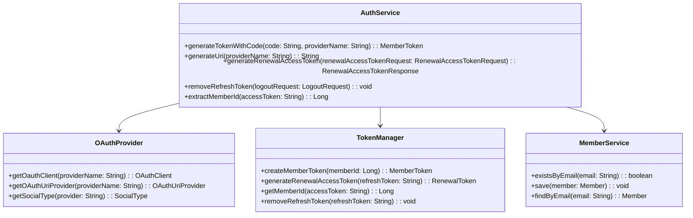
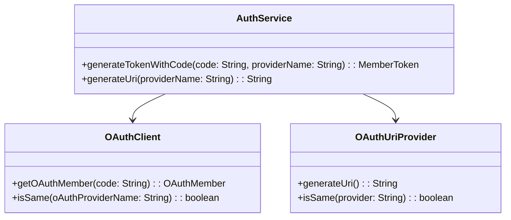
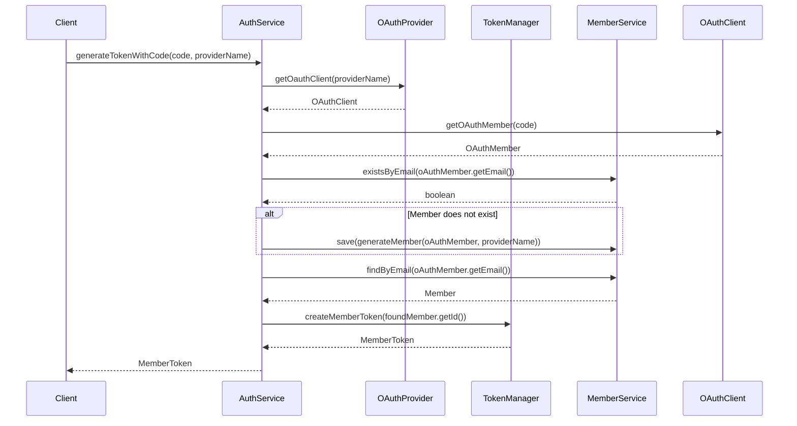

# Comprehensive Documentation for the Auth Service Code

## 1. Overall Structure

### High-Level Overview
The codebase consists of several packages that define the domain models, data transfer objects (DTOs), exceptions, and services related to authentication and member management. The main components include OAuth clients, member tokens, and the `AuthService` which orchestrates the authentication process.

### Purpose and Function of Service Code
The `AuthService` is responsible for handling authentication-related operations, including generating tokens for members, managing OAuth providers, and handling member creation and retrieval based on OAuth member information. It interacts with various components such as `OAuthProvider`, `TokenManager`, and `MemberService` to fulfill its responsibilities.

### Interaction Between Components
- **AuthService**: The main service that coordinates authentication processes.
- **OAuthProvider**: Provides access to different OAuth clients and URI providers based on the provider name.
- **TokenManager**: Manages the creation and renewal of member tokens.
- **MemberService**: Handles member-related operations such as saving and retrieving member information.

### Mermaid Diagram


## 2. Strategy Pattern Implementation

### Strategy Pattern Overview
The strategy pattern is implemented through the use of interfaces for OAuth clients and URI providers. This allows for different implementations of OAuth clients and URI generation strategies to be used interchangeably.

### Strategy Interface and Concrete Strategy Classes
- **OAuthClient**: Interface for OAuth clients that defines methods for retrieving OAuth member information.
- **OAuthUriProvider**: Interface for generating OAuth URIs.

### Context Class
- **AuthService**: Acts as the context that uses the strategies defined by `OAuthClient` and `OAuthUriProvider` to perform authentication tasks.

### Class Diagram


## 3. Detailed Component Documentation

### a. Classes

#### 1. OAuthClient
- **Purpose**: Interface for OAuth clients to retrieve member information.
- **Attributes**: None.
- **Role**: Defines the contract for OAuth clients.
- **Relationships**: Used by `AuthService`.

#### 2. OAuthMember
- **Purpose**: Interface representing an OAuth member.
- **Attributes**: None.
- **Role**: Provides methods to access member details.
- **Relationships**: Used by `OAuthClient`.

#### 3. OAuthProvider
- **Purpose**: Interface for managing OAuth clients and URI providers.
- **Attributes**: None.
- **Role**: Provides methods to retrieve OAuth clients and URI providers.
- **Relationships**: Used by `AuthService`.

#### 4. OAuthUriProvider
- **Purpose**: Interface for generating OAuth URIs.
- **Attributes**: None.
- **Role**: Defines methods for URI generation.
- **Relationships**: Used by `AuthService`.

#### 5. MemberToken
- **Purpose**: Represents a member's access and refresh tokens.
- **Attributes**:
  - `accessToken`: String
  - `refreshToken`: String
- **Role**: Encapsulates token information.
- **Relationships**: Used by `TokenManager` and `AuthService`.

#### 6. RenewalToken
- **Purpose**: Represents a renewal token for access.
- **Attributes**:
  - `accessToken`: String
  - `refreshToken`: String
- **Role**: Encapsulates renewal token information.
- **Relationships**: Used by `TokenManager` and `AuthService`.

#### 7. TokenManager
- **Purpose**: Interface for managing tokens.
- **Attributes**: None.
- **Role**: Defines methods for token creation and management.
- **Relationships**: Used by `AuthService`.

#### 8. AuthService
- **Purpose**: Main service for handling authentication.
- **Attributes**:
  - `oAuthProvider`: OAuthProvider
  - `memberService`: MemberService
  - `tokenManager`: TokenManager
- **Role**: Coordinates authentication processes.
- **Relationships**: Interacts with `OAuthProvider`, `TokenManager`, and `MemberService`.

### b. Methods and Functions

#### 1. generateTokenWithCode
- **Purpose**: Generates a member token using an OAuth code.
- **Parameters**:
  - `code`: String - The OAuth code received from the provider.
  - `providerName`: String - The name of the OAuth provider.
- **Return Value**: `MemberToken` - The generated member token.
- **Code Example**:
  ```java
  MemberToken token = authService.generateTokenWithCode("oauth_code", "provider_name");
  ```

#### 2. generateUri
- **Purpose**: Generates an OAuth URI for a given provider.
- **Parameters**:
  - `providerName`: String - The name of the OAuth provider.
- **Return Value**: `String` - The generated OAuth URI.
- **Code Example**:
  ```java
  String uri = authService.generateUri("provider_name");
  ```

#### 3. generateRenewalAccessToken
- **Purpose**: Generates a renewal access token.
- **Parameters**:
  - `renewalAccessTokenRequest`: RenewalAccessTokenRequest - The request containing the refresh token.
- **Return Value**: `RenewalAccessTokenResponse` - The response containing the new access token.
- **Code Example**:
  ```java
  RenewalAccessTokenResponse response = authService.generateRenewalAccessToken(new RenewalAccessTokenRequest("refresh_token"));
  ```

#### 4. removeRefreshToken
- **Purpose**: Removes a refresh token.
- **Parameters**:
  - `logoutRequest`: LogoutRequest - The request containing the refresh token to be removed.
- **Return Value**: `void`
- **Code Example**:
  ```java
  authService.removeRefreshToken(new LogoutRequest("refresh_token"));
  ```

#### 5. extractMemberId
- **Purpose**: Extracts the member ID from an access token.
- **Parameters**:
  - `accessToken`: String - The access token.
- **Return Value**: `Long` - The extracted member ID.
- **Code Example**:
  ```java
  Long memberId = authService.extractMemberId("access_token");
  ```

## 4. Implementation Flow

### Sequence Diagram


This documentation provides a comprehensive overview of the `AuthService` code, detailing its structure, strategy pattern implementation, component documentation, and the flow of implementation. It serves as a guide for both new and experienced developers to understand and work with the code effectively.