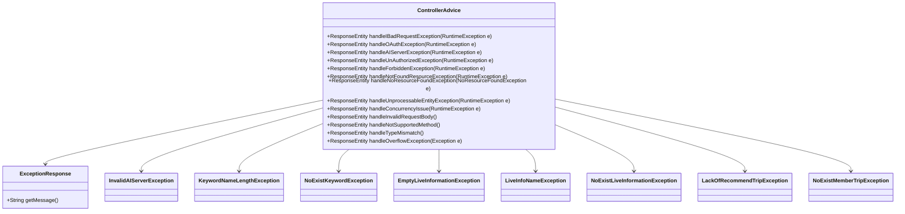

# Comprehensive Documentation for Service Code

## 1. Overall Structure

### High-Level Overview
The codebase consists of a set of exception classes and a central controller advice class that handles exceptions thrown by the application. The primary purpose of this code is to manage error responses in a consistent manner across the application, ensuring that clients receive meaningful error messages and appropriate HTTP status codes.

### Purpose and Function of Service Code
The `ControllerAdvice` class is annotated with `@RestControllerAdvice`, which allows it to handle exceptions globally for all controllers in the application. It defines various methods to handle specific exceptions and return a standardized `ExceptionResponse` object containing error messages.

### Interaction Between Components
- **Exception Classes**: Custom exceptions are defined for various error scenarios, such as invalid input or resource not found.
- **ControllerAdvice**: This class listens for exceptions thrown by controllers and responds with an appropriate HTTP response.
- **ExceptionResponse**: This DTO (Data Transfer Object) is used to encapsulate error messages returned to the client.

### Mermaid Diagram


## 2. Strategy Pattern Implementation

### Strategy Pattern Overview
The strategy pattern is not explicitly implemented in the provided code. However, the `ControllerAdvice` class can be seen as a context that uses various strategies (exception handlers) to handle different types of exceptions.

### Strategy Interface and Concrete Strategy Classes
In this case, the strategies are represented by the various `@ExceptionHandler` methods within the `ControllerAdvice` class. Each method acts as a concrete strategy for handling specific exceptions.

### Context Class
The `ControllerAdvice` class serves as the context that delegates exception handling to the appropriate strategy based on the type of exception thrown.

### Class Diagram


## 3. Detailed Component Documentation

### a. Classes

#### ExceptionResponse
- **Purpose**: Represents the structure of the error response sent to the client.
- **Attributes**:
  - `message`: A string containing the error message.
- **Role in System**: Used to encapsulate error messages for consistent API responses.
- **Relationships**: Used by `ControllerAdvice` to return error responses.

#### InvalidAIServerException
- **Purpose**: Custom exception for invalid AI server errors.
- **Attributes**: Inherits from `RuntimeException`.
- **Role in System**: Thrown when there is an issue with the AI server.
- **Relationships**: Handled by `ControllerAdvice`.

#### KeywordNameLengthException
- **Purpose**: Custom exception for keyword name length violations.
- **Attributes**: Inherits from `RuntimeException`.
- **Role in System**: Thrown when a keyword name exceeds the allowed length.
- **Relationships**: Handled by `ControllerAdvice`.

#### NoExistKeywordException
- **Purpose**: Custom exception for non-existent keywords.
- **Attributes**: Inherits from `RuntimeException`.
- **Role in System**: Thrown when a requested keyword does not exist.
- **Relationships**: Handled by `ControllerAdvice`.

#### EmptyLiveInformationException
- **Purpose**: Custom exception for empty live information.
- **Attributes**: Inherits from `RuntimeException`.
- **Role in System**: Thrown when live information is expected but not found.
- **Relationships**: Handled by `ControllerAdvice`.

#### LiveInfoNameException
- **Purpose**: Custom exception for invalid live information names.
- **Attributes**: Inherits from `RuntimeException`.
- **Role in System**: Thrown when a live information name is invalid.
- **Relationships**: Handled by `ControllerAdvice`.

#### NoExistLiveInformationException
- **Purpose**: Custom exception for non-existent live information.
- **Attributes**: Inherits from `RuntimeException`.
- **Role in System**: Thrown when requested live information does not exist.
- **Relationships**: Handled by `ControllerAdvice`.

#### LackOfRecommendTripException
- **Purpose**: Custom exception for lack of recommended trips.
- **Attributes**: Inherits from `RuntimeException`.
- **Role in System**: Thrown when there are no recommended trips available.
- **Relationships**: Handled by `ControllerAdvice`.

#### NoExistMemberTripException
- **Purpose**: Custom exception for non-existent member trips.
- **Attributes**: Inherits from `RuntimeException`.
- **Role in System**: Thrown when a member's trip does not exist.
- **Relationships**: Handled by `ControllerAdvice`.

### b. Methods and Functions

#### handleIBadRequestException
- **Purpose**: Handles various bad request exceptions.
- **Parameters**:
  - `e`: `RuntimeException` - The exception that was thrown.
- **Return Value**: `ResponseEntity<ExceptionResponse>` - A response entity containing the error message and HTTP status 400 (Bad Request).
- **Code Example**:
  ```java
  @ExceptionHandler({
      BadRequestException.class,
      InvalidEmailFormatException.class,
      // other exceptions
  })
  public ResponseEntity<ExceptionResponse> handleIBadRequestException(final RuntimeException e) {
      logger.error(e.getMessage(), e);
      ExceptionResponse exceptionResponse = new ExceptionResponse(e.getMessage());
      return ResponseEntity.badRequest().body(exceptionResponse);
  }
  ```

#### handleOAuthException
- **Purpose**: Handles exceptions related to OAuth.
- **Parameters**:
  - `e`: `RuntimeException` - The exception that was thrown.
- **Return Value**: `ResponseEntity<ExceptionResponse>` - A response entity containing the error message and HTTP status 500 (Internal Server Error).
- **Code Example**:
  ```java
  @ExceptionHandler(InvalidOAuthServiceException.class)
  public ResponseEntity<ExceptionResponse> handleOAuthException(final RuntimeException e) {
      logger.error(e.getMessage(), e);
      ExceptionResponse exceptionResponse = new ExceptionResponse(e.getMessage());
      return ResponseEntity.internalServerError().body(exceptionResponse);
  }
  ```

#### handleAIServerException
- **Purpose**: Handles exceptions related to the AI server.
- **Parameters**:
  - `e`: `RuntimeException` - The exception that was thrown.
- **Return Value**: `ResponseEntity<ExceptionResponse>` - A response entity containing the error message and HTTP status 500 (Internal Server Error).
- **Code Example**:
  ```java
  @ExceptionHandler(InvalidAIServerException.class)
  public ResponseEntity<ExceptionResponse> handleAIServerException(final RuntimeException e) {
      logger.error(e.getMessage(), e);
      ExceptionResponse exceptionResponse = new ExceptionResponse(e.getMessage());
      return ResponseEntity.internalServerError().body(exceptionResponse);
  }
  ```

#### handleUnAuthorizedException
- **Purpose**: Handles unauthorized access exceptions.
- **Parameters**:
  - `e`: `RuntimeException` - The exception that was thrown.
- **Return Value**: `ResponseEntity<ExceptionResponse>` - A response entity containing the error message and HTTP status 401 (Unauthorized).
- **Code Example**:
  ```java
  @ExceptionHandler({
      EmptyBearerHeaderException.class,
      InvalidTokenFormatException.class,
      // other exceptions
  })
  public ResponseEntity<ExceptionResponse> handleUnAuthorizedException(final RuntimeException e) {
      logger.error(e.getMessage(), e);
      ExceptionResponse errorResponse = new ExceptionResponse(e.getMessage());
      return ResponseEntity.status(HttpStatus.UNAUTHORIZED).body(errorResponse);
  }
  ```

## 4. Implementation Flow

### Sequence Diagram


This documentation provides a comprehensive overview of the service code, detailing its structure, implementation of the strategy pattern, and in-depth descriptions of its components. It serves as a guide for both new and experienced developers to understand and work with the code effectively.