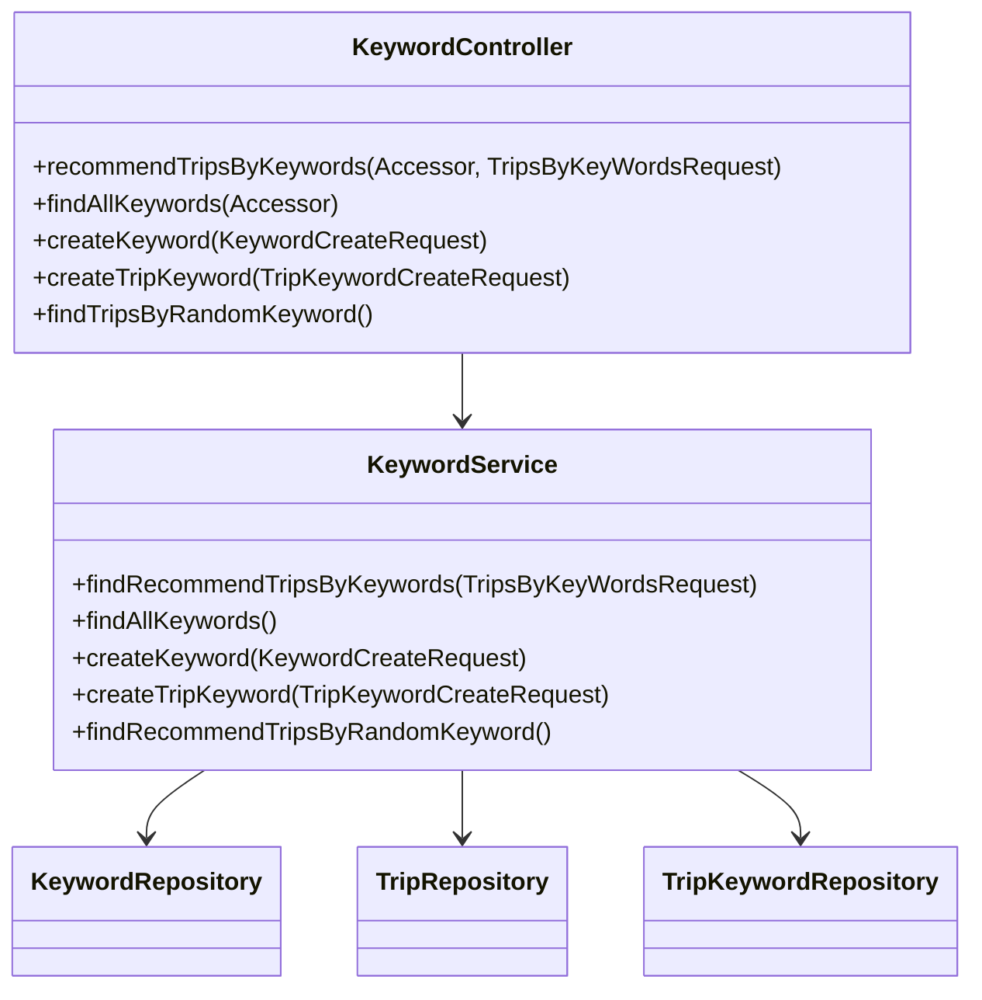
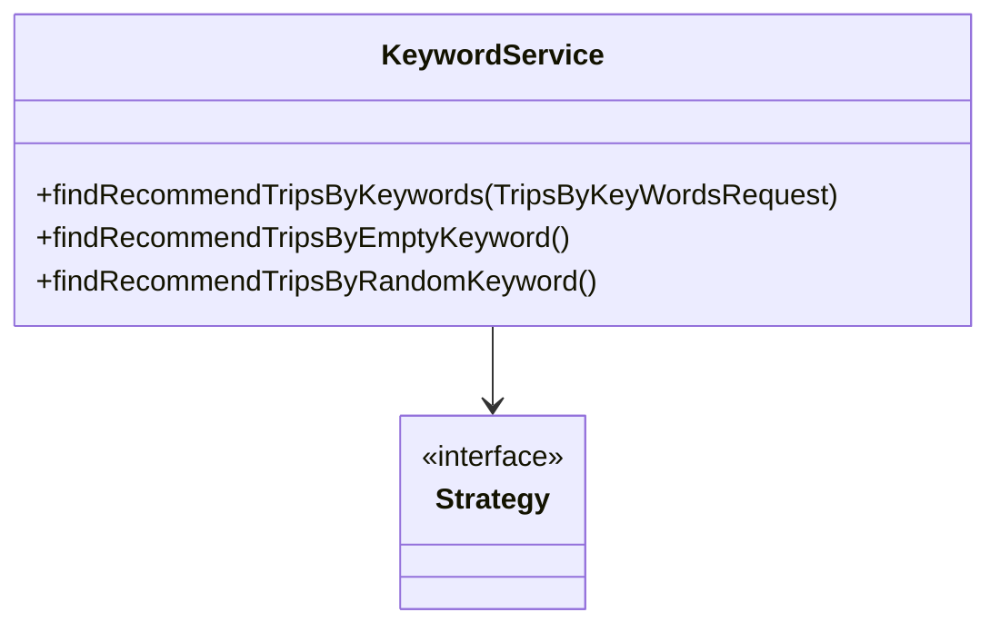
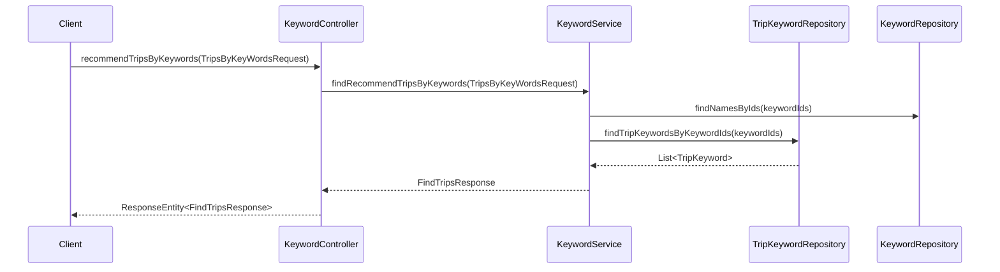

# Comprehensive Documentation for the Service Code

## 1. Overall Structure

### High-Level Overview
The codebase is structured into several packages, each serving a specific purpose in the application. The main packages include:

- **moheng.auth**: Contains authentication-related classes and annotations.
- **moheng.keyword**: Contains classes related to keyword management, including DTOs, services, and repositories.
- **moheng.trip**: Contains classes related to trip management, including DTOs and repositories.
- **moheng.keyword.presentation**: Contains the controller that handles HTTP requests related to keywords.

### Purpose and Function of Service Code
The `KeywordService` class is responsible for managing keywords and their relationships with trips. It provides methods to create keywords, find keywords, and recommend trips based on keywords. The `KeywordController` class serves as the entry point for HTTP requests related to keywords, delegating the business logic to the `KeywordService`.

### Interaction Between Parts
- The `KeywordController` receives HTTP requests and uses the `KeywordService` to perform operations.
- The `KeywordService` interacts with repositories to fetch and manipulate data related to keywords and trips.
- DTOs (Data Transfer Objects) are used to transfer data between the controller and service layers.

### Mermaid Diagram


## 2. Strategy Pattern Implementation

### Strategy Pattern Overview
The strategy pattern is implemented in the `KeywordService` class, where different strategies can be used to recommend trips based on keywords. The strategies can be switched out without modifying the `KeywordService`.

### Strategy Interface and Concrete Strategy Classes
Currently, the code does not explicitly define a strategy interface or concrete strategy classes. However, the methods in `KeywordService` can be seen as strategies for different ways to recommend trips based on keywords.

### Context Class
The `KeywordService` acts as the context class that uses different strategies to recommend trips based on keywords.

### Class Diagram


## 3. Detailed Component Documentation

### a. Classes

#### 1. Accessor
- **Purpose**: Represents an accessor for authentication purposes.
- **Attributes**:
  - `Long id`: Unique identifier for the accessor.
- **Role**: Used to authenticate requests in the `KeywordController`.
- **Relationships**: None.

#### 2. KeywordService
- **Purpose**: Manages keywords and their relationships with trips.
- **Attributes**:
  - `TripsByStatisticsFinder tripsByStatisticsFinder`
  - `RandomKeywordGeneratable randomKeywordGeneratable`
  - `KeywordRepository keywordRepository`
  - `TripRepository tripRepository`
  - `TripKeywordRepository tripKeywordRepository`
- **Role**: Provides methods to create keywords, find keywords, and recommend trips based on keywords.
- **Relationships**: Uses multiple repositories to interact with the database.

### b. Methods and Functions

#### 1. `findAllKeywords`
- **Purpose**: Retrieves all keywords.
- **Parameters**: None.
- **Return Value**: `FindAllKeywordResponses` - a DTO containing all keywords.
- **Code Example**:
  ```java
  FindAllKeywordResponses responses = keywordService.findAllKeywords();
  ```

#### 2. `createKeyword`
- **Purpose**: Creates a new keyword.
- **Parameters**:
  - `KeywordCreateRequest request`: The request containing the keyword to create.
- **Return Value**: `void`.
- **Code Example**:
  ```java
  keywordService.createKeyword(new KeywordCreateRequest("New Keyword"));
  ```

#### 3. `findRecommendTripsByKeywords`
- **Purpose**: Finds recommended trips based on provided keyword IDs.
- **Parameters**:
  - `TripsByKeyWordsRequest request`: The request containing keyword IDs.
- **Return Value**: `FindTripsResponse` - a DTO containing recommended trips.
- **Code Example**:
  ```java
  FindTripsResponse response = keywordService.findRecommendTripsByKeywords(new TripsByKeyWordsRequest(Arrays.asList(1L, 2L)));
  ```

#### 4. `findRecommendTripsByRandomKeyword`
- **Purpose**: Finds recommended trips based on a randomly generated keyword.
- **Parameters**: None.
- **Return Value**: `FindTripsWithRandomKeywordResponse` - a DTO containing recommended trips and the random keyword.
- **Code Example**:
  ```java
  FindTripsWithRandomKeywordResponse response = keywordService.findRecommendTripsByRandomKeyword();
  ```

## 4. Implementation Flow

### Sequence Diagram


This documentation provides a comprehensive overview of the service code, detailing its structure, strategy pattern implementation, component documentation, and implementation flow. It serves as a guide for both new and experienced developers to understand and work with the code effectively.