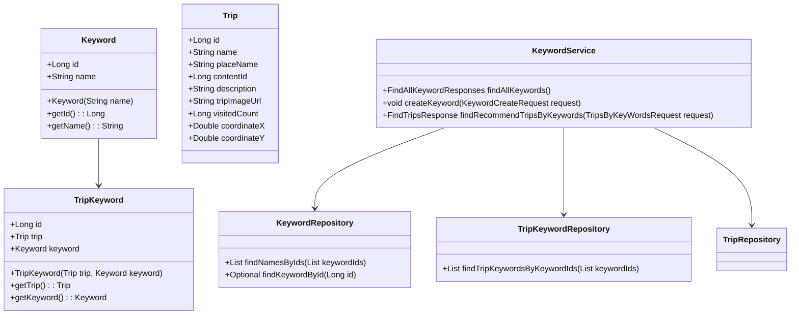
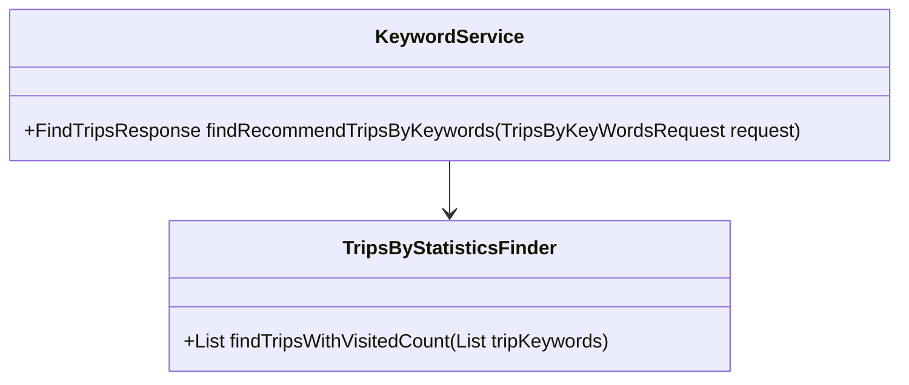
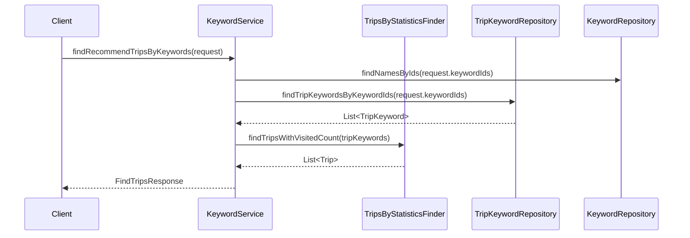

# Comprehensive Documentation for KeywordService Code

## 1. Overall Structure

### High-Level Overview
The codebase is structured into several packages, each serving a specific purpose. The main components include domain entities, repositories, DTOs (Data Transfer Objects), exceptions, and the service layer. The `KeywordService` class is the focal point for managing keywords and their associated trips.

### Purpose and Function of Service Code
The `KeywordService` class is responsible for handling business logic related to keywords and their relationships with trips. It provides methods to create keywords, find trips associated with keywords, and validate keyword existence. The service interacts with various repositories to perform CRUD operations and fetch data.

### Interaction Between Components
- **Repositories**: The service uses `KeywordRepository`, `TripRepository`, and `TripKeywordRepository` to interact with the database.
- **DTOs**: Data transfer objects like `FindAllKeywordResponses`, `FindTripsWithRandomKeywordResponse`, and `TripsByKeyWordsRequest` are used to encapsulate data for requests and responses.
- **Domain Entities**: The service operates on domain entities like `Keyword`, `Trip`, and `TripKeyword` to perform business logic.
- **Exceptions**: Custom exceptions like `NoExistKeywordException` are thrown to handle error scenarios.

### Mermaid Diagram


## 2. Strategy Pattern Implementation

### Strategy Pattern Overview
The strategy pattern is implemented in the `KeywordService` class, where different strategies for finding trips based on keywords are encapsulated in interfaces and concrete implementations.

### Strategy Interface and Concrete Strategy Classes
- **Interface**: `TripsByStatisticsFinder` defines the method `findTripsWithVisitedCount(List<TripKeyword> tripKeywords)`.
- **Concrete Implementations**: The actual implementations of this interface are not provided in the given code but would typically contain logic to find trips based on statistics.

### Context Class
- **Context Class**: `KeywordService` acts as the context that uses the strategy defined by `TripsByStatisticsFinder` to find trips based on keywords.

### Class Diagram


## 3. Detailed Component Documentation

### a. Classes

#### Keyword
- **Purpose**: Represents a keyword entity.
- **Attributes**:
  - `Long id`: Unique identifier for the keyword.
  - `String name`: The name of the keyword.
- **Role**: Serves as a domain entity for keywords.
- **Relationships**: Has a one-to-many relationship with `TripKeyword`.

#### Trip
- **Purpose**: Represents a trip entity.
- **Attributes**:
  - `Long id`: Unique identifier for the trip.
  - `String name`: Name of the trip.
  - `String placeName`: Location of the trip.
  - `Long contentId`: Content identifier associated with the trip.
  - `String description`: Description of the trip.
  - `String tripImageUrl`: URL of the trip image.
  - `Long visitedCount`: Count of how many times the trip has been visited.
  - `Double coordinateX`: X coordinate for the trip location.
  - `Double coordinateY`: Y coordinate for the trip location.
- **Role**: Serves as a domain entity for trips.
- **Relationships**: Has a one-to-many relationship with `TripKeyword`.

#### TripKeyword
- **Purpose**: Represents the association between a trip and a keyword.
- **Attributes**:
  - `Long id`: Unique identifier for the trip keyword.
  - `Trip trip`: The associated trip.
  - `Keyword keyword`: The associated keyword.
- **Role**: Serves as a linking entity between trips and keywords.

#### KeywordService
- **Purpose**: Contains business logic for managing keywords and their associated trips.
- **Attributes**:
  - `TripsByStatisticsFinder tripsByStatisticsFinder`: Strategy for finding trips.
  - `RandomKeywordGeneratable randomKeywordGeneratable`: Strategy for generating random keywords.
  - `KeywordRepository keywordRepository`: Repository for keyword operations.
  - `TripRepository tripRepository`: Repository for trip operations.
  - `TripKeywordRepository tripKeywordRepository`: Repository for trip keyword operations.
- **Role**: Acts as the service layer for keyword-related operations.

### b. Methods and Functions

#### findAllKeywords
- **Purpose**: Retrieves all keywords from the repository.
- **Parameters**: None.
- **Return Value**: `FindAllKeywordResponses` - a DTO containing a list of all keywords.
- **Code Example**:
  ```java
  FindAllKeywordResponses responses = keywordService.findAllKeywords();
  ```

#### createKeyword
- **Purpose**: Creates a new keyword.
- **Parameters**:
  - `KeywordCreateRequest request`: DTO containing the keyword to create.
- **Return Value**: None.
- **Code Example**:
  ```java
  keywordService.createKeyword(new KeywordCreateRequest("New Keyword"));
  ```

#### findNamesByIds
- **Purpose**: Finds keyword names by their IDs.
- **Parameters**:
  - `TripsByKeyWordsRequest request`: DTO containing a list of keyword IDs.
- **Return Value**: `List<String>` - a list of keyword names.
- **Code Example**:
  ```java
  List<String> names = keywordService.findNamesByIds(new TripsByKeyWordsRequest(Arrays.asList(1L, 2L)));
  ```

#### findRecommendTripsByKeywords
- **Purpose**: Finds recommended trips based on provided keyword IDs.
- **Parameters**:
  - `TripsByKeyWordsRequest request`: DTO containing a list of keyword IDs.
- **Return Value**: `FindTripsResponse` - a DTO containing recommended trips.
- **Code Example**:
  ```java
  FindTripsResponse tripsResponse = keywordService.findRecommendTripsByKeywords(new TripsByKeyWordsRequest(Arrays.asList(1L, 2L)));
  ```

#### createTripKeyword
- **Purpose**: Creates a new association between a trip and a keyword.
- **Parameters**:
  - `TripKeywordCreateRequest request`: DTO containing the trip ID and keyword ID.
- **Return Value**: None.
- **Code Example**:
  ```java
  keywordService.createTripKeyword(new TripKeywordCreateRequest(1L, 2L));
  ```

## 4. Implementation Flow

### Sequence Diagram


This sequence diagram illustrates how the client interacts with the `KeywordService`, which in turn delegates tasks to the appropriate repositories and strategies to fulfill the request for recommended trips based on keywords. The flow demonstrates the encapsulation of logic and the separation of concerns within the service architecture.