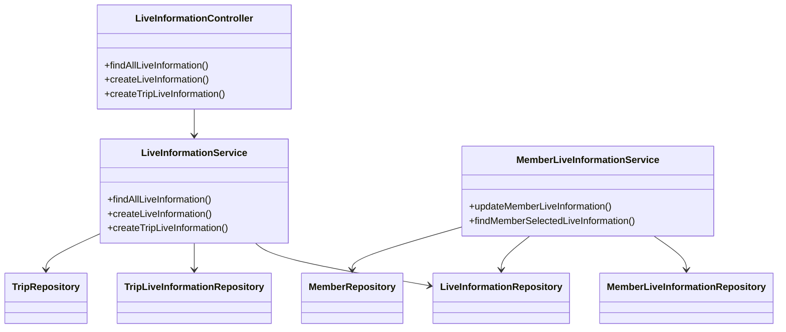
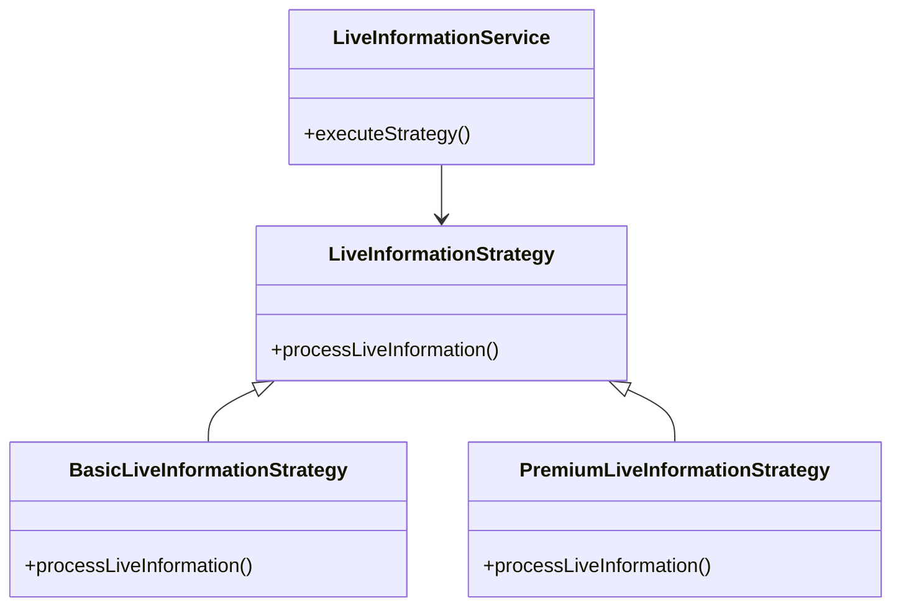
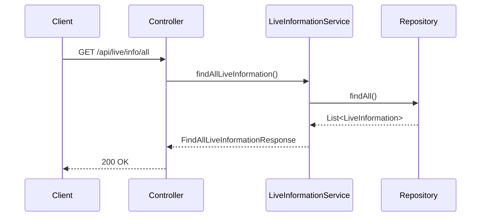

# Comprehensive Documentation for the Service Code

## 1. Overall Structure

### High-Level Overview
The codebase is structured into several packages, each serving a specific purpose within the application. The main packages include:

- **moheng.auth.dto**: Contains data transfer objects (DTOs) related to authentication.
- **moheng.auth.presentation.authentication**: Contains annotations related to authentication.
- **moheng.liveinformation.application**: Contains service classes that handle business logic for live information and member live information.
- **moheng.liveinformation.domain**: Contains domain entities related to live information.
- **moheng.liveinformation.dto**: Contains DTOs for transferring data related to live information.
- **moheng.liveinformation.presentation**: Contains REST controllers that expose endpoints for live information operations.

### Purpose and Function of Service Code
The service code primarily handles the business logic for managing live information and member live information. It interacts with repositories to perform CRUD operations and encapsulates the logic required to create, retrieve, and manage live information entities.

### Interaction Between Different Parts
- **Controllers** (e.g., `LiveInformationController`) handle incoming HTTP requests and delegate the processing to **Services** (e.g., `LiveInformationService`, `MemberLiveInformationService`).
- **Services** interact with **Repositories** to perform database operations and return results to the controllers.
- **DTOs** are used to transfer data between the controllers and services, ensuring a clean separation of concerns.

### Mermaid Diagram


## 2. Strategy Pattern Implementation

### Strategy Pattern Overview
The strategy pattern is not explicitly implemented in the provided code. However, if we were to implement it, we would define a strategy interface for different types of live information processing and create concrete strategy classes for each type.

### Strategy Interface and Concrete Strategy Classes
- **Strategy Interface**: `LiveInformationStrategy`
- **Concrete Strategy Classes**: `BasicLiveInformationStrategy`, `PremiumLiveInformationStrategy`, etc.

### Context Class
- **Context Class**: `LiveInformationService` would use the strategy interface to delegate the processing of live information based on the strategy chosen.

### Class Diagram


## 3. Detailed Component Documentation

### a. Classes

#### 1. Accessor
- **Purpose**: Represents an accessor with an ID.
- **Attributes**:
  - `Long id`: Unique identifier for the accessor.
- **Role**: Used for authentication purposes.
- **Relationships**: None.

#### 2. LiveInformationService
- **Purpose**: Handles business logic related to live information.
- **Attributes**:
  - `LiveInformationRepository liveInformationRepository`: Repository for live information.
  - `TripLiveInformationRepository tripLiveInformationRepository`: Repository for trip live information.
  - `TripRepository tripRepository`: Repository for trips.
- **Role**: Provides methods to create and retrieve live information.
- **Relationships**: Uses multiple repositories.

#### 3. MemberLiveInformationService
- **Purpose**: Manages member-specific live information.
- **Attributes**:
  - `MemberLiveInformationRepository memberLiveInformationRepository`: Repository for member live information.
  - `LiveInformationRepository liveInformationRepository`: Repository for live information.
  - `MemberRepository memberRepository`: Repository for members.
- **Role**: Provides methods to update and retrieve member live information.
- **Relationships**: Uses multiple repositories.

#### 4. LiveInformation
- **Purpose**: Represents live information entity.
- **Attributes**:
  - `Long id`: Unique identifier.
  - `String name`: Name of the live information.
- **Role**: Core entity representing live information in the system.
- **Relationships**: Inherits from `BaseEntity`.

#### 5. FindAllLiveInformationResponse
- **Purpose**: DTO for returning all live information.
- **Attributes**:
  - `List<LiveInformationResponse> liveInformationResponses`: List of live information responses.
- **Role**: Encapsulates the response for retrieving all live information.
- **Relationships**: None.

### b. Methods and Functions

#### 1. LiveInformationService.createLiveInformation
- **Purpose**: Creates new live information.
- **Parameters**:
  - `LiveInformationCreateRequest request`: The request containing the name of the live information.
- **Return Value**: `void`
- **Code Example**:
  ```java
  LiveInformationCreateRequest request = new LiveInformationCreateRequest("New Live Info");
  liveInformationService.createLiveInformation(request);
  ```

#### 2. LiveInformationService.findAllLiveInformation
- **Purpose**: Retrieves all live information.
- **Parameters**: None
- **Return Value**: `FindAllLiveInformationResponse`
- **Code Example**:
  ```java
  FindAllLiveInformationResponse response = liveInformationService.findAllLiveInformation();
  ```

#### 3. MemberLiveInformationService.updateMemberLiveInformation
- **Purpose**: Updates member live information.
- **Parameters**:
  - `long memberId`: ID of the member.
  - `UpdateMemberLiveInformationRequest request`: Request containing updated live information IDs.
- **Return Value**: `void`
- **Code Example**:
  ```java
  UpdateMemberLiveInformationRequest request = new UpdateMemberLiveInformationRequest(List.of(1L, 2L));
  memberLiveInformationService.updateMemberLiveInformation(1L, request);
  ```

## 4. Implementation Flow

### Sequence Diagram


### Explanation of Sequence Diagram
1. The client sends a GET request to the controller to retrieve all live information.
2. The controller calls the `findAllLiveInformation` method of the `LiveInformationService`.
3. The service interacts with the repository to fetch all live information.
4. The repository returns the list of live information to the service.
5. The service constructs a response and returns it to the controller.
6. Finally, the controller sends the response back to the client.

This documentation provides a comprehensive overview of the service code, detailing its structure, strategy pattern implementation, component documentation, and implementation flow. It serves as a guide for both new and experienced developers to understand and work with the code effectively.