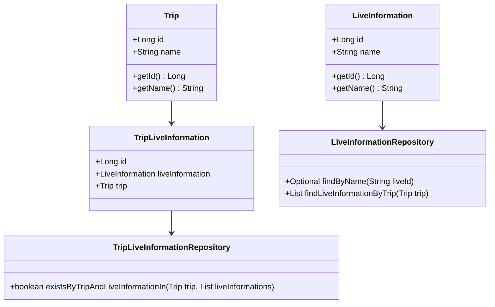
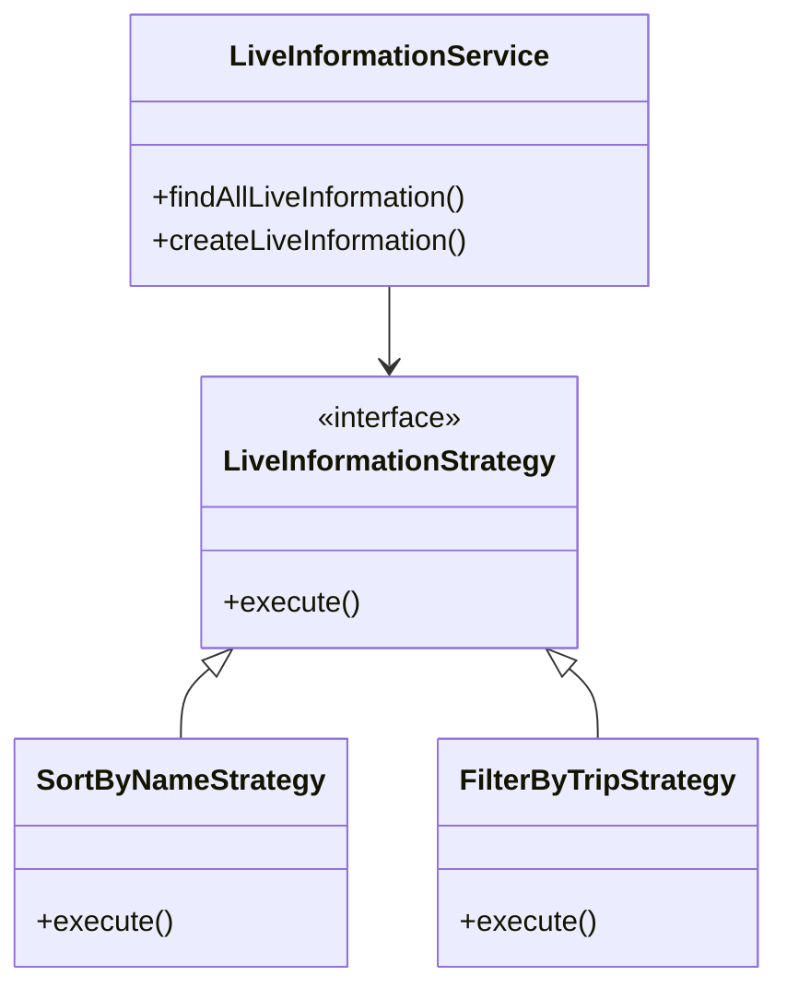
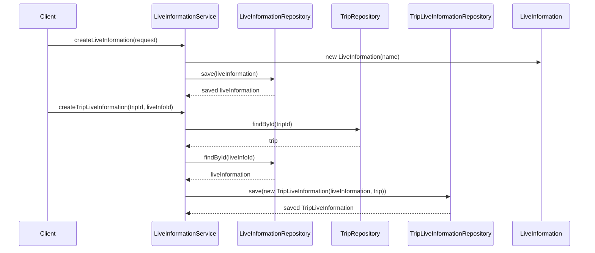

# Comprehensive Documentation for LiveInformation Service Code

## 1. Overall Structure

### High-Level Overview
The codebase is structured around the concept of managing live information related to trips. It consists of domain entities, repositories for data access, DTOs for data transfer, exceptions for error handling, and a service layer that encapsulates the business logic.

### Purpose and Function of Service Code
The `LiveInformationService` class is responsible for managing live information entities. It provides methods to create, retrieve, and associate live information with trips. The service interacts with repositories to perform CRUD operations and ensures that the business rules are followed.

### Interaction Between Components
- **Entities**: `LiveInformation`, `Trip`, and `TripLiveInformation` represent the core data models.
- **Repositories**: `LiveInformationRepository` and `TripLiveInformationRepository` provide data access methods for the entities.
- **DTOs**: `FindAllLiveInformationResponse` and `LiveInformationCreateRequest` are used for transferring data between the service and the client.
- **Exceptions**: Custom exceptions like `NoExistLiveInformationException` and `NoExistTripException` are thrown for error handling.
- **Service**: `LiveInformationService` orchestrates the interactions between the repositories and the DTOs.

### Mermaid Diagram


## 2. Strategy Pattern Implementation

### Strategy Pattern Overview
The strategy pattern is not explicitly implemented in the provided code. However, if we were to implement it, we could define different strategies for handling live information based on various criteria (e.g., filtering, sorting).

### Strategy Interface and Concrete Strategy Classes
- **Strategy Interface**: `LiveInformationStrategy` (hypothetical)
- **Concrete Strategies**: `SortByNameStrategy`, `FilterByTripStrategy` (hypothetical)

### Context Class
- **Context Class**: `LiveInformationService` would act as the context that uses the strategies to perform operations based on the selected strategy.

### Class Diagram


## 3. Detailed Component Documentation

### a. Classes

#### LiveInformation
- **Purpose**: Represents live information with a name.
- **Attributes**:
  - `Long id`: Unique identifier for the live information.
  - `String name`: Name of the live information.
- **Role**: Core entity representing live information in the system.
- **Relationships**: 
  - Inherits from `BaseEntity`.

#### TripLiveInformation
- **Purpose**: Represents the association between a trip and live information.
- **Attributes**:
  - `Long id`: Unique identifier for the association.
  - `LiveInformation liveInformation`: The live information associated with the trip.
  - `Trip trip`: The trip associated with the live information.
- **Role**: Facilitates the relationship between trips and live information.
- **Relationships**: 
  - Inherits from `BaseEntity`.

#### LiveInformationService
- **Purpose**: Service class for managing live information.
- **Attributes**:
  - `LiveInformationRepository liveInformationRepository`: Repository for live information.
  - `TripLiveInformationRepository tripLiveInformationRepository`: Repository for trip live information.
  - `TripRepository tripRepository`: Repository for trips.
- **Role**: Encapsulates business logic for live information management.
- **Relationships**: 
  - Uses multiple repositories for data access.

### b. Methods and Functions

#### findAllLiveInformation
- **Purpose**: Retrieves all live information.
- **Parameters**: None.
- **Return Value**: `FindAllLiveInformationResponse` - Contains a list of live information responses.
- **Code Example**:
  ```java
  FindAllLiveInformationResponse response = liveInformationService.findAllLiveInformation();
  ```

#### createLiveInformation
- **Purpose**: Creates a new live information entry.
- **Parameters**:
  - `LiveInformationCreateRequest request`: DTO containing the name of the live information.
- **Return Value**: None.
- **Code Example**:
  ```java
  LiveInformationCreateRequest request = new LiveInformationCreateRequest("New Live Info");
  liveInformationService.createLiveInformation(request);
  ```

#### createTripLiveInformation
- **Purpose**: Associates live information with a trip.
- **Parameters**:
  - `long tripId`: ID of the trip.
  - `long liveInfoId`: ID of the live information.
- **Return Value**: None.
- **Code Example**:
  ```java
  liveInformationService.createTripLiveInformation(tripId, liveInfoId);
  ```

#### findByName
- **Purpose**: Retrieves live information by name.
- **Parameters**:
  - `String liveTypeName`: Name of the live information.
- **Return Value**: `LiveInformation` - The live information entity.
- **Code Example**:
  ```java
  LiveInformation liveInfo = liveInformationService.findByName("Live Info Name");
  ```

## 4. Implementation Flow

### Sequence Diagram


This documentation provides a comprehensive overview of the `LiveInformationService` code, detailing its structure, strategy pattern implementation, component documentation, and implementation flow. It serves as a guide for both new and experienced developers to understand and work with the code effectively.