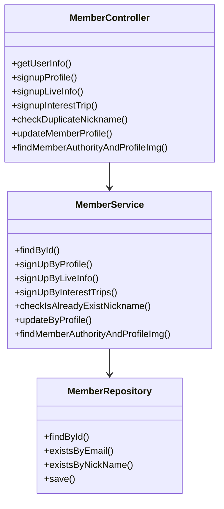
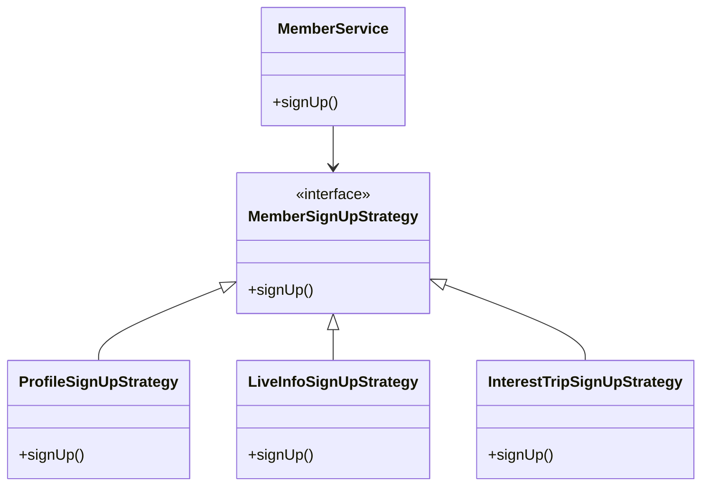
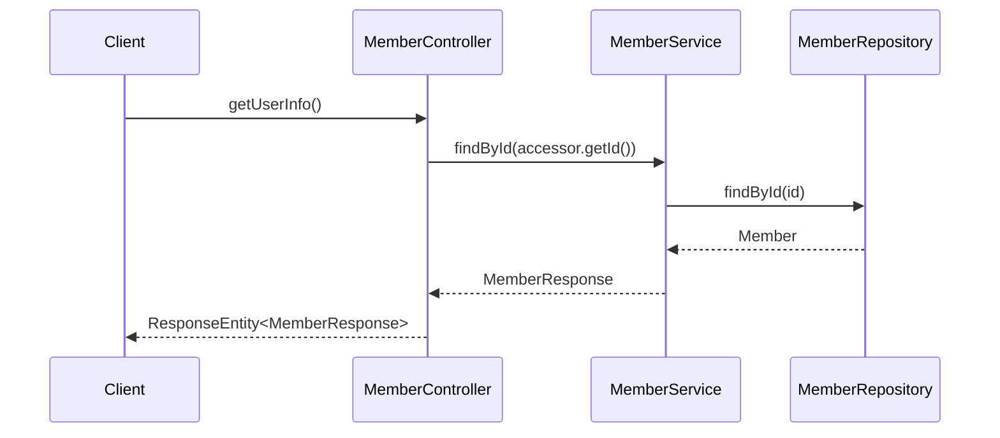

# Comprehensive Documentation for Member Service Code

## 1. Overall Structure

### High-Level Overview
The codebase is structured into several packages, each serving a specific purpose in the application. The main components include:

- **DTOs (Data Transfer Objects)**: These classes are used to transfer data between different layers of the application, such as `Accessor`, `MemberResponse`, and various request/response DTOs.
- **Presentation Layer**: This layer contains the REST controllers, such as `MemberController`, which handle incoming HTTP requests and delegate the processing to the service layer.
- **Service Layer**: The `MemberService` class contains the business logic related to member operations, such as signing up, updating profiles, and checking for duplicate nicknames.
- **Domain Layer**: This layer includes domain entities like `Member`, `Trip`, and `LiveInformation`, along with their respective repositories for data access.

### Purpose and Function of Service Code
The `MemberService` class is responsible for managing member-related operations, including:
- Finding members by ID or email.
- Signing up members with various profiles and interests.
- Validating and checking for duplicate nicknames.
- Updating member profiles and managing member privileges.

### Interaction Between Components
The `MemberController` interacts with the `MemberService` to process requests related to member operations. The service, in turn, interacts with repositories to perform CRUD operations on member data. The DTOs are used to encapsulate the data being transferred between the controller and service layers.

### Mermaid Diagram


## 2. Strategy Pattern Implementation

### Strategy Pattern Overview
The strategy pattern is not explicitly implemented in the provided code. However, if we were to implement it, we could define different strategies for member sign-up processes (e.g., by profile, live info, or interest trips) as separate classes that implement a common interface.

### Strategy Interface and Concrete Strategy Classes
- **Strategy Interface**: `MemberSignUpStrategy`
- **Concrete Strategies**: 
  - `ProfileSignUpStrategy`
  - `LiveInfoSignUpStrategy`
  - `InterestTripSignUpStrategy`

### Context Class
- **Context Class**: `MemberService` would act as the context that uses the strategies to perform sign-up operations based on the provided strategy.

### Class Diagram


## 3. Detailed Component Documentation

### a. Classes

#### 1. Accessor
- **Purpose**: Represents an accessor object containing the member ID.
- **Attributes**:
  - `Long id`: The unique identifier for the member.
- **Role**: Used to retrieve the member's ID in authentication contexts.
- **Relationships**: Used in `MemberController` for authentication.

#### 2. MemberService
- **Purpose**: Contains business logic for member-related operations.
- **Attributes**:
  - `MemberRepository memberRepository`: Repository for member data.
  - `MemberLiveInformationService memberLiveInformationService`: Service for managing member live information.
  - `TripService tripService`: Service for managing trips.
  - `RecommendTripService recommendTripService`: Service for managing recommended trips.
  - `LiveInformationRepository liveInformationRepository`: Repository for live information.
  - `MemberTripRepository memberTripRepository`: Repository for member trips.
- **Role**: Central service for managing member operations.
- **Relationships**: Interacts with various repositories and services.

#### 3. MemberResponse
- **Purpose**: DTO for member response data.
- **Attributes**:
  - `Long id`: Member ID.
  - `String profileImageUrl`: URL of the member's profile image.
  - `String nickname`: Member's nickname.
  - `LocalDate birthday`: Member's birthday.
  - `GenderType genderType`: Member's gender type.
- **Role**: Used to transfer member data in responses.
- **Relationships**: Constructed from `Member` domain entity.

### b. Methods and Functions

#### 1. MemberService.findById
- **Purpose**: Finds a member by ID.
- **Parameters**:
  - `Long id`: The ID of the member to find.
- **Return Value**: `MemberResponse`: The response containing member details.
- **Code Example**:
  ```java
  MemberResponse response = memberService.findById(1L);
  ```

#### 2. MemberService.signUpByProfile
- **Purpose**: Signs up a member using profile information.
- **Parameters**:
  - `long memberId`: The ID of the member.
  - `SignUpProfileRequest request`: The request containing profile data.
- **Return Value**: `void`: No return value.
- **Code Example**:
  ```java
  memberService.signUpByProfile(1L, signUpProfileRequest);
  ```

#### 3. MemberService.checkIsAlreadyExistNickname
- **Purpose**: Checks if a nickname already exists.
- **Parameters**:
  - `String nickname`: The nickname to check.
- **Return Value**: `void`: Throws `DuplicateNicknameException` if the nickname exists.
- **Code Example**:
  ```java
  memberService.checkIsAlreadyExistNickname("newNickname");
  ```

## 4. Implementation Flow

### Sequence Diagram


### Explanation of Sequence Diagram
1. The client sends a request to `MemberController` to get user information.
2. The controller calls `MemberService` to find the member by ID.
3. The service queries the `MemberRepository` to retrieve the member data.
4. The repository returns the member entity to the service.
5. The service constructs a `MemberResponse` and returns it to the controller.
6. Finally, the controller sends the response back to the client.

This documentation provides a comprehensive overview of the member service code, detailing its structure, functionality, and interactions, making it easier for developers to understand and work with the codebase.