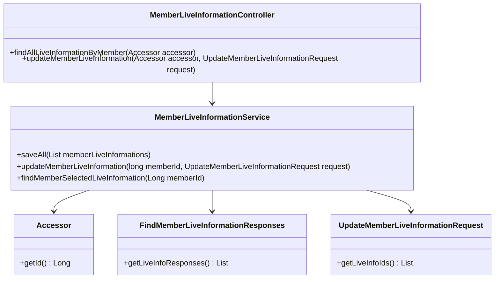
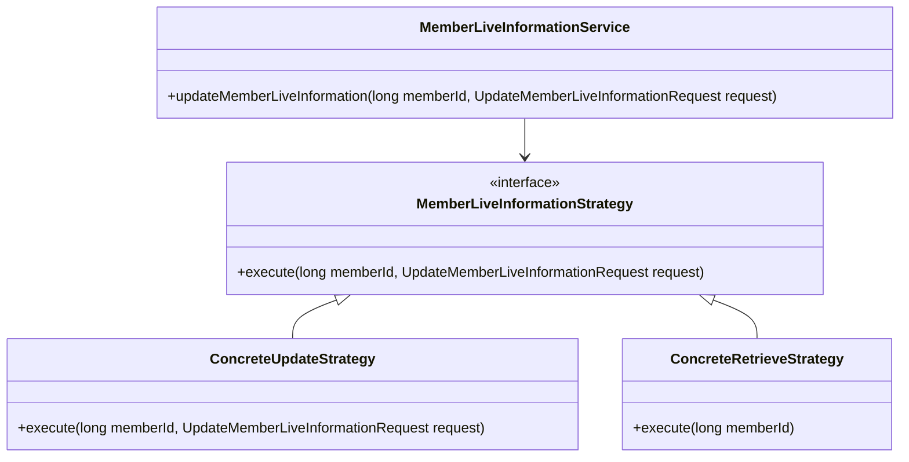
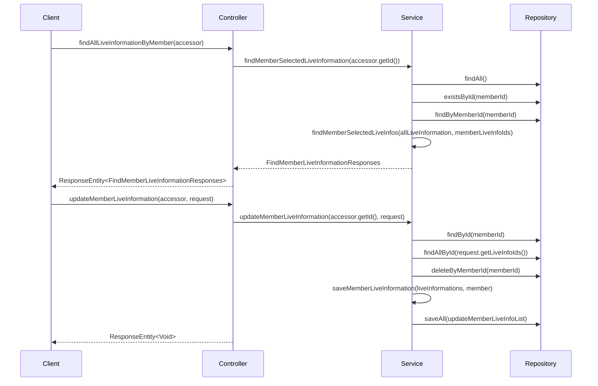

# Comprehensive Documentation for the Service Code

## 1. Overall Structure

### High-Level Overview
The codebase is structured into several packages, each serving a specific purpose within the application. The main components include:

- **DTOs (Data Transfer Objects)**: These classes are used to transfer data between different layers of the application, such as `Accessor`, `FindMemberLiveInformationResponses`, `LiveInfoResponse`, and `UpdateMemberLiveInformationRequest`.
- **Domain**: This package contains the core business logic and domain entities, such as `MemberLiveInformation`, `LiveInformation`, and their respective repositories.
- **Application Services**: The `MemberLiveInformationService` class contains the business logic for managing member live information.
- **Presentation Layer**: The `MemberLiveInformationController` class handles HTTP requests and responses, serving as the entry point for client interactions.

### Purpose and Function of Service Code
The service code primarily manages member live information, allowing for the retrieval and updating of live information associated with members. It interacts with repositories to perform CRUD operations and uses DTOs to encapsulate data for communication between the controller and service layers.

### Interaction Between Components
- The `MemberLiveInformationController` receives HTTP requests and uses the `MemberLiveInformationService` to process them.
- The service interacts with various repositories to fetch and manipulate data.
- DTOs are used to encapsulate request and response data, ensuring a clean separation of concerns.

### Mermaid Diagram


## 2. Strategy Pattern Implementation

### Strategy Pattern Overview
The strategy pattern is not explicitly implemented in the provided code. However, if we were to implement it, we could define different strategies for handling various types of member live information updates or retrievals.

### Strategy Interface and Concrete Strategy Classes
- **Strategy Interface**: This would define a method for updating or retrieving member live information.
- **Concrete Strategy Classes**: These would implement the strategy interface for specific types of updates or retrievals.

### Context Class
- **Context Class**: The `MemberLiveInformationService` could act as the context that uses different strategies based on the type of operation being performed.

### Class Diagram


## 3. Detailed Component Documentation

### a. Classes

#### 1. Accessor
- **Purpose**: Represents an accessor object containing the ID of a member.
- **Attributes**:
  - `Long id`: The unique identifier for the member.
- **Role**: Used to authenticate and identify members in the system.
- **Relationships**: Used in the `MemberLiveInformationController` to retrieve member information.

#### 2. MemberLiveInformationService
- **Purpose**: Contains business logic for managing member live information.
- **Attributes**:
  - `MemberLiveInformationRepository memberLiveInformationRepository`: Repository for member live information.
  - `LiveInformationRepository liveInformationRepository`: Repository for live information.
  - `MemberRepository memberRepository`: Repository for members.
- **Role**: Acts as a service layer to handle operations related to member live information.
- **Relationships**: Interacts with multiple repositories to perform CRUD operations.

#### 3. FindMemberLiveInformationResponses
- **Purpose**: Encapsulates the response for finding member live information.
- **Attributes**:
  - `List<LiveInfoResponse> liveInfoResponses`: List of live information responses.
- **Role**: Used to return data to the client in a structured format.
- **Relationships**: Used in the `MemberLiveInformationService` and `MemberLiveInformationController`.

#### 4. UpdateMemberLiveInformationRequest
- **Purpose**: Represents a request to update member live information.
- **Attributes**:
  - `List<Long> liveInfoIds`: List of live information IDs to be updated.
- **Role**: Used to encapsulate data for updating member live information.
- **Relationships**: Used in the `MemberLiveInformationService` and `MemberLiveInformationController`.

### b. Methods and Functions

#### 1. Accessor.getId()
- **Purpose**: Retrieves the ID of the accessor.
- **Parameters**: None
- **Return Value**: `Long` - The ID of the accessor.
- **Code Example**:
  ```java
  Accessor accessor = new Accessor(1L);
  Long id = accessor.getId(); // Returns 1L
  ```

#### 2. MemberLiveInformationService.saveAll(List<MemberLiveInformation> memberLiveInformations)
- **Purpose**: Saves a list of member live information.
- **Parameters**:
  - `List<MemberLiveInformation> memberLiveInformations`: List of member live information to save.
- **Return Value**: None
- **Code Example**:
  ```java
  memberLiveInformationService.saveAll(memberLiveInfoList);
  ```

#### 3. MemberLiveInformationService.updateMemberLiveInformation(long memberId, UpdateMemberLiveInformationRequest request)
- **Purpose**: Updates the live information for a specific member.
- **Parameters**:
  - `long memberId`: The ID of the member to update.
  - `UpdateMemberLiveInformationRequest request`: The request containing live information IDs.
- **Return Value**: None
- **Code Example**:
  ```java
  memberLiveInformationService.updateMemberLiveInformation(1L, request);
  ```

#### 4. MemberLiveInformationService.findMemberSelectedLiveInformation(Long memberId)
- **Purpose**: Finds live information selected by a member.
- **Parameters**:
  - `Long memberId`: The ID of the member.
- **Return Value**: `FindMemberLiveInformationResponses` - The response containing selected live information.
- **Code Example**:
  ```java
  FindMemberLiveInformationResponses responses = memberLiveInformationService.findMemberSelectedLiveInformation(1L);
  ```

#### 5. MemberLiveInformationController.findAllLiveInformationByMember(Accessor accessor)
- **Purpose**: Handles GET requests to find all live information for a member.
- **Parameters**:
  - `Accessor accessor`: The accessor containing member ID.
- **Return Value**: `ResponseEntity<FindMemberLiveInformationResponses>` - The response entity containing live information responses.
- **Code Example**:
  ```java
  ResponseEntity<FindMemberLiveInformationResponses> response = controller.findAllLiveInformationByMember(accessor);
  ```

#### 6. MemberLiveInformationController.updateMemberLiveInformation(Accessor accessor, UpdateMemberLiveInformationRequest request)
- **Purpose**: Handles PUT requests to update live information for a member.
- **Parameters**:
  - `Accessor accessor`: The accessor containing member ID.
  - `UpdateMemberLiveInformationRequest request`: The request containing live information IDs.
- **Return Value**: `ResponseEntity<Void>` - No content response.
- **Code Example**:
  ```java
  ResponseEntity<Void> response = controller.updateMemberLiveInformation(accessor, request);
  ```

## 4. Implementation Flow

### Sequence Diagram


This documentation provides a comprehensive overview of the service code, detailing its structure, strategy pattern implementation, and the flow of operations. It serves as a guide for both new and experienced developers to understand and work with the code effectively.