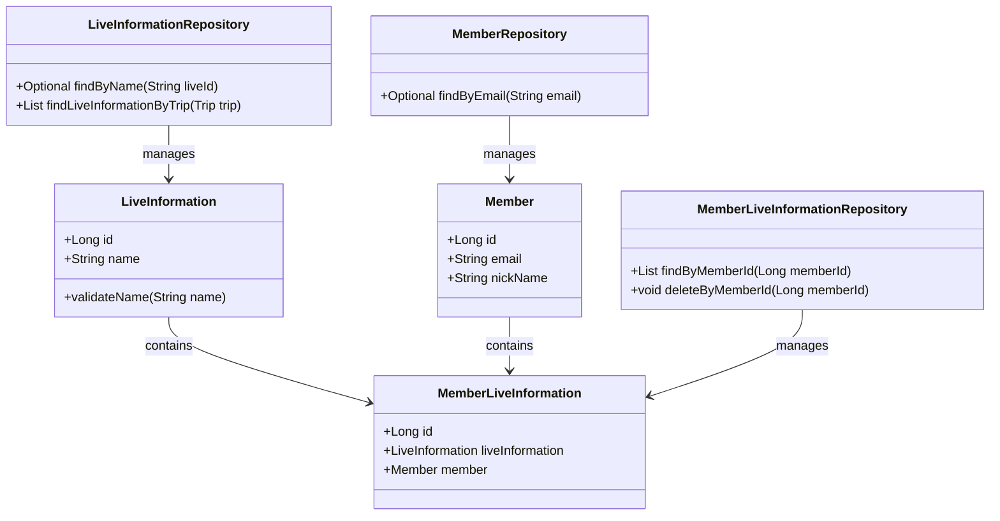
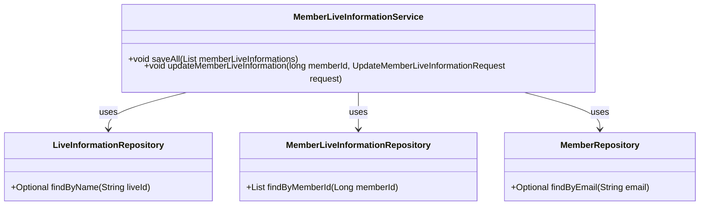
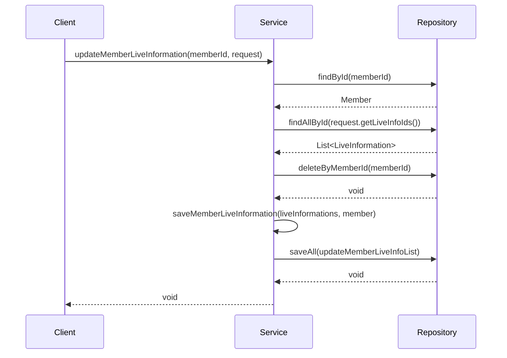

# Comprehensive Documentation for MemberLiveInformationService Code

## 1. Overall Structure

### High-Level Overview
The codebase is structured around the concept of managing live information associated with members. It includes domain entities, repositories for data access, DTOs for data transfer, and exception handling. The main service class, `MemberLiveInformationService`, orchestrates the interactions between these components.

### Purpose and Function of Service Code
The `MemberLiveInformationService` class is responsible for managing the relationship between members and their associated live information. It provides methods to save, update, and retrieve live information for members, ensuring data integrity and handling exceptions appropriately.

### Interaction Between Components
- **Entities**: `LiveInformation`, `Member`, and `MemberLiveInformation` represent the core data structures.
- **Repositories**: `LiveInformationRepository` and `MemberLiveInformationRepository` provide data access methods for the entities.
- **DTOs**: `FindMemberLiveInformationResponses`, `LiveInfoResponse`, and `UpdateMemberLiveInformationRequest` are used for transferring data between the service and the client.
- **Exceptions**: Custom exceptions like `NoExistLiveInformationException` and `NoExistMemberException` are thrown to handle error scenarios.

### Mermaid Diagram


## 2. Strategy Pattern Implementation

### Strategy Pattern Overview
The strategy pattern is not explicitly implemented in the provided code. However, the service class can be seen as a context that uses different strategies (repositories) to perform operations related to member live information.

### Strategy Interface and Concrete Strategy Classes
In this context, the repositories act as strategies for data access:
- **Strategy Interface**: `JpaRepository` (from Spring Data JPA)
- **Concrete Strategies**: `LiveInformationRepository`, `MemberLiveInformationRepository`, and `MemberRepository`.

### Context Class
The `MemberLiveInformationService` class acts as the context that utilizes these strategies to perform operations.

### Class Diagram


## 3. Detailed Component Documentation

### a. Classes

#### 1. LiveInformation
- **Purpose**: Represents live information with an ID and name.
- **Attributes**:
  - `Long id`: Unique identifier for the live information.
  - `String name`: Name of the live information.
- **Role**: Core entity representing live information in the system.
- **Relationships**: 
  - Has a one-to-many relationship with `MemberLiveInformation`.

#### 2. Member
- **Purpose**: Represents a member with personal details.
- **Attributes**:
  - `Long id`: Unique identifier for the member.
  - `String email`: Email address of the member.
  - `String nickName`: Nickname of the member.
- **Role**: Core entity representing a user in the system.
- **Relationships**: 
  - Has a one-to-many relationship with `MemberLiveInformation`.

#### 3. MemberLiveInformation
- **Purpose**: Represents the association between a member and live information.
- **Attributes**:
  - `Long id`: Unique identifier for the association.
  - `LiveInformation liveInformation`: The live information associated with the member.
  - `Member member`: The member associated with the live information.
- **Role**: Entity that links members to their live information.
- **Relationships**: 
  - Many-to-one relationship with both `LiveInformation` and `Member`.

#### 4. MemberLiveInformationService
- **Purpose**: Service class for managing member live information.
- **Attributes**:
  - `MemberLiveInformationRepository memberLiveInformationRepository`: Repository for member live information.
  - `LiveInformationRepository liveInformationRepository`: Repository for live information.
  - `MemberRepository memberRepository`: Repository for members.
- **Role**: Orchestrates operations related to member live information.
- **Relationships**: 
  - Uses multiple repositories to perform CRUD operations.

### b. Methods and Functions

#### 1. saveAll
- **Purpose**: Saves a list of `MemberLiveInformation` entities.
- **Parameters**:
  - `List<MemberLiveInformation> memberLiveInformations`: List of member live information to save.
- **Return Value**: None.
- **Code Example**:
  ```java
  List<MemberLiveInformation> liveInfos = new ArrayList<>();
  service.saveAll(liveInfos);
  ```

#### 2. updateMemberLiveInformation
- **Purpose**: Updates the live information associated with a member.
- **Parameters**:
  - `long memberId`: ID of the member to update.
  - `UpdateMemberLiveInformationRequest request`: Request containing live information IDs.
- **Return Value**: None.
- **Code Example**:
  ```java
  UpdateMemberLiveInformationRequest request = new UpdateMemberLiveInformationRequest(Arrays.asList(1L, 2L));
  service.updateMemberLiveInformation(memberId, request);
  ```

#### 3. findMemberSelectedLiveInformation
- **Purpose**: Retrieves live information selected by a member.
- **Parameters**:
  - `Long memberId`: ID of the member.
- **Return Value**: `FindMemberLiveInformationResponses`: DTO containing selected live information responses.
- **Code Example**:
  ```java
  FindMemberLiveInformationResponses responses = service.findMemberSelectedLiveInformation(memberId);
  ```

#### 4. findMemberLiveInfoIds
- **Purpose**: Finds live information IDs associated with a member.
- **Parameters**:
  - `Long memberId`: ID of the member.
- **Return Value**: `List<Long>`: List of live information IDs.
- **Code Example**:
  ```java
  List<Long> liveInfoIds = service.findMemberLiveInfoIds(memberId);
  ```

## 4. Implementation Flow

### Sequence Diagram


This sequence diagram illustrates how the client interacts with the `MemberLiveInformationService`, which in turn interacts with the repositories to perform the necessary operations. The flow includes retrieving the member, checking live information, deleting existing associations, and saving new associations.

---

This documentation provides a comprehensive overview of the `MemberLiveInformationService` code, detailing its structure, strategy pattern implementation, component documentation, and implementation flow. It serves as a valuable resource for both new and experienced developers working with this codebase.