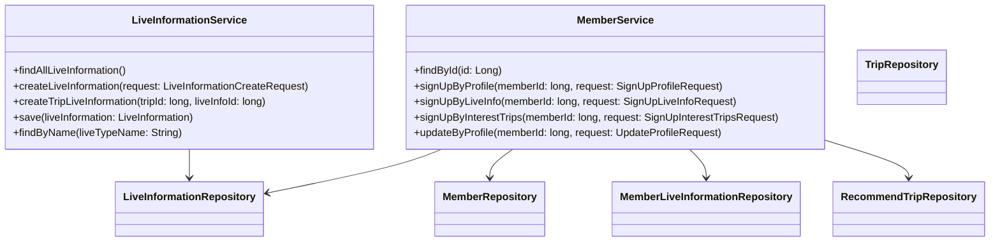
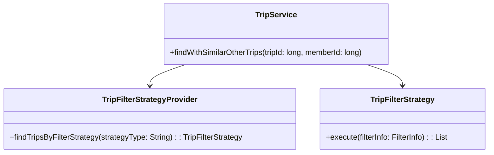
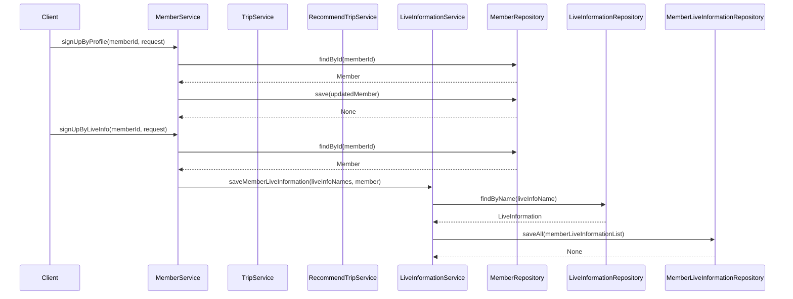

# Comprehensive Documentation for the Service Code

## 1. Overall Structure

### High-Level Overview
The codebase is structured into several packages, each serving a specific purpose within the application. The main packages include:

- **Domain**: Contains the core business entities and their relationships.
- **Application**: Contains service classes that implement business logic and interact with repositories.
- **DTO**: Contains Data Transfer Objects for communication between layers.
- **Repository**: Contains interfaces for data access, extending Spring Data JPA repositories.
- **Exception**: Contains custom exceptions for error handling.

### Purpose and Function of Service Code
The service code is responsible for implementing the business logic of the application. It acts as an intermediary between the controllers (or other entry points) and the data repositories. The services handle operations such as creating, updating, and retrieving data, while also enforcing business rules and validations.

### Interaction Between Components
The service classes interact with the repository interfaces to perform CRUD operations on the domain entities. They also utilize DTOs to transfer data between layers and handle exceptions to provide meaningful error messages to the client.

### Mermaid Diagram

## 2. Strategy Pattern Implementation

### Strategy Pattern Overview
The strategy pattern is implemented in the context of filtering trips based on various criteria. The `TripFilterStrategy` interface defines the strategy, while concrete implementations provide specific filtering logic.

### Strategy Interface and Concrete Strategy Classes
- **Strategy Interface**: `TripFilterStrategy`
  - Method: `execute(filterInfo: FilterInfo): List<Trip>`

- **Concrete Strategy Classes**: Various implementations of `TripFilterStrategy` that define specific filtering logic based on different criteria.

### Context Class
- **Context Class**: `TripService`
  - Uses `TripFilterStrategyProvider` to retrieve the appropriate strategy based on the filtering criteria.

### Class Diagram

## 3. Detailed Component Documentation

### a. Classes

#### 1. LiveInformationService
- **Purpose**: Manages live information data and operations.
- **Attributes**:
  - `liveInformationRepository`: Repository for LiveInformation.
  - `tripLiveInformationRepository`: Repository for TripLiveInformation.
  - `tripRepository`: Repository for Trip.
- **Role**: Provides methods to create and retrieve live information.
- **Relationships**: Interacts with multiple repositories.

#### 2. MemberService
- **Purpose**: Manages member-related operations.
- **Attributes**:
  - `memberRepository`: Repository for Member.
  - `memberLiveInformationService`: Service for member live information.
  - `tripService`: Service for trip operations.
  - `recommendTripService`: Service for recommending trips.
  - `liveInformationRepository`: Repository for LiveInformation.
  - `memberTripRepository`: Repository for MemberTrip.
- **Role**: Provides methods for member registration, profile updates, and trip recommendations.
- **Relationships**: Interacts with multiple repositories and services.

### b. Methods and Functions

#### 1. LiveInformationService Methods
- **findAllLiveInformation**
  - **Purpose**: Retrieves all live information.
  - **Return Value**: `FindAllLiveInformationResponse` containing a list of live information.
  
- **createLiveInformation**
  - **Parameters**: 
    - `request`: `LiveInformationCreateRequest` - contains the name of the live information.
  - **Return Value**: None.
  
- **createTripLiveInformation**
  - **Parameters**: 
    - `tripId`: `long` - ID of the trip.
    - `liveInfoId`: `long` - ID of the live information.
  - **Return Value**: None.

#### 2. MemberService Methods
- **findById**
  - **Parameters**: 
    - `id`: `Long` - ID of the member.
  - **Return Value**: `MemberResponse` containing member details.

- **signUpByProfile**
  - **Parameters**: 
    - `memberId`: `long` - ID of the member.
    - `request`: `SignUpProfileRequest` - contains profile details.
  - **Return Value**: None.

- **signUpByLiveInfo**
  - **Parameters**: 
    - `memberId`: `long` - ID of the member.
    - `request`: `SignUpLiveInfoRequest` - contains live information names.
  - **Return Value**: None.

## 4. Implementation Flow

### Sequence Diagram

This documentation provides a comprehensive overview of the service code, detailing its structure, strategy pattern implementation, component documentation, and implementation flow. It serves as a guide for both new and experienced developers to understand and work with the code effectively.