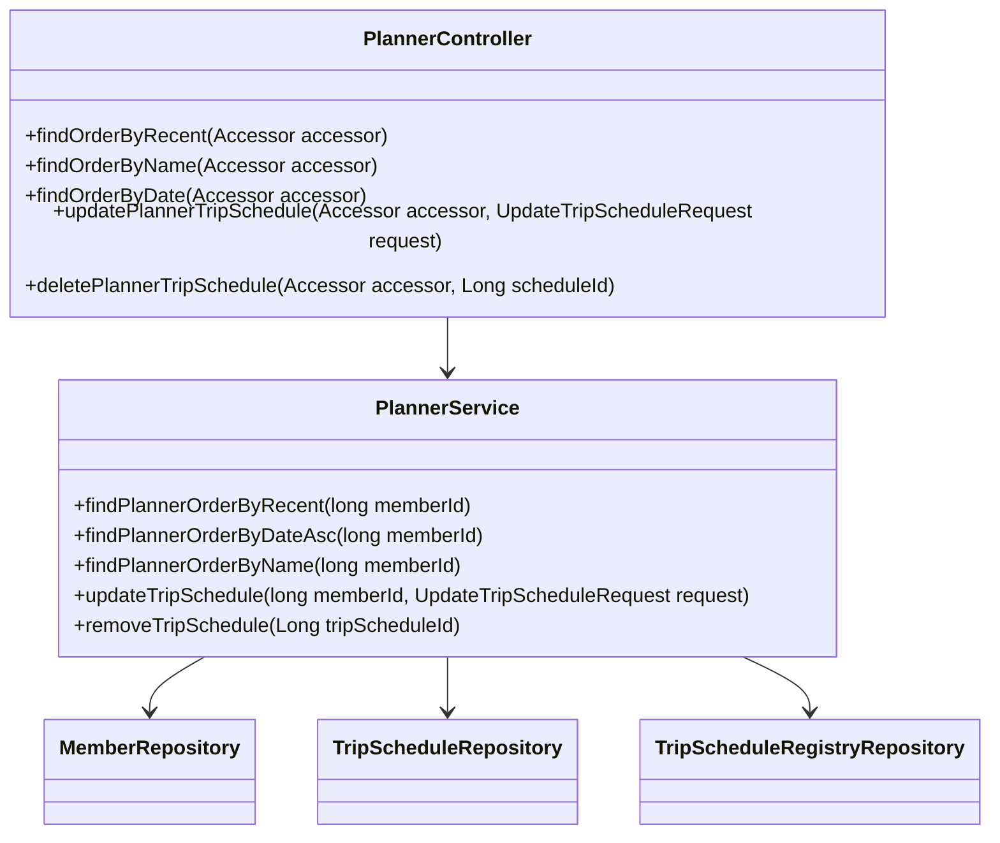
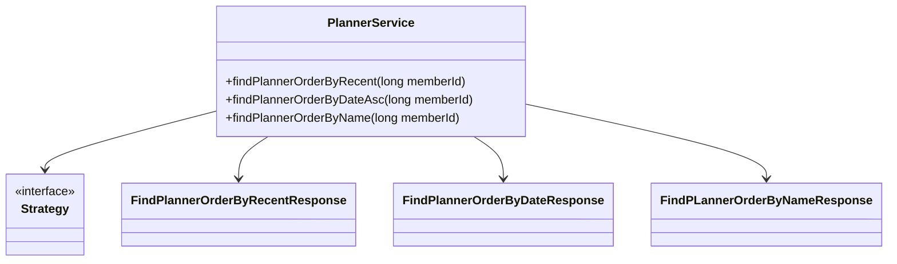
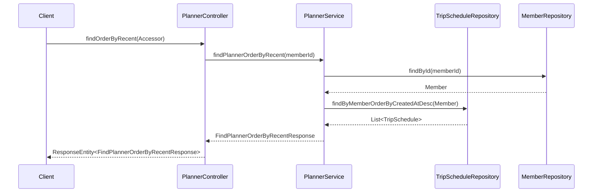

# Comprehensive Documentation for the Service Code

## 1. Overall Structure

### High-Level Overview
The codebase is structured into several packages, each serving a specific purpose within the application. The main packages include:

- **moheng.auth.dto**: Contains data transfer objects (DTOs) related to authentication.
- **moheng.auth.presentation.authentication**: Contains annotations related to authentication.
- **moheng.planner.application**: Contains the core business logic for managing trip schedules.
- **moheng.planner.domain**: Contains domain entities and repositories related to trip scheduling.
- **moheng.planner.dto**: Contains DTOs for responses and requests related to trip scheduling.
- **moheng.planner.presentation**: Contains REST controllers for handling HTTP requests related to trip scheduling.

### Purpose and Function of Service Code
The `PlannerService` class is responsible for managing trip schedules. It interacts with repositories to perform CRUD operations on trip schedules and provides methods to retrieve schedules based on different criteria (recent, name, date). The `PlannerController` class exposes these functionalities through RESTful endpoints.

### Interaction Between Components
- The `PlannerController` receives HTTP requests and delegates the processing to the `PlannerService`.
- The `PlannerService` interacts with the `MemberRepository` and `TripScheduleRepository` to perform operations on trip schedules.
- DTOs are used to transfer data between the controller and service layers.

### Mermaid Diagram


## 2. Strategy Pattern Implementation

### Strategy Pattern Overview
The strategy pattern is not explicitly implemented in the provided code. However, the service methods can be seen as different strategies for retrieving trip schedules based on various criteria (recent, name, date). Each method encapsulates a specific algorithm for fetching data.

### Strategy Interface and Concrete Strategy Classes
While there is no formal strategy interface, the methods in `PlannerService` can be viewed as strategies:
- `findPlannerOrderByRecent`
- `findPlannerOrderByDateAsc`
- `findPlannerOrderByName`

### Context Class
The `PlannerService` acts as the context that uses these strategies to retrieve trip schedules based on the member's request.

### Class Diagram


## 3. Detailed Component Documentation

### a. Classes

#### 1. Accessor
- **Purpose**: Represents an accessor object containing the ID of a member.
- **Attributes**:
  - `Long id`: The unique identifier for the accessor.
- **Role**: Used to authenticate and identify the member making requests.
- **Relationships**: Used in the `PlannerController` to retrieve the member ID.

#### 2. PlannerService
- **Purpose**: Contains business logic for managing trip schedules.
- **Attributes**:
  - `TripScheduleRepository tripScheduleRepository`: Repository for trip schedules.
  - `MemberRepository memberRepository`: Repository for members.
  - `TripScheduleRegistryRepository tripScheduleRegistryRepository`: Repository for trip schedule registries.
- **Role**: Provides methods to find, update, and remove trip schedules.
- **Relationships**: Interacts with repositories to perform CRUD operations.

#### 3. FindPLannerOrderByNameResponse
- **Purpose**: DTO for returning trip schedules ordered by name.
- **Attributes**:
  - `List<TripScheduleResponse> tripScheduleResponses`: List of trip schedule responses.
- **Role**: Encapsulates the response data for trip schedules ordered by name.
- **Relationships**: Uses `TripScheduleResponse` to format the response.

#### 4. FindPlannerOrderByDateResponse
- **Purpose**: DTO for returning trip schedules ordered by date.
- **Attributes**:
  - `List<TripScheduleResponse> tripScheduleResponses`: List of trip schedule responses.
- **Role**: Encapsulates the response data for trip schedules ordered by date.
- **Relationships**: Uses `TripScheduleResponse` to format the response.

#### 5. FindPlannerOrderByRecentResponse
- **Purpose**: DTO for returning trip schedules ordered by recent creation date.
- **Attributes**:
  - `List<TripScheduleResponse> tripScheduleResponses`: List of trip schedule responses.
- **Role**: Encapsulates the response data for trip schedules ordered by recent creation.
- **Relationships**: Uses `TripScheduleResponse` to format the response.

#### 6. UpdateTripScheduleRequest
- **Purpose**: DTO for updating a trip schedule.
- **Attributes**:
  - `Long scheduleId`: ID of the schedule to update.
  - `String scheduleName`: New name for the schedule.
  - `LocalDate startDate`: New start date for the schedule.
  - `LocalDate endDate`: New end date for the schedule.
- **Role**: Used to transfer data for updating trip schedules.
- **Relationships**: None.

### b. Methods and Functions

#### 1. PlannerController Methods
- **findOrderByRecent**
  - **Purpose**: Retrieves trip schedules ordered by recent creation.
  - **Parameters**: 
    - `Accessor accessor`: The authenticated accessor containing the member ID.
  - **Return Value**: `ResponseEntity<FindPlannerOrderByRecentResponse>`: The response containing the ordered trip schedules.
  - **Code Example**:
    ```java
    ResponseEntity<FindPlannerOrderByRecentResponse> response = plannerController.findOrderByRecent(accessor);
    ```

- **findOrderByName**
  - **Purpose**: Retrieves trip schedules ordered by name.
  - **Parameters**: 
    - `Accessor accessor`: The authenticated accessor containing the member ID.
  - **Return Value**: `ResponseEntity<FindPLannerOrderByNameResponse>`: The response containing the ordered trip schedules.
  - **Code Example**:
    ```java
    ResponseEntity<FindPLannerOrderByNameResponse> response = plannerController.findOrderByName(accessor);
    ```

- **findOrderByDate**
  - **Purpose**: Retrieves trip schedules ordered by start date.
  - **Parameters**: 
    - `Accessor accessor`: The authenticated accessor containing the member ID.
  - **Return Value**: `ResponseEntity<FindPlannerOrderByDateResponse>`: The response containing the ordered trip schedules.
  - **Code Example**:
    ```java
    ResponseEntity<FindPlannerOrderByDateResponse> response = plannerController.findOrderByDate(accessor);
    ```

- **updatePlannerTripSchedule**
  - **Purpose**: Updates an existing trip schedule.
  - **Parameters**: 
    - `Accessor accessor`: The authenticated accessor containing the member ID.
    - `UpdateTripScheduleRequest updateTripScheduleRequest`: The request containing updated schedule data.
  - **Return Value**: `ResponseEntity<Void>`: No content response indicating success.
  - **Code Example**:
    ```java
    ResponseEntity<Void> response = plannerController.updatePlannerTripSchedule(accessor, updateRequest);
    ```

- **deletePlannerTripSchedule**
  - **Purpose**: Deletes a trip schedule by ID.
  - **Parameters**: 
    - `Accessor accessor`: The authenticated accessor containing the member ID.
    - `Long scheduleId`: The ID of the schedule to delete.
  - **Return Value**: `ResponseEntity<Void>`: No content response indicating success.
  - **Code Example**:
    ```java
    ResponseEntity<Void> response = plannerController.deletePlannerTripSchedule(accessor, scheduleId);
    ```

## 4. Implementation Flow

### Sequence Diagram


This documentation provides a comprehensive overview of the service code, detailing its structure, implementation of the strategy pattern, and the flow of operations. It serves as a guide for both new and experienced developers to understand and work with the code effectively.