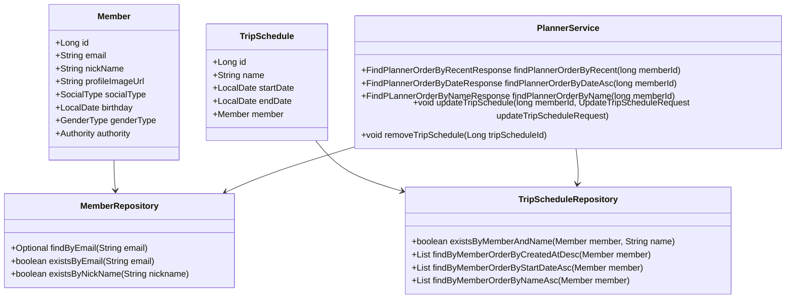
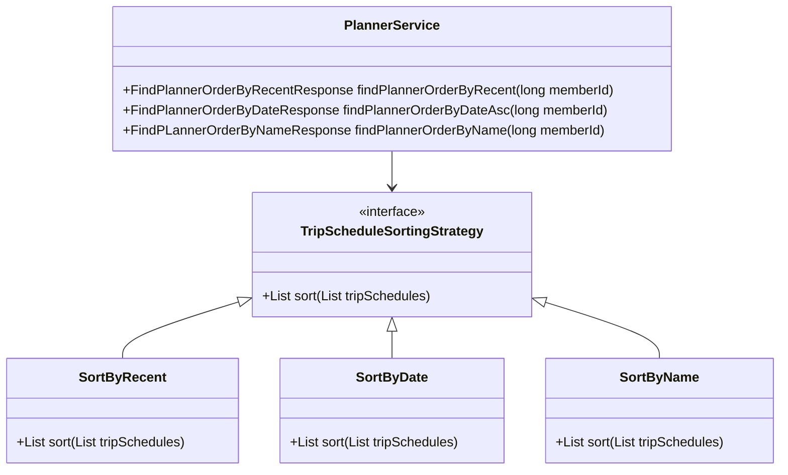
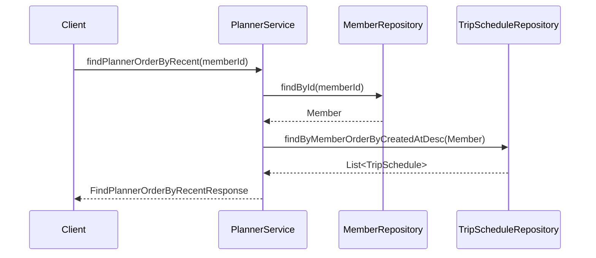

# Comprehensive Documentation for the PlannerService Code

## 1. Overall Structure

### High-Level Overview
The codebase is structured around a domain-driven design, focusing on the management of members and their trip schedules. The primary components include domain entities, repositories for data access, exceptions for error handling, and a service layer that orchestrates the business logic.

### Purpose and Function of Service Code
The `PlannerService` class is responsible for managing trip schedules associated with members. It provides methods to retrieve trip schedules in various orders (recent, by date, by name), update existing schedules, and remove schedules. The service interacts with repositories to perform CRUD operations on the underlying data.

### Interaction Between Components
- **Entities**: `Member` and `TripSchedule` represent the core data structures.
- **Repositories**: `MemberRepository` and `TripScheduleRepository` handle data persistence and retrieval.
- **Service**: `PlannerService` coordinates the interaction between repositories and handles business logic.
- **Exceptions**: Custom exceptions are thrown to handle specific error scenarios.

### Mermaid Diagram


## 2. Strategy Pattern Implementation

### Strategy Pattern Overview
The strategy pattern is not explicitly implemented in the provided code. However, the service class can be designed to utilize different strategies for handling trip schedules based on various criteria (e.g., sorting by date, name, etc.). 

### Strategy Interface and Concrete Strategy Classes
While the current implementation does not have a defined strategy interface, it can be conceptualized as follows:
- **Strategy Interface**: `TripScheduleSortingStrategy`
- **Concrete Strategies**: `SortByRecent`, `SortByDate`, `SortByName`

### Context Class
The `PlannerService` can act as the context class that utilizes these strategies to fetch trip schedules based on the member's request.

### Class Diagram


## 3. Detailed Component Documentation

### a. Classes

#### 1. PlannerService
- **Purpose**: Manages trip schedules for members.
- **Attributes**:
  - `TripScheduleRepository tripScheduleRepository`: Repository for trip schedules.
  - `MemberRepository memberRepository`: Repository for members.
  - `TripScheduleRegistryRepository tripScheduleRegistryRepository`: Repository for trip schedule registries.
- **Role**: Acts as a service layer to handle business logic related to trip schedules.
- **Relationships**: 
  - Uses `MemberRepository` and `TripScheduleRepository`.

### b. Methods and Functions

#### 1. findPlannerOrderByRecent
- **Purpose**: Retrieves trip schedules for a member ordered by creation date (most recent first).
- **Parameters**:
  - `long memberId`: The ID of the member whose schedules are to be retrieved.
- **Return Value**: `FindPlannerOrderByRecentResponse` containing the list of trip schedules.
- **Code Example**:
  ```java
  FindPlannerOrderByRecentResponse response = plannerService.findPlannerOrderByRecent(memberId);
  ```

#### 2. findPlannerOrderByDateAsc
- **Purpose**: Retrieves trip schedules for a member ordered by start date (ascending).
- **Parameters**:
  - `long memberId`: The ID of the member whose schedules are to be retrieved.
- **Return Value**: `FindPlannerOrderByDateResponse` containing the list of trip schedules.
- **Code Example**:
  ```java
  FindPlannerOrderByDateResponse response = plannerService.findPlannerOrderByDateAsc(memberId);
  ```

#### 3. findPlannerOrderByName
- **Purpose**: Retrieves trip schedules for a member ordered by name (alphabetically).
- **Parameters**:
  - `long memberId`: The ID of the member whose schedules are to be retrieved.
- **Return Value**: `FindPLannerOrderByNameResponse` containing the list of trip schedules.
- **Code Example**:
  ```java
  FindPLannerOrderByNameResponse response = plannerService.findPlannerOrderByName(memberId);
  ```

#### 4. updateTripSchedule
- **Purpose**: Updates an existing trip schedule for a member.
- **Parameters**:
  - `long memberId`: The ID of the member.
  - `UpdateTripScheduleRequest updateTripScheduleRequest`: Request object containing updated schedule details.
- **Return Value**: None.
- **Code Example**:
  ```java
  plannerService.updateTripSchedule(memberId, new UpdateTripScheduleRequest(scheduleId, "New Name", startDate, endDate));
  ```

#### 5. removeTripSchedule
- **Purpose**: Removes a trip schedule by its ID.
- **Parameters**:
  - `Long tripScheduleId`: The ID of the trip schedule to be removed.
- **Return Value**: None.
- **Code Example**:
  ```java
  plannerService.removeTripSchedule(tripScheduleId);
  ```

## 4. Implementation Flow

### Sequence Diagram


### Explanation of Sequence
1. The client calls `findPlannerOrderByRecent` on the `PlannerService`.
2. The service retrieves the member using `MemberRepository`.
3. The service then fetches the trip schedules ordered by creation date from `TripScheduleRepository`.
4. Finally, the service returns the response to the client.

This documentation provides a comprehensive overview of the `PlannerService` code, detailing its structure, functionality, and interactions with other components in the system. It serves as a guide for both new and experienced developers to understand and work with the code effectively.