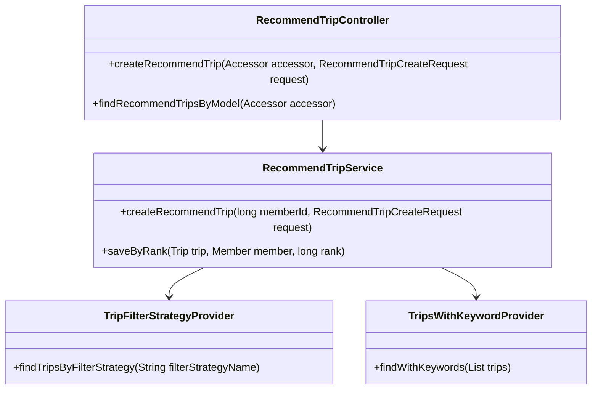
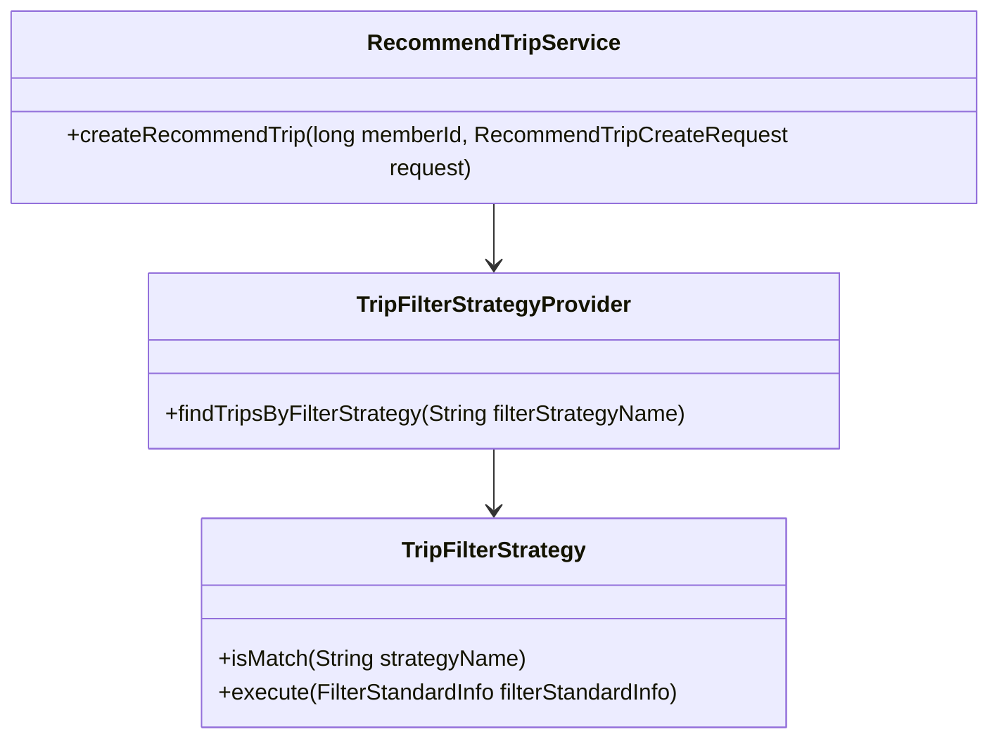
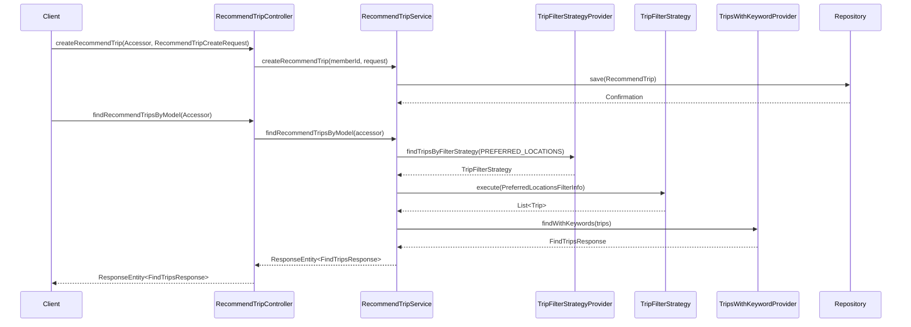

# Comprehensive Documentation for the RecommendTrip Service Code

## 1. Overall Structure

### High-Level Overview
The codebase is structured into several packages, each serving a specific purpose within the application. The main components include:

- **DTOs (Data Transfer Objects)**: Classes like `Accessor`, `RecommendTripCreateRequest`, and `FindTripsResponse` that facilitate data transfer between layers.
- **Entities**: Classes like `Trip`, `TripKeyword`, and `Member` that represent the core data model and are mapped to the database.
- **Repositories**: Interfaces for data access, such as `TripKeywordRepository`, `MemberRepository`, and `RecommendTripRepository`.
- **Services**: Business logic is encapsulated in classes like `RecommendTripService`, which orchestrates the application's operations.
- **Controllers**: The `RecommendTripController` handles HTTP requests and responses, acting as the entry point for client interactions.

### Purpose and Function of Service Code
The `RecommendTripService` is responsible for managing the recommendation of trips based on user preferences. It interacts with various repositories to fetch data and applies different filtering strategies to generate recommendations.

### Interaction Between Components
- The `RecommendTripController` receives HTTP requests and delegates the processing to the `RecommendTripService`.
- The service uses the `TripFilterStrategyProvider` to select the appropriate filtering strategy based on user preferences.
- The selected strategy is executed to retrieve a list of trips, which is then processed by the `TripsWithKeywordProvider` to enrich the response with keywords.

### Mermaid Diagram


## 2. Strategy Pattern Implementation

### Strategy Pattern Overview
The strategy pattern is implemented to allow dynamic selection of filtering strategies for trip recommendations. This enables the application to easily extend or modify filtering behavior without changing the core logic.

### Strategy Interface and Concrete Strategy Classes
- **Interface**: `TripFilterStrategy`
  - Method `isMatch(String strategyName)`: Determines if the strategy matches the given name.
  - Method `execute(FilterStandardInfo filterStandardInfo)`: Executes the filtering logic based on the provided information.

- **Concrete Strategies**: Implementations of `TripFilterStrategy` can be created for different filtering criteria (e.g., `PreferredLocationsStrategy`).

### Context Class
- **Context**: `RecommendTripService`
  - Uses `TripFilterStrategyProvider` to obtain the appropriate strategy and delegates the filtering operation to it.

### Class Diagram


## 3. Detailed Component Documentation

### a. Classes

#### 1. Accessor
- **Purpose**: Represents an authenticated user accessor.
- **Attributes**:
  - `Long id`: Unique identifier for the accessor.
- **Role**: Used to retrieve the ID of the authenticated user for processing requests.
- **Relationships**: None.

#### 2. RecommendTripService
- **Purpose**: Manages the logic for recommending trips.
- **Attributes**:
  - `TripFilterStrategyProvider tripFilterStrategyProvider`: Provides filtering strategies.
  - `RecommendTripRepository recommendTripRepository`: Repository for managing recommended trips.
  - `MemberRepository memberRepository`: Repository for member data.
  - `TripRepository tripRepository`: Repository for trip data.
  - `TripKeywordRepository tripKeywordRepository`: Repository for trip keywords.
- **Role**: Central service for creating and managing trip recommendations.
- **Relationships**: Collaborates with multiple repositories and the strategy provider.

#### 3. TripFilterStrategy
- **Purpose**: Interface for defining filtering strategies.
- **Methods**:
  - `boolean isMatch(String strategyName)`: Checks if the strategy matches the given name.
  - `List<Trip> execute(FilterStandardInfo filterStandardInfo)`: Executes the filtering logic.
- **Role**: Provides a contract for different filtering strategies.
- **Relationships**: Implemented by various concrete strategy classes.

#### 4. TripFilterStrategyProvider
- **Purpose**: Provides the appropriate filtering strategy based on the strategy name.
- **Attributes**:
  - `List<TripFilterStrategy> tripFilterStrategies`: List of available strategies.
- **Role**: Acts as a factory for obtaining filtering strategies.
- **Relationships**: Uses the `TripFilterStrategy` interface.

#### 5. TripsWithKeywordProvider
- **Purpose**: Enriches the trip recommendations with associated keywords.
- **Attributes**:
  - `TripKeywordRepository tripKeywordRepository`: Repository for trip keywords.
- **Role**: Validates and processes the list of trips to ensure the correct number of recommendations.
- **Relationships**: Collaborates with the `TripKeywordRepository`.

### b. Methods and Functions

#### 1. createRecommendTrip
- **Purpose**: Creates a new recommended trip for a member.
- **Parameters**:
  - `long memberId`: ID of the member.
  - `RecommendTripCreateRequest request`: Request containing trip details.
- **Return Value**: `void`
- **Code Example**:
  ```java
  recommendTripService.createRecommendTrip(memberId, new RecommendTripCreateRequest(tripId));
  ```

#### 2. findRecommendTripsByModel
- **Purpose**: Finds recommended trips based on the user's preferred locations.
- **Parameters**:
  - `Accessor accessor`: Authenticated user accessor.
- **Return Value**: `ResponseEntity<FindTripsResponse>`
- **Code Example**:
  ```java
  ResponseEntity<FindTripsResponse> response = recommendTripController.findRecommendTripsByModel(accessor);
  ```

## 4. Implementation Flow

### Sequence Diagram


This documentation provides a comprehensive overview of the `RecommendTrip` service code, detailing its structure, strategy pattern implementation, component documentation, and implementation flow. It serves as a guide for both new and experienced developers to understand and work with the code effectively.