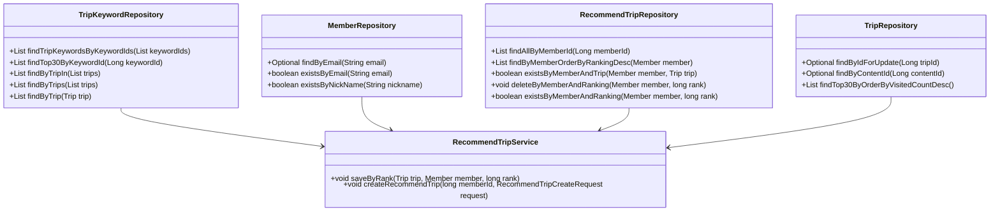
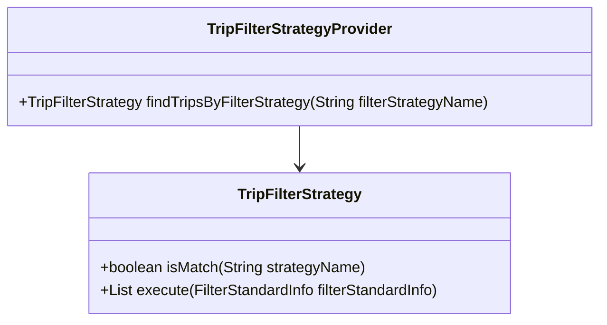
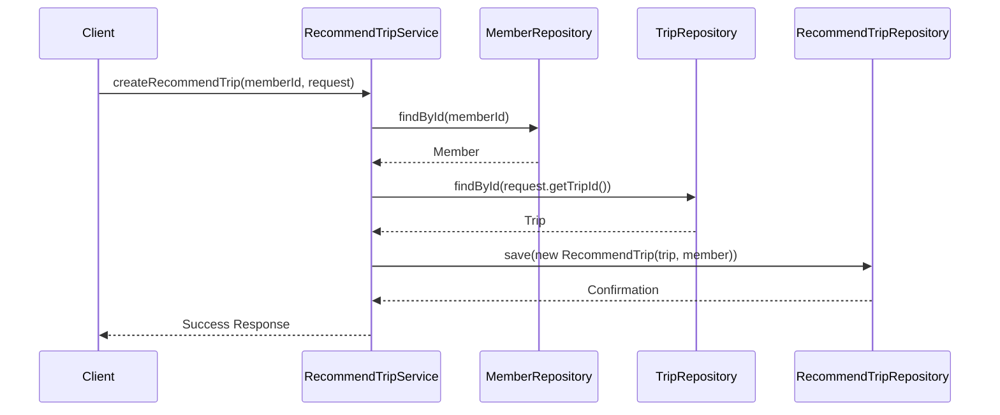

# Comprehensive Documentation for RecommendTripService Code

## 1. Overall Structure

### High-Level Overview
The codebase is structured into several packages, each serving a specific purpose within the application. The main packages include:

- **domain**: Contains the core business entities such as `Member`, `Trip`, `RecommendTrip`, and their respective repositories.
- **repository**: Interfaces for data access, extending `JpaRepository` for CRUD operations.
- **exception**: Custom exceptions for handling specific error scenarios.
- **dto**: Data Transfer Objects for encapsulating data sent to and from the client.
- **application**: Contains the service layer, specifically the `RecommendTripService`, which orchestrates the business logic.

### Purpose and Function of Service Code
The `RecommendTripService` class is responsible for managing the recommendation of trips to members. It interacts with various repositories to fetch data, apply business logic, and persist recommendations. The service uses the Strategy Pattern to determine how to filter trips based on member preferences.

### Interaction Between Components
- The service interacts with repositories to retrieve `Member`, `Trip`, and `RecommendTrip` entities.
- It utilizes the `TripFilterStrategyProvider` to apply different filtering strategies for trip recommendations.
- The service methods handle transactions and exceptions, ensuring data integrity and proper error handling.

### Mermaid Diagram


## 2. Strategy Pattern Implementation

### Strategy Pattern Overview
The Strategy Pattern is implemented in the `TripFilterStrategy` interface and its concrete implementations. This allows the `RecommendTripService` to dynamically choose a filtering strategy based on the member's preferences.

### Strategy Interface and Concrete Strategy Classes
- **TripFilterStrategy**: An interface defining the contract for filtering strategies.
  - **Methods**:
    - `boolean isMatch(final String strategyName)`: Determines if the strategy matches the provided name.
    - `List<Trip> execute(final FilterStandardInfo filterStandardInfo)`: Executes the filtering logic based on the provided information.

### Context Class
- **TripFilterStrategyProvider**: This class acts as a context that holds a list of strategies and provides a method to find the appropriate strategy based on the name.

### Class Diagram


## 3. Detailed Component Documentation

### a. Classes

#### 1. RecommendTripService
- **Purpose**: Manages the recommendation of trips for members.
- **Attributes**:
  - `TripFilterStrategyProvider tripFilterStrategyProvider`: Provides filtering strategies.
  - `RecommendTripRepository recommendTripRepository`: Repository for managing recommended trips.
  - `MemberRepository memberRepository`: Repository for managing members.
  - `TripRepository tripRepository`: Repository for managing trips.
  - `TripKeywordRepository tripKeywordRepository`: Repository for managing trip keywords.
- **Role**: Orchestrates the business logic for recommending trips based on member preferences.
- **Relationships**: Uses multiple repositories to fetch and persist data.

#### 2. TripFilterStrategy
- **Purpose**: Interface for defining trip filtering strategies.
- **Methods**:
  - `boolean isMatch(final String strategyName)`: Checks if the strategy matches the given name.
  - `List<Trip> execute(final FilterStandardInfo filterStandardInfo)`: Executes the filtering logic.

#### 3. TripFilterStrategyProvider
- **Purpose**: Provides the appropriate trip filtering strategy based on the strategy name.
- **Attributes**:
  - `List<TripFilterStrategy> tripFilterStrategies`: List of available filtering strategies.
- **Methods**:
  - `TripFilterStrategy findTripsByFilterStrategy(final String filterStrategyName)`: Finds and returns the matching strategy.

### b. Methods and Functions

#### 1. saveByRank
- **Purpose**: Saves a recommended trip with a specified ranking.
- **Parameters**:
  - `Trip trip`: The trip to be recommended.
  - `Member member`: The member for whom the trip is recommended.
  - `long rank`: The ranking of the recommendation.
- **Return Value**: None.
- **Code Example**:
  ```java
  recommendTripService.saveByRank(trip, member, 1);
  ```

#### 2. createRecommendTrip
- **Purpose**: Creates a new recommended trip for a member.
- **Parameters**:
  - `long memberId`: The ID of the member.
  - `RecommendTripCreateRequest request`: The request containing trip details.
- **Return Value**: None.
- **Code Example**:
  ```java
  recommendTripService.createRecommendTrip(memberId, new RecommendTripCreateRequest(tripId));
  ```

## 4. Implementation Flow

### Sequence Diagram


### Explanation of Flow
1. The client calls the `createRecommendTrip` method on the `RecommendTripService`.
2. The service retrieves the member using `MemberRepository`.
3. It fetches the trip using `TripRepository`.
4. Finally, it saves the new recommendation using `RecommendTripRepository` and returns a success response to the client.

This documentation provides a comprehensive overview of the `RecommendTripService` code, detailing its structure, strategy pattern implementation, component documentation, and implementation flow. It serves as a guide for both new and experienced developers to understand and work with the code effectively.