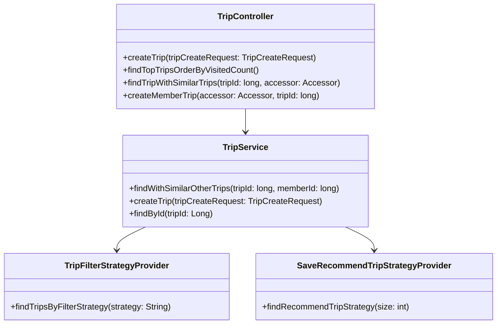
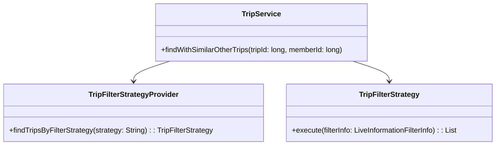
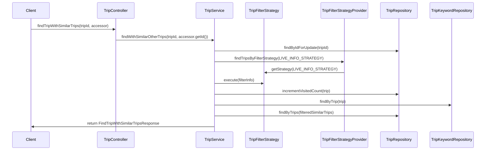

# Comprehensive Documentation for the Service Code

## 1. Overall Structure

### High-Level Overview
The codebase is structured into several packages, each serving a specific purpose within the application. The main packages include:

- **moheng.auth.dto**: Contains data transfer objects (DTOs) related to authentication.
- **moheng.auth.presentation.authentication**: Contains annotations related to authentication.
- **moheng.trip.application**: Contains the core business logic for trip management, including services and strategies.
- **moheng.trip.domain**: Contains domain models related to trips.
- **moheng.trip.dto**: Contains DTOs for trip-related requests and responses.
- **moheng.trip.presentation**: Contains REST controllers for handling HTTP requests related to trips.

### Purpose and Function of Service Code
The `TripService` class is responsible for managing trip-related operations, including creating trips, finding trips, and managing member trip interactions. It utilizes various repositories to interact with the database and employs the Strategy Pattern to filter and recommend trips based on different criteria.

### Interaction Between Different Parts
- The `TripController` handles incoming HTTP requests and delegates the business logic to the `TripService`.
- The `TripService` interacts with multiple repositories to perform CRUD operations and apply filtering strategies.
- The `TripFilterStrategyProvider` and `SaveRecommendTripStrategyProvider` are used to obtain the appropriate strategies for filtering trips and saving recommendations.

### Mermaid Diagram


## 2. Strategy Pattern Implementation

### Strategy Pattern Overview
The Strategy Pattern is implemented in the `TripService` class, where different filtering strategies for trips are defined and utilized. This allows for flexible and interchangeable filtering mechanisms.

### Strategy Interface and Concrete Strategy Classes
- **TripFilterStrategy**: This is the strategy interface that defines the method for executing a filtering strategy.
- **Concrete Strategies**: Implementations of `TripFilterStrategy` are provided by classes that define specific filtering logic (e.g., `LiveInformationFilterStrategy`).

### Context Class
- **TripService**: This class acts as the context that uses the strategies. It retrieves the appropriate strategy from the `TripFilterStrategyProvider` and executes it based on the current requirements.

### Class Diagram


## 3. Detailed Component Documentation

### a. Classes

#### 1. Class: Accessor
- **Purpose**: Represents an accessor for authentication purposes.
- **Attributes**:
  - `Long id`: Unique identifier for the accessor.
- **Role**: Used to retrieve the ID of the authenticated user.
- **Relationships**: None.

#### 2. Class: Authentication
- **Purpose**: Custom annotation for marking parameters that require authentication.
- **Attributes**: None.
- **Role**: Used in controller methods to indicate that the parameter should be populated with an authenticated user's information.
- **Relationships**: None.

#### 3. Class: TripService
- **Purpose**: Contains business logic for managing trips.
- **Attributes**:
  - `TripFilterStrategyProvider tripFilterStrategyProvider`
  - `SaveRecommendTripStrategyProvider saveRecommendTripStrategyProvider`
  - `TripRepository tripRepository`
  - `RecommendTripRepository recommendTripRepository`
  - `MemberRepository memberRepository`
  - `MemberTripRepository memberTripRepository`
  - `TripKeywordRepository tripKeywordRepository`
- **Role**: Central service for trip-related operations.
- **Relationships**: Interacts with various repositories and strategy providers.

#### 4. Class: FindTripWithSimilarTripsResponse
- **Purpose**: DTO for returning trip details along with similar trips.
- **Attributes**:
  - `FindTripResponse findTripResponse`
  - `SimilarTripResponses similarTripResponses`
- **Role**: Encapsulates the response structure for finding trips with similar options.
- **Relationships**: None.

#### 5. Class: FindTripsResponse
- **Purpose**: DTO for returning a list of trips.
- **Attributes**:
  - `List<FindTripResponse> findTripResponses`
- **Role**: Encapsulates the response structure for finding multiple trips.
- **Relationships**: None.

#### 6. Class: TripCreateRequest
- **Purpose**: DTO for creating a new trip.
- **Attributes**:
  - `String name`
  - `String placeName`
  - `Long contentId`
  - `String description`
  - `String tripImageUrl`
- **Role**: Represents the data required to create a new trip.
- **Relationships**: None.

### b. Methods and Functions

#### 1. Method: createTrip
- **Purpose**: Creates a new trip.
- **Parameters**:
  - `tripCreateRequest: TripCreateRequest`: The request object containing trip details.
- **Return Value**: `void`
- **Code Example**:
  ```java
  TripCreateRequest request = new TripCreateRequest("Trip Name", "Place Name", 1L, "Description", "Image URL");
  tripService.createTrip(request);
  ```

#### 2. Method: findWithSimilarOtherTrips
- **Purpose**: Finds a trip and similar trips based on the provided trip ID and member ID.
- **Parameters**:
  - `tripId: long`: The ID of the trip to find.
  - `memberId: long`: The ID of the member requesting the trip.
- **Return Value**: `FindTripWithSimilarTripsResponse`
- **Code Example**:
  ```java
  FindTripWithSimilarTripsResponse response = tripService.findWithSimilarOtherTrips(1L, 1L);
  ```

#### 3. Method: findTop30OrderByVisitedCountDesc
- **Purpose**: Retrieves the top 30 trips ordered by visited count.
- **Parameters**: None.
- **Return Value**: `FindTripsResponse`
- **Code Example**:
  ```java
  FindTripsResponse topTrips = tripService.findTop30OrderByVisitedCountDesc();
  ```

#### 4. Method: createMemberTrip
- **Purpose**: Creates a member trip association.
- **Parameters**:
  - `memberId: long`: The ID of the member.
  - `tripId: long`: The ID of the trip.
- **Return Value**: `void`
- **Code Example**:
  ```java
  tripService.createMemberTrip(1L, 1L);
  ```

## 4. Implementation Flow

### Sequence Diagram


This documentation provides a comprehensive overview of the service code, detailing its structure, strategy pattern implementation, component documentation, and implementation flow. It serves as a guide for both new and experienced developers to understand and work with the code effectively.