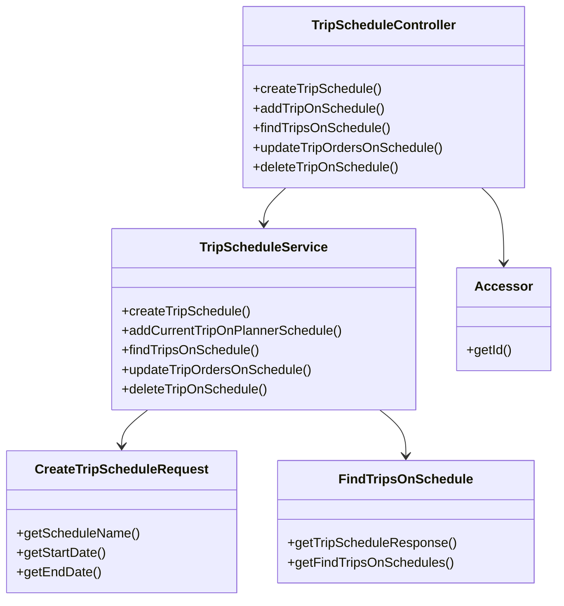
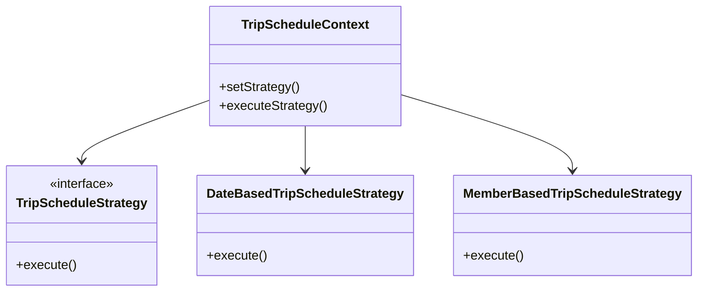
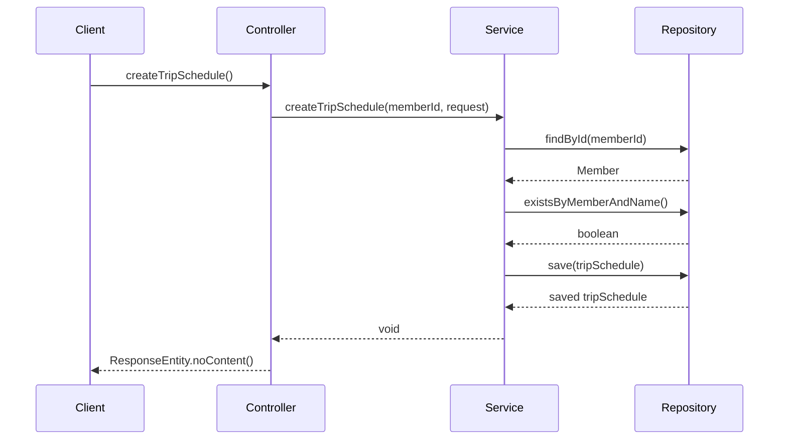

# Comprehensive Documentation for the Service Code

## 1. Overall Structure

### High-Level Overview
The codebase is structured into several packages, each serving a specific purpose within the application. The main components include:

- **DTOs (Data Transfer Objects)**: These classes are used to transfer data between layers of the application, such as `Accessor`, `CreateTripScheduleRequest`, and `FindTripsOnSchedule`.
- **Presentation Layer**: This includes the `TripScheduleController`, which handles HTTP requests and responses.
- **Application Layer**: The `TripScheduleService` contains the business logic for managing trip schedules.
- **Domain Layer**: This includes domain entities like `TripSchedule`, `Trip`, and repositories for data access.

### Purpose and Function of Service Code
The service code primarily manages the creation, updating, and retrieval of trip schedules. It interacts with repositories to perform CRUD operations and handles exceptions related to trip schedules and members.

### Interaction Between Components
- The `TripScheduleController` receives HTTP requests and delegates the processing to the `TripScheduleService`.
- The `TripScheduleService` interacts with various repositories to perform operations on trip schedules and members.
- DTOs are used to encapsulate request and response data, ensuring a clean separation of concerns.

### Mermaid Diagram


## 2. Strategy Pattern Implementation

### Strategy Pattern Overview
The strategy pattern is not explicitly implemented in the provided code. However, if we were to implement it, we could define different strategies for handling trip schedules based on various criteria (e.g., by date, by member, etc.).

### Strategy Interface and Concrete Strategy Classes
- **Strategy Interface**: `TripScheduleStrategy`
- **Concrete Strategy Classes**: `DateBasedTripScheduleStrategy`, `MemberBasedTripScheduleStrategy`

### Context Class
- **Context Class**: `TripScheduleContext` which would use the strategy interface to delegate the scheduling logic.

### Class Diagram


## 3. Detailed Component Documentation

### a. Classes

#### 1. Class: Accessor
- **Purpose**: Represents an accessor for authentication purposes.
- **Attributes**:
  - `Long id`: Unique identifier for the accessor.
- **Role**: Used to retrieve the ID of the authenticated user.
- **Relationships**: None.

#### 2. Class: TripScheduleService
- **Purpose**: Contains business logic for managing trip schedules.
- **Attributes**:
  - `MemberRepository memberRepository`
  - `TripScheduleRepository tripScheduleRepository`
  - `TripRepository tripRepository`
  - `TripScheduleRegistryRepository tripScheduleRegistryRepository`
- **Role**: Interacts with repositories to perform CRUD operations on trip schedules.
- **Relationships**: Uses multiple repository classes.

### b. Methods and Functions

#### 1. Method: createTripSchedule
- **Purpose**: Creates a new trip schedule.
- **Parameters**:
  - `long memberId`: ID of the member creating the schedule.
  - `CreateTripScheduleRequest createTripScheduleRequest`: DTO containing schedule details.
- **Return Value**: `void`
- **Code Example**:
```java
tripScheduleService.createTripSchedule(memberId, new CreateTripScheduleRequest("Vacation", LocalDate.now(), LocalDate.now().plusDays(7)));
```

#### 2. Method: addCurrentTripOnPlannerSchedule
- **Purpose**: Adds a trip to an existing schedule.
- **Parameters**:
  - `long tripId`: ID of the trip to add.
  - `AddTripOnScheduleRequests addTripOnScheduleRequests`: DTO containing schedule IDs.
- **Return Value**: `void`
- **Code Example**:
```java
tripScheduleService.addCurrentTripOnPlannerSchedule(tripId, new AddTripOnScheduleRequests(Arrays.asList(scheduleId1, scheduleId2)));
```

#### 3. Method: findTripsOnSchedule
- **Purpose**: Retrieves trips associated with a specific schedule.
- **Parameters**:
  - `long scheduleId`: ID of the schedule to query.
- **Return Value**: `FindTripsOnSchedule`
- **Code Example**:
```java
FindTripsOnSchedule tripsOnSchedule = tripScheduleService.findTripsOnSchedule(scheduleId);
```

#### 4. Method: updateTripOrdersOnSchedule
- **Purpose**: Updates the order of trips in a schedule.
- **Parameters**:
  - `long scheduleId`: ID of the schedule to update.
  - `UpdateTripOrdersRequest updateTripOrdersRequest`: DTO containing new trip IDs.
- **Return Value**: `void`
- **Code Example**:
```java
tripScheduleService.updateTripOrdersOnSchedule(scheduleId, new UpdateTripOrdersRequest(Arrays.asList(tripId1, tripId2)));
```

#### 5. Method: deleteTripOnSchedule
- **Purpose**: Deletes a trip from a schedule.
- **Parameters**:
  - `long scheduleId`: ID of the schedule.
  - `long tripId`: ID of the trip to delete.
- **Return Value**: `void`
- **Code Example**:
```java
tripScheduleService.deleteTripOnSchedule(scheduleId, tripId);
```

## 4. Implementation Flow

### Sequence Diagram


### Explanation of Sequence Diagram
1. The client calls the `createTripSchedule` method on the `TripScheduleController`.
2. The controller delegates the call to the `TripScheduleService`.
3. The service checks if the member exists by querying the `MemberRepository`.
4. If the member exists, it checks if a trip schedule with the same name already exists.
5. If not, it saves the new trip schedule to the `TripScheduleRepository`.
6. Finally, the service returns control back to the controller, which sends a response back to the client.

This documentation provides a comprehensive overview of the service code, detailing its structure, components, and interactions, making it easier for developers to understand and work with the code effectively.