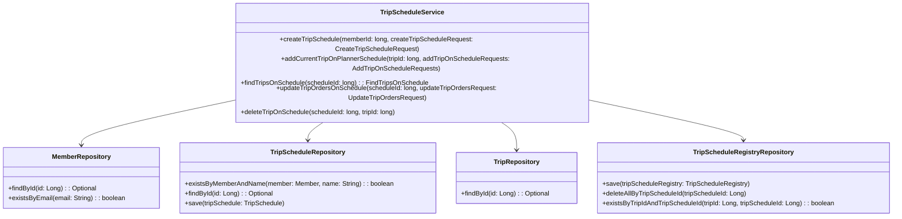
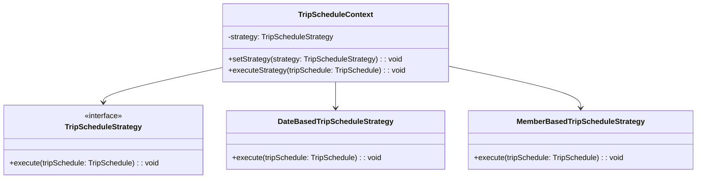
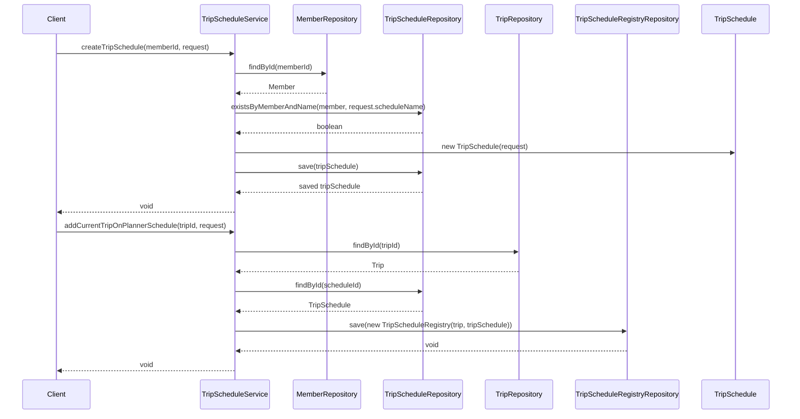

# Comprehensive Documentation for TripScheduleService Code

## 1. Overall Structure

### High-Level Overview
The codebase is structured into several packages, each serving a specific purpose. The main packages include:
- **Domain**: Contains the core business entities such as `Member`, `TripSchedule`, and `Trip`.
- **Repository**: Interfaces for data access using Spring Data JPA.
- **Exception**: Custom exceptions for handling specific error scenarios.
- **Application**: Contains the service classes that implement business logic, such as `TripScheduleService`.

### Purpose and Function of Service Code
The `TripScheduleService` class is responsible for managing trip schedules. It provides methods to create, update, and delete trip schedules, as well as to add trips to a schedule and retrieve trips associated with a specific schedule.

### Interaction Between Parts
- The service interacts with repositories to perform CRUD operations on entities.
- It uses domain entities like `Member`, `TripSchedule`, and `Trip` to encapsulate business logic.
- Custom exceptions are thrown to handle error scenarios gracefully.

### Mermaid Diagram


## 2. Strategy Pattern Implementation

### Strategy Pattern Explanation
The strategy pattern is not explicitly implemented in the provided code. However, if we were to implement a strategy pattern for trip scheduling, we could define different strategies for handling trip schedules based on various criteria (e.g., by date, by member).

### Strategy Interface and Concrete Strategy Classes
- **Strategy Interface**: `TripScheduleStrategy`
- **Concrete Strategies**: `DateBasedTripScheduleStrategy`, `MemberBasedTripScheduleStrategy`

### Context Class
- **Context Class**: `TripScheduleContext` which uses the strategies to perform operations based on the selected strategy.

### Class Diagram


## 3. Detailed Component Documentation

### a. Classes

#### TripScheduleService
- **Purpose**: Manages trip schedules and their associated operations.
- **Attributes**:
  - `memberRepository`: Repository for member data.
  - `tripScheduleRepository`: Repository for trip schedule data.
  - `tripRepository`: Repository for trip data.
  - `tripScheduleRegistryRepository`: Repository for trip schedule registry data.
- **Role**: Acts as a service layer to handle business logic related to trip schedules.
- **Relationships**: Uses multiple repositories to perform CRUD operations.

### b. Methods and Functions

#### createTripSchedule
- **Purpose**: Creates a new trip schedule for a member.
- **Parameters**:
  - `memberId` (long): The ID of the member creating the schedule.
  - `createTripScheduleRequest` (CreateTripScheduleRequest): DTO containing schedule details.
- **Return Value**: None
- **Code Example**:
  ```java
  tripScheduleService.createTripSchedule(1L, new CreateTripScheduleRequest("My Trip", startDate, endDate));
  ```

#### addCurrentTripOnPlannerSchedule
- **Purpose**: Adds a trip to an existing trip schedule.
- **Parameters**:
  - `tripId` (long): The ID of the trip to be added.
  - `addTripOnScheduleRequests` (AddTripOnScheduleRequests): DTO containing schedule IDs.
- **Return Value**: None
- **Code Example**:
  ```java
  tripScheduleService.addCurrentTripOnPlannerSchedule(2L, new AddTripOnScheduleRequests(Arrays.asList(1L, 2L)));
  ```

#### findTripsOnSchedule
- **Purpose**: Retrieves trips associated with a specific schedule.
- **Parameters**:
  - `scheduleId` (long): The ID of the trip schedule.
- **Return Value**: `FindTripsOnSchedule` containing the schedule and associated trips.
- **Code Example**:
  ```java
  FindTripsOnSchedule tripsOnSchedule = tripScheduleService.findTripsOnSchedule(1L);
  ```

#### updateTripOrdersOnSchedule
- **Purpose**: Updates the order of trips in a schedule.
- **Parameters**:
  - `scheduleId` (long): The ID of the trip schedule.
  - `updateTripOrdersRequest` (UpdateTripOrdersRequest): DTO containing new trip order.
- **Return Value**: None
- **Code Example**:
  ```java
  tripScheduleService.updateTripOrdersOnSchedule(1L, new UpdateTripOrdersRequest(Arrays.asList(2L, 1L)));
  ```

#### deleteTripOnSchedule
- **Purpose**: Deletes a trip from a schedule.
- **Parameters**:
  - `scheduleId` (long): The ID of the trip schedule.
  - `tripId` (long): The ID of the trip to be deleted.
- **Return Value**: None
- **Code Example**:
  ```java
  tripScheduleService.deleteTripOnSchedule(1L, 2L);
  ```

## 4. Implementation Flow

### Sequence Diagram


This documentation provides a comprehensive overview of the `TripScheduleService` code, detailing its structure, purpose, implementation of the strategy pattern, and the flow of operations. It serves as a guide for both new and experienced developers to understand and work with the code effectively.