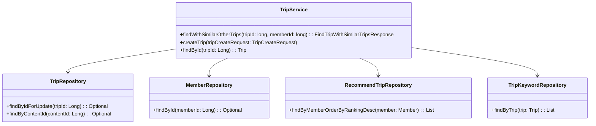
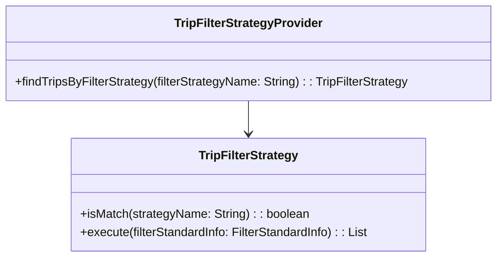
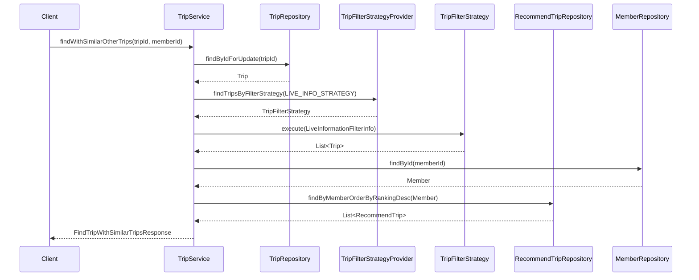

# Comprehensive Documentation for TripService Code

## 1. Overall Structure

### High-Level Overview
The codebase is structured around a domain-driven design, focusing on the management of trips, members, and their relationships. The primary components include entities, repositories, services, and exception handling. The `TripService` class serves as the main service layer for handling trip-related operations.

### Purpose and Function of Service Code
The `TripService` class is responsible for managing trip-related business logic, including:
- Retrieving trips and their associated keywords.
- Handling member interactions with trips, such as saving recommendations and tracking visits.
- Implementing filtering strategies for trip recommendations.

### Interaction Between Components
- **Entities**: Represent the core data models (e.g., `Trip`, `Member`, `RecommendTrip`).
- **Repositories**: Provide data access methods for entities (e.g., `TripRepository`, `MemberRepository`).
- **Services**: Contain business logic and orchestrate interactions between repositories and entities (e.g., `TripService`).
- **Exceptions**: Handle error scenarios (e.g., `NoExistTripException`, `NoExistMemberException`).

### Mermaid Diagram


## 2. Strategy Pattern Implementation

### Strategy Pattern Overview
The strategy pattern is implemented to allow dynamic selection of filtering strategies for trip recommendations. This enables the system to adapt to different filtering criteria without modifying the core logic.

### Strategy Interface and Concrete Strategy Classes
- **Interface**: `TripFilterStrategy`
  - Method: `boolean isMatch(String strategyName)`
  - Method: `List<Trip> execute(FilterStandardInfo filterStandardInfo)`

- **Concrete Strategy**: Implementations of `TripFilterStrategy` would define specific filtering logic based on the strategy name.

### Context Class
- **Class**: `TripFilterStrategyProvider`
  - Purpose: Provides the appropriate filtering strategy based on the strategy name.

### Class Diagram


## 3. Detailed Component Documentation

### a. Classes

#### Class: TripService
- **Purpose**: Manages trip-related business logic.
- **Attributes**:
  - `TripFilterStrategyProvider tripFilterStrategyProvider`
  - `SaveRecommendTripStrategyProvider saveRecommendTripStrategyProvider`
  - `TripRepository tripRepository`
  - `RecommendTripRepository recommendTripRepository`
  - `MemberRepository memberRepository`
  - `MemberTripRepository memberTripRepository`
  - `TripKeywordRepository tripKeywordRepository`
- **Role**: Acts as the service layer for trip operations, coordinating between repositories and handling business logic.
- **Relationships**: Uses various repositories to perform CRUD operations on entities.

#### Class: TripFilterStrategy
- **Purpose**: Defines a strategy interface for filtering trips.
- **Methods**:
  - `boolean isMatch(String strategyName)`
  - `List<Trip> execute(FilterStandardInfo filterStandardInfo)`

#### Class: TripFilterStrategyProvider
- **Purpose**: Provides the appropriate trip filter strategy based on the strategy name.
- **Attributes**:
  - `List<TripFilterStrategy> tripFilterStrategies`
- **Methods**:
  - `TripFilterStrategy findTripsByFilterStrategy(String filterStrategyName)`

### b. Methods and Functions

#### Method: findWithSimilarOtherTrips
- **Purpose**: Finds a trip and similar trips based on a given trip ID and member ID.
- **Parameters**:
  - `tripId: long`: The ID of the trip to find.
  - `memberId: long`: The ID of the member requesting the trip.
- **Return Value**: `FindTripWithSimilarTripsResponse`: Contains the found trip and similar trips.
- **Code Example**:
```java
FindTripWithSimilarTripsResponse response = tripService.findWithSimilarOtherTrips(tripId, memberId);
```

#### Method: createTrip
- **Purpose**: Creates a new trip based on the provided request.
- **Parameters**:
  - `tripCreateRequest: TripCreateRequest`: The request object containing trip details.
- **Return Value**: None.
- **Code Example**:
```java
tripService.createTrip(new TripCreateRequest("Trip Name", "Place Name", 1L, "Description", "Image URL"));
```

#### Method: findById
- **Purpose**: Retrieves a trip by its ID.
- **Parameters**:
  - `tripId: Long`: The ID of the trip to find.
- **Return Value**: `Trip`: The found trip.
- **Code Example**:
```java
Trip trip = tripService.findById(tripId);
```

## 4. Implementation Flow

### Sequence Diagram


This documentation provides a comprehensive overview of the `TripService` code, detailing its structure, strategy pattern implementation, component documentation, and flow of execution. It serves as a guide for both new and experienced developers to understand and work with the code effectively.